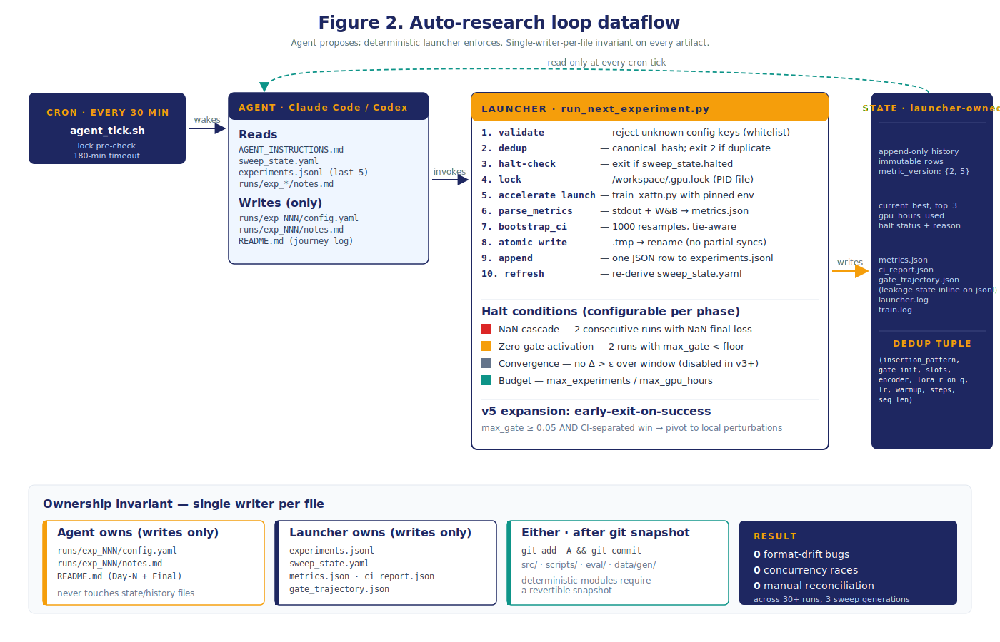

# The Agentic Experiment Harness

**Whitepaper companion document · v1.2 · 2026-05-22**

This document covers the Karpathy-style **agent-proposes / deterministic-launcher-enforces** experiment harness that drove all 30 cross-attention and baseline runs across the three sweep generations. It is one of four companion deep-dives behind the master whitepaper (`00-whitepaper-main.md`). The other three are data curation (`01-data-curation-and-distribution.md`), the eval strategy (`03-eval-strategy.md`), and the cross-attention experiments (`04-cross-attention-experiments.md`).

The harness is the methodology contribution we believe will most generalize beyond this specific architecture and task. We document it in enough detail that a sibling team could re-implement it for a different research question with light modification.

---

## 1. Design principle

**Agent proposes, deterministic script enforces.** An LLM agent (Claude Code or Codex) reads sweep state, the experiment history, and a written playbook, then proposes the next experiment as a YAML configuration. A deterministic Python launcher (`scripts/run_next_experiment.py`) does everything else: validates the proposal against a whitelist, dedups it against history, acquires a GPU lockfile, runs `accelerate launch`, parses metrics, computes 1000-resample bootstrap confidence intervals with tie-aware exact-target operating-point computation, writes atomic outputs, and appends one immutable row to `experiments.jsonl`.



The decomposition is summarized in Figure 2 above and detailed in §3 below.

The principle has three motivating constraints, drawn from earlier failed iterations of similar loops:

1. **An agent under output pressure will skip safety checks.** Dedup, halt conditions, GPU lockfile, atomic write — any of these can be silently elided if the agent is asked to "just run the next experiment." The launcher's whitelist-validate / dedup / lock / atomic-write structure removes that surface.
2. **An agent loses its place across sessions.** Conversation context is ephemeral; files are not. Every wake-up reads `sweep_state.yaml`, the last 5 rows of `experiments.jsonl`, the recent `runs/exp_*/notes.md`. The agent never has to remember what it tried — the launcher has already written it down.
3. **An agent will optimize for the wrong metric if the prompt is ambiguous.** The ranking criterion (`hn_fpr_worst_stripped` in v3, `v5_adv_error` in v5; lower is better; tiebreak on `hn_fpr_mean_stripped`) is encoded in the launcher's `update_sweep_state` function. The agent's playbook (`AGENT_INSTRUCTIONS.md`) references it explicitly. The agent cannot quietly redefine the objective.

The result, across 30 runs and three sweep generations: zero format-drift incidents, zero concurrency races, zero manual reconciliation at synthesis time, and two mid-POC metric corrections (`metric_version: 1 → 2 → 5`) rolled forward without rerunning training.

---

## 2. Ownership invariant

Every artifact in the system has exactly one writer (Figure 2, bottom panel). The mapping is hard:

| Artifact | Owner | Contents |
|---|---|---|
| `experiments.jsonl` | **Launcher only** | One JSON row per completed run. Append-only. Immutable once written. |
| `sweep_state.yaml` | **Launcher only** | Derived state — `current_best`, `top_3`, `gpu_hours_used`, `halted`, `halt_reason`. Recomputed from `experiments.jsonl + budget.yaml` on every run. |
| `runs/exp_NNN/{metrics, ci_report, gate_trajectory}.json` | **Launcher only** | Structured per-run artifacts written atomically. Leakage state is recorded inline on the corresponding `experiments.jsonl` row (`leakage_clean`, `clean_eval_n`, `clean_eval_dropped`, `clean_eval_mask_text_overlap`, `clean_eval_mask_events_overlap`), not as a separate per-run file. |
| `runs/exp_NNN/config.yaml` | **Agent only** | The proposed experiment — what dials are set, why. One file per planned run. |
| `runs/exp_NNN/notes.md` | **Agent only** | One-paragraph natural-language interpretation written after the launcher completes. |
| `README.md` (Day-N + Final sections) | **Agent only** | The journey log — what happened, what it means. |
| Source code under `src/`, `scripts/`, `eval/`, `data/gen/` | **Either** | After `git add -A && git commit -m "snapshot before <change>"` only. |

The ownership map is enforced by the playbook (`AGENT_INSTRUCTIONS.md` § "What you must NOT do") and verifiable by `git diff` after any agent-initiated edit. The launcher *never* edits `config.yaml` or `notes.md`; the agent *never* edits `experiments.jsonl` or `sweep_state.yaml`.

This is the invariant. Every other guardrail in the system rests on it.

---

## 3. The launcher's pipeline

When the agent writes `runs/exp_NNN/config.yaml` and invokes `python scripts/run_next_experiment.py runs/exp_NNN/config.yaml`, the launcher executes the following ten steps in order. Each step has a well-defined exit condition; if any fails, the launcher returns a non-zero exit code and the row is not appended.

### Step 1 — Whitelist validate

The proposed config is parsed against `experiment_template.yaml`, which enumerates every legal key, every legal value range, and every type. Unknown keys, out-of-range values, and type mismatches are rejected with a clear error message and exit code 1. This blocks the agent from introducing unsupported dials (e.g., a typo'd `gate_inti: 0.05`), from setting fields the trainer does not handle, and — more importantly — from injecting arbitrary shell commands through a YAML field that the launcher might otherwise pass through to `accelerate launch`.

### Step 2 — Canonical-hash dedup

The validated config is canonicalized (deterministic key order, normalized numeric representations) and hashed. The launcher scans `experiments.jsonl` for any prior row with the same hash and `status: ok`. If found, exit code 2 (DUPLICATE). The agent reads this and skips. This is a safety net; the agent is also expected to perform a *tuple-based dedup check* before writing the config (§5 below) on a wider set of dials than the canonical hash covers.

### Step 3 — Halt check

The launcher reads `sweep_state.yaml`. If `halted: true`, it exits immediately with code 3 (HALTED) and an explanation written to stderr. The agent reads `halted` itself on every wake-up; the launcher's halt check is a backstop in case the agent attempts to proceed anyway.

### Step 4 — GPU lockfile

A single-writer guard at `/workspace/.gpu.lock` contains the PID of the currently-running launcher. `agent_tick.sh` pre-checks this file and exits without invoking the CLI if a launcher is already running. The launcher itself acquires the lock atomically (`fcntl.flock`) before any work begins; if the lock is held, the launcher exits with code 4 (LOCK_BUSY).

The lockfile prevents the cron-driven re-invocation (every 30 minutes) from racing concurrent agent instances onto the GPU. In practice the cron almost always finds a held lock and exits cleanly; the lockfile is only released when the launcher finishes parsing + atomic-write + history-append.

### Step 5 — `accelerate launch`

```bash
accelerate launch \
  --config_file src/train/accelerate_configs/single_h100.yaml \
  src/train/train_xattn.py \
  --config runs/exp_NNN/config.yaml
```

The launcher pipes `accelerate`'s stdout to a per-run log file (`runs/exp_NNN/train.log`) and tees the W&B local log directory. The accelerate config is pinned (single-process, paged-adamw-8bit, bf16, no DataParallel wrapping) — the *only* blessed accelerate config; any deviation fails the preflight check (`scripts/preflight_xattn.py`) and the launcher exits before any model weights are loaded.

This step is the bulk of wall-clock: 39–48 minutes per 1500-step run on a single H100; up to 150 minutes for a 3000-step stress run at seq_len 4096.

### Step 6 — Parse metrics

`scripts/parse_metrics.py` consumes the train log and the W&B local files, emitting `metrics.json` (final loss, wall-clock, gate-trajectory pointer, predictions-file pointer) and `gate_trajectory.json` (per-step max-gate magnitudes for the gates story in the journey log).

### Step 7 — Bootstrap CI computation

`eval/bootstrap_ci.py` runs 1000-resample bootstrap on every reported metric: AUC, R@FPR@0.1%, R@FPR@1%, per-family hard-negative FPR, and the v5_adv_error decomposition (`metric_version: 5` only). Each per-resample run recomputes the **tie-aware exact-target operating-point** (`(threshold, alpha, achieved_fpr, n_above, n_tied, tie_fraction)`) so the CI bounds are verifiable from JSON. See `03-eval-strategy.md` §3 for the operating-point computation. The result is `runs/exp_NNN/ci_report.json` containing per-mode (stripped, opaque, full) blocks.

### Step 8 — Atomic write

Every output file is written to `<path>.tmp` and then `os.rename(<path>.tmp, <path>)` to place it. POSIX rename is atomic; consumers downstream (`backup_to_external.sh` running every 30 minutes via cron) will never observe a half-written file. This was a v3 design requirement: an early version had `backup_to_external.sh` syncing partial JSON files to S3, which the rescore script then choked on.

### Step 9 — Append to history

One JSON line, with the full set of metric_version-current fields, is appended to `experiments.jsonl`. The append is also `fcntl.flock`-protected; no concurrent writers can interleave bytes.

### Step 10 — Refresh `sweep_state.yaml`

`update_sweep_state` re-derives the entire `sweep_state.yaml` from `experiments.jsonl + budget.yaml`: `current_best`, `top_3`, `gpu_hours_used`, `halted`, `halt_reason`, `n_xattn_runs`. The ranking filter is **`metric_version >= 2`** in v3 (after the sklearn-cliff correction) and **`metric_version >= 5`** in v5. Older rows remain in history for audit but are excluded from `current_best` and `top_3`. The launcher *fully rebuilds* the state file on every run; no incremental update logic.

---

## 4. The agent's role

The agent's job is judgment: which dial is worth perturbing given the history? The playbook in `src/auto_research/AGENT_INSTRUCTIONS.md` is the contract. It has six sections:

1. **Mission.** The single-sentence research question for the current sweep phase.
2. **State you read.** The files the agent must read at every wake-up.
3. **Ownership.** The single-writer-per-file map.
4. **Per-iteration loop.** The sequence: read state → check halt → propose config → launch → read result → write notes → decide next.
5. **Proposer heuristic.** The phase-specific dial-priority order. v3's was 3-round (spread → perturb → stress); v5's is 2-phase (training-dial → encoder) with an explicit early-exit-on-success rule.
6. **What you must NOT do.** Edit launcher modules, edit `experiments.jsonl` or `sweep_state.yaml`, manually edit `metrics.json`, delete completed run directories, skip git-checkpoints before code edits, report a "win" without non-overlapping CIs.

The playbook is re-read at every cron tick. Conversation context across ticks is ignored; the only persistent state is in files. This is a deliberate design choice — the agent must be able to wake up from scratch and continue the sweep with full context.

### 4.1 The proposer heuristic across sweep generations

The proposer heuristic evolves per sweep phase. The launcher does not care which heuristic is in effect; the agent reads `AGENT_INSTRUCTIONS.md` and applies whatever heuristic it finds.

**v3 (3-round, original PLAN.md).**

- **Round 1 — spread (6 cells).** Cover the `insertion_pattern × resampler_slots` grid at fixed `gate_init=small_0.01`, `encoder=small_transformer`.
- **Round 2 — perturb (2 cells).** Top-2 by worst-family HN-FPR get a `gate_init=zero` perturbation.
- **Round 3 — stress (1 cell).** Top-1 gets a `stress_run=true, steps=3000, seq_len=4096` run.

The v3 budget was 18 GPU-hours; 7.735 used. Round 3 did not run because the convergence halt fired at the end of Round 2; see §6 for the postmortem.

**v3 expansion (post-convergence-halt-disable).** After the convergence halt was disabled, the original PLAN.md heuristic was superseded by an explicit phase queue (`.claude/tasks/xattn-expanded-sweep-plan.md`):

- **Phase 1 — LR/warmup sweep around current best** (3 runs).
- **Phase 2 — One stress run on best config so far.**
- **Phase 3 — Finish non-duplicate original-grid cells** (5 runs).
- **Phase 4 — Rank-capacity sweep** (2 runs, conditional on GPU budget).

with an explicit dedup tuple covering 9 dials (vs the canonical-hash's narrower coverage), an explicit retry-once-allowed rule for cells that previously failed (`exp_xa_round1_005` in particular, which hung in Round 1), and an early-exit-on-success rule that pivots to local perturbations if any single run records `max_gate_magnitude ≥ 0.05` AND beats the current best with non-overlapping CIs.

**v5 (2-phase, post-v4-pivot).**

- **Phase 1 — training and arch-dial sweep** (8 cells): insertion_pattern (every_4, every_8, late_only) × gate_init (zero, small_0.01) × slots (32, 64, 128) × LR perturbations (3e-4 fast, 3e-5 slow) × LoRA-r (16, 32). Cells are chosen one at a time by the agent; the playbook prioritizes "single-dial perturbation around the current best."
- **Phase 2 — encoder sweep** (3 cells): the Phase-1 winner config tested with `small_transformer`, `pooled_mlp`, `ft_transformer`. Stop rule: halt if neither alternative beats the Phase-1 winner by ≥0.005 absolute `v5_adv_error`.

The 2-phase structure was chosen because v4 had already demonstrated the architectural win on the small_transformer + every_8 + slots=64 + gate=small_0.01 baseline; v5's job was to test robustness of the win to dial perturbation, not to re-search the grid from scratch.

### 4.2 What the agent writes

Per run, the agent writes exactly two things:

1. **`runs/exp_NNN/config.yaml`** — one file before launch. Contains the dial settings, the rationale for choosing those dials given the history, and a `rationale` field explaining what hypothesis this run is testing.
2. **`runs/exp_NNN/notes.md`** — one file after the launcher returns. The launcher has already recorded the structured fields (AUC, CI, gates, wall-clock) in `experiments.jsonl`; the agent's job is the *interpretation*. A typical notes.md is 1–2 paragraphs covering: gates story (did they open or ride init?), baseline comparison (CI-separated or overlapping?), per-family signal (which family moved, which is stuck), and "next" — what the agent plans to try next.

The agent also writes the Day-N + Final synthesis sections of `README.md` at sweep close, drawing on the notes and the `experiments.jsonl` records.

---

## 5. The dedup tuple

The canonical-hash dedup (step 2 above) is a safety net. The *primary* dedup mechanism is a tuple-based check the agent performs before writing each `config.yaml`. The v3-expanded tuple is:

```text
(insertion_pattern, gate_init, resampler_slots, encoder, lora_r_on_q,
 lr, warmup_steps, steps, seq_len)
```

with three rules:

- **No-redo.** If any `status: ok` row matches the tuple exactly, skip and advance to the next queue item.
- **Retry-failed-once.** If a `status: failed | nan | timeout` row matches the tuple, retry once with a new exp_id. If there are already two failed rows for the tuple OR any successful row exists, skip.
- **Explicit retry-allowed cells.** The playbook can name specific cells as "retry-once-allowed" (e.g., `exp_xa_grid_014` in the v3 expansion, which retried the failed `exp_xa_round1_005`).

The tuple is wider than the launcher's canonical hash on purpose. The agent operates on the cognitive units of the experiment — *which dials are different, semantically* — not on YAML-serialized bytes. A `lr: 3e-4` and `lr: 0.0003` would hash differently but tuple-match; the agent skips the redundant proposal before writing the file, saving config-writing work.

---

## 6. Halt conditions, and the v3 convergence-halt postmortem

The halt conditions are configurable per sweep phase in `budget.yaml`. v3, v4, and v5 used different settings:

| Halt | v3 | v4 | v5 | When it fires |
|---|---|---|---|---|
| **NaN cascade** | on | on | on | 2 consecutive runs with NaN final loss |
| **Zero-gate activation** | on | on | on | 2 consecutive x-attn runs with max_gate < threshold (0.005 in v3, lowered from initial 0.05; see PLAN.md) |
| **Convergence** | **on (PROBLEM)** | **off** | **off** | No worst-family HN-FPR improvement ≥0.005 over last 4 valid runs AND ≥6 runs completed |
| **Budget caps** | on (18 GPU-h) | on | on (12 GPU-h) | `max_experiments` or `max_gpu_hours` reached |
| **Early-exit-on-success** | n/a | n/a | **on** | Any single run records max_gate ≥ 0.05 AND beats current best with non-overlapping CIs |

### 6.1 The v3 convergence-halt postmortem

The convergence halt fired on v3 Day-2, halting the sweep after Round-1 (6 valid runs) before any Round-2 perturbation could probe gate-init sensitivity. The halt's window-based "no improvement ≥0.005 over last 4 runs" logic interacted pathologically with the Round-1 leader landing in slot 1 of the window. By construction, any later sibling in the window had to beat the leader by ≥0.005 to keep the loop running. The halt was firing on the metric's halt logic, not on actual convergence of the research question.

The post-mortem in `docs/day-2-results.md` formalized the issue. The fix was to make halt conditions configurable per phase and to disable the convergence halt for v4 and v5. NaN-cascade and zero-gate-activation remained as the real algorithmic stops; the GPU-hours cap remained the cost stop. v5 added the early-exit-on-success rule as a "stop the mechanical queue" trigger when the loop finds something worth investigating in depth — the inverse of the convergence halt's "stop because nothing is moving" logic.

The lesson: **halt conditions need to be designed against the question being asked, not against generic optimization heuristics.** A "no improvement" halt that ignores the *what* of the next experiment will always over-fire. The fix is "halt on things that mean we are out of useful work to do," not on rolling-window deltas of the current metric.

### 6.2 The `max_gate_magnitude` halt-floor tuning

A separate v3 halt postmortem: the original `zero_gate_activation` threshold was `magnitude < 0.05`. With `gate_init=small_0.01` initializing at exactly 0.01 and 1500 steps lifting only to ~0.011, every run was tripping the halt threshold despite gates being "open" relative to their init.

The threshold was lowered to 0.005 after `exp_xa_smoke_001` and `exp_xa_round1_001` both landed in the 0.010–0.011 band. The lowered threshold still catches a true zero-collapse (Round-2 zero-init landed at 0.0038–0.0041, correctly tripping the halt) without false-firing on Round-1 small-init runs. The threshold is now the documented "below this is structurally dead" line; runs that hit it are flagged as the halt event rather than as a bug.

This was a v3-only issue; v4 and v5 inherited the 0.005 floor without change.

### 6.3 Three halt mechanisms — only one of them writes to `sweep_state.yaml`

A reader inspecting `sweep_state.yaml` after a sweep ends will see `halted: false, halt_reason: null` for v4 and v5 even though both sweeps stopped intentionally. That is not a bug; it is a consequence of the system having *three distinct halt mechanisms* and only one of them being launcher-recorded:

1. **Launcher-recorded halt** (writes `sweep_state.yaml::halted: true, halt_reason: <name>`). Fires from `update_sweep_state` when a hard rule trips — NaN cascade, zero-gate-activation streak, convergence (v3 only), GPU-hours budget cap, max-experiment cap. This is the only halt that the launcher's own state file knows about. v3's premature convergence halt is recorded this way; v4 and v5 never tripped a hard rule and so `sweep_state.yaml` stays clean.

2. **Instruction-level / agent-queue stop** (no state-file write). The agent reads `AGENT_INSTRUCTIONS.md` on every cron tick and decides whether further runs are worth proposing. v5's Phase-2 stop is of this kind: the agent inspected the Phase-2 results, concluded that neither alternative encoder beat the Phase-1 winner by the ≥0.005 absolute threshold, and stopped proposing new cells. The launcher saw no further `config.yaml` arrivals and therefore had nothing to record. From `sweep_state.yaml`'s perspective the sweep "just ended"; the actual stop logic lives in the playbook.

3. **`agent_tick.sh` stale-tick auto-stop** (writes a launcher-halt flag, then `runpodctl podStop`). A safety net for runaway pods: if `experiments.jsonl` has not grown across N consecutive ticks AND no GPU lock is held, the tick script writes a halt flag to `sweep_state.yaml` and (in v5) calls the RunPod GraphQL `podStop` mutation to release the pod and credit the account. This protects against the agent crashing silently mid-sweep. Distinct from (1) because it doesn't go through `update_sweep_state`; distinct from (2) because it doesn't require the agent to be alive to fire.

The cleanest mental model: launcher halts are *rule-based* (rule triggers ⇒ state file written), instruction-level stops are *judgment-based* (agent reads results and chooses), tick-script halts are *liveness-based* (no progress detected ⇒ pod stopped). Reading `sweep_state.yaml` alone will tell you whether (1) fired; you have to read `AGENT_INSTRUCTIONS.md` and the recent `notes.md` to see whether (2) fired; and the tick log (`/workspace/agent_tick.log`) is the source of truth for (3).

---

## 7. Cron and `agent_tick.sh`

The cron entry:

```
*/30 * * * * /workspace/cross_attn_ato_poc/scripts/agent_tick.sh \
  >> /workspace/agent_tick.log 2>&1
```

`agent_tick.sh` is a 200-line bash script that:

1. `cd`s into the repo and sources `/workspace/.env` (`HF_HOME`, `ANTHROPIC_API_KEY`, etc.).
2. **Pre-checks the GPU lockfile.** If an experiment is already running, exit immediately without invoking the CLI. The lockfile contains the live launcher's PID; the script does `kill -0 PID` to confirm. If the PID is dead (stale lock), remove the lockfile and proceed.
3. **Runs a halt check.** `python scripts/run_next_experiment.py --halt-check` so the cron log shows the launcher's halt assessment. This is informational only — the agent reads `sweep_state.yaml` directly.
4. **Invokes the CLI with a fixed prompt** wrapped in `timeout 180m`. The prompt instructs the agent to read `AGENT_INSTRUCTIONS.md` and follow it.
5. **Logs the exit code.**

The CLI receives the loop prompt on stdin and loops within one invocation — proposing, launching, evaluating, writing notes, and proposing the next — until either a halt condition is met or the 180-minute outer timeout fires. In v5, a single CLI tick ran three back-to-back experiments within its 180-minute budget (`exp_v5_p1_every4_64` → `exp_v5_p1_late_64` → `exp_v5_p1_zero_64` during the 04:30 → 07:30 UTC window of 2026-05-21); intervening cron ticks at 05:00, 05:30, 06:00, and 06:30 observed the held GPU lock (PID file present, process alive) and skipped cleanly. The 180-minute timeout is the outer backstop — a single 1500-step run is ~47 minutes, so the budget covers three sequential launches with notes-writes between them; a hung session is bounded.

The architecture is intentionally simple. Cron handles scheduling. `agent_tick.sh` handles the GPU contention guard. The CLI handles the LLM call. The launcher handles everything else. No persistent agent process, no service-level orchestration, no message queue — files and lockfiles are the only state.

---

## 8. The harness's three-generation evolution

The harness was not designed once and frozen. It evolved across the three sweep generations as we discovered new failure modes. The major changes:

**v3 → v4 changes:**
- Halt config made phase-specific (`budget.yaml`). Convergence halt disabled.
- Preflight check (`scripts/preflight_xattn.py`) added: hard-fails on Blackwell + bitsandbytes < 0.45, on multi-process accelerate config, on missing CPT-light merged checkpoint.
- Narrator cache key extended with `NARRATOR_PROMPT_VERSION` to prevent v3-cached narratives from leaking into v4 generation.
- Per-arm text-field routing in trainers (the v4 baseline-contract fix; see `01-data-curation-and-distribution.md` §3.4).
- `metric_version: 1` → `metric_version: 2` rescore via `scripts/rescore_baselines.py` (re-applies the tie-aware exact-target metric to existing predictions on disk; idempotent).

**v4 → v5 changes:**
- `metric_version: 2` → `metric_version: 5`. Primary metric switches from worst-family HN-FPR to `v5_adv_error` (the three-component decomposition; see `03-eval-strategy.md` §3.2). Bootstrap CI now propagates through component-wise resampling.
- Early-exit-on-success rule added to `AGENT_INSTRUCTIONS.md`.
- Phase-2 stop rule added (halt if no encoder beats Phase-1 winner by ≥0.005 absolute).
- Backup script `backup_to_external.sh` now syncs the four v5 metric_version-5 fields (`v5_adv_error`, `v5_phish_takeover_recall`, `v5_phish_takeover_mfa_phished_recall`, `v5_hn_recovery_high_amount_fpr`) in addition to the prior schema.

The launcher's 10-step pipeline is unchanged across the three generations. The configurable halt conditions, ranking metric, and dedup tuple are the parts that move. The 10-step pipeline is the durable contract.

---

## 9. What the harness got us, in numbers

Across all three sweep generations (v3 + v3-expansion + v4 + v5):

- **30 experiments** total across the union of the current `experiments.jsonl` (12 rows, all `metric_version: 5`) and the archived `experiments.jsonl.pre_v5_20260521T035735Z` (18 rows, mostly `metric_version: 2`; archived at the v5 schema reset on 2026-05-21). The two ledgers were split rather than merged because the v3-era rows used incompatible field shapes (no `v5_adv_*` columns, no `clean_eval_*` columns); the archive preserves them verbatim for audit. By `arm`: 21 cross-attention runs (10 archived + 11 current v5-schema) and 9 baseline runs (2 `cpt_light`, 2 `lora_text`, 2 `structured_as_text`, 2 `event_only`, 1 `text_only` v4 seed). One archived row carries a `failed` status (`exp_xa_round1_005`, hung in Round-1, retried as `exp_xa_grid_014`); two carry `PASS_smoke` / `PASS_full` markers.
- **Two mid-POC metric corrections** rolled forward without rerunning training (`scripts/rescore_baselines.py`: v1→v2 for v3 baselines; the metric_version=5 trainer-side scoring for v5).
- **Zero format-drift incidents** in the 30 rows of `experiments.jsonl`. Field naming is consistent because the launcher is the only writer.
- **Zero concurrency races.** The GPU lockfile + atomic write pattern handled every cron-driven re-invocation cleanly.
- **Zero manual reconciliation at synthesis time.** The Day-3 v3 synthesis, the v4 verdict document, and the v5 final synthesis were all written directly from `experiments.jsonl` + `runs/exp_*/notes.md`. No spreadsheets, no late-night data engineering.
- **GPU budget utilization.** v3 used 7.735 of 18 hours; v5 used 7.92 of 12 hours. The harness's halt-condition design stopped the sweep before exhausting the budget in both cases — convergence (incorrectly) in v3, Phase-2 stop rule (correctly) in v5.

---

## 10. What the harness did *not* do

**The harness does not substitute for research judgment about what question to ask.** Two findings during the POC required a human to step in and reframe the question — the AUC saturation pivot at v3 Day-1 evening (headline metric switched from AUC-stripped to worst-family HN-FPR) and the sklearn-cliff metric correction at v3 Day-2 second-half (`metric_version: 1 → 2`). The agent caught the *symptoms* in both cases (AUC=1.0 logged in every row; `event_only` reporting an implausibly large advantage), but the human caught the *reframe* — what should we measure instead?

The right division of labor for autonomous-research systems with hard guardrails is: harness automates the slow, repetitive, error-prone work (validation, dedup, lockfile, CI, atomic writes, leakage audit); human handles the qualitative judgment about what to measure and why.

**The harness does not enforce code quality.** The agent's source-code edits are gated on a `git add -A && git commit` snapshot, but the commit content itself is whatever the agent wrote. We did not run automated code review on agent commits. In practice the agent's source edits were limited to small bug fixes (e.g., trainer dataloader collate functions during the v4 per-arm routing rollout); the heavier code-pathway changes (rescore script, eval pipeline, harness itself) were authored by the human.

**The harness does not replace the experimental design.** PLAN.md, the data-v4-pivot-plan, and the agent-native-journey-families-plan are all human-authored. The harness implements the plans; it does not write them. We have not tested whether a more autonomous variant (the agent proposes the plan, then implements it) is viable.

---

## 11. Generalizing the harness

The components most likely to transfer to a different research question:

- **`scripts/run_next_experiment.py`** (the launcher). The domain-coupling is in the trainer module it invokes (`train_xattn.py` in our case) and the metric module it imports. The orchestration (validate → dedup → lock → launch → parse → CI → atomic → append → refresh) is generic and could drop into a different POC with the trainer + metric modules swapped.
- **`src/auto_research/AGENT_INSTRUCTIONS.md`** (the agent playbook template). The proposer heuristic is research-question-specific; the ownership map, the dedup-tuple framework, and the halt-condition design pattern are not.
- **`eval/bootstrap_ci.py`** (generic 1000-resample bootstrap). Wraps any scalar metric function and emits per-resample diagnostics alongside the point estimate. Drop-in for any metric pipeline.
- **`eval/leakage_checks.py`** (train/eval leakage detector). The structured-events-hash + text-hash dedup pattern generalizes to any paired-stream dataset.
- **`scripts/preflight_check.py`** (GPU, VRAM, model-download, tokenizer-roundtrip, writable-volume gate). Catches environmental issues before they cost training time. The Blackwell-image patch in this script (a v3 integration-friction finding that would have silently halved throughput) saved ~2× wall-clock before anyone noticed it was missing.

Specific to the cross-attention POC and not directly transferable:

- The `train_xattn.py` trainer and its supporting modules (`src/model/{cross_attn_block, resampler, qwen_xattn_wrapper}.py`).
- The journey/actor schema in `data/gen/journey_templates.py`.
- The `v5_adv_error` metric in `eval/score_risk.py` (a specific composition for the v4 adversarial-family setup).

The recommendation in the master whitepaper — *invest in the loop; validate cross-attention through data, not blind architecture sweeps* — is grounded in this split. The architecture-specific code is single-use. The harness is multi-use.

---

## 12. References

- **Companion documents in this whitepaper set:** `00-whitepaper-main.md`, `01-data-curation-and-distribution.md`, `03-eval-strategy.md`, `04-cross-attention-experiments.md`.
- **Implementation:** `scripts/run_next_experiment.py`, `scripts/agent_tick.sh`, `scripts/preflight_xattn.py`, `src/auto_research/AGENT_INSTRUCTIONS.md`, `src/auto_research/configs/{sweep_space, budget}.yaml`, `src/auto_research/experiment_template.yaml`.
- **Internal references:** `docs/auto-research-loop.md` (plain-language walkthrough; the source of much of this document), `RUNBOOK.md` (RunPod boot + cron entry + recovery sequence), `.claude/tasks/xattn-expanded-sweep-plan.md` (v3 expansion phase queue).
- **External reference:** Karpathy (2017–2024), public talks and online writings on the agent-proposes / deterministic-enforcement pattern. See the master References block in `00-whitepaper-main.md` for the consolidated entry.
