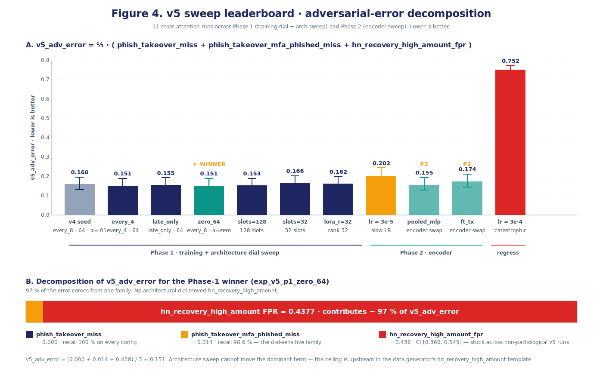

# The Eval Strategy

**Whitepaper companion document · v1.2 · 2026-05-22**

This document covers the evaluation pipeline used across all three sweep generations (v3, v4, v5): the three eval modes, the three eval-set sizes, the headline metric and its three-generation evolution (`metric_version` 1 → 2 → 5), the tie-aware exact-target operating-point computation that anchors every CI bound, the bootstrap-CI derivation, and the leakage-control regime applied at eval time.

It is one of four companion deep-dives behind the master whitepaper (`00-whitepaper-main.md`). The other three are data curation (`01-data-curation-and-distribution.md`), the agentic harness (`02-agentic-experiment-harness.md`), and the cross-attention experiments (`04-cross-attention-experiments.md`).

The evaluation strategy is, alongside the harness and the data pipeline, the third pillar of the methodology contribution. Two of the most consequential findings in the POC — the v3 AUC-saturation pivot at Day-1 evening and the v3 sklearn-cliff metric correction at Day-2 second-half — were eval-pipeline findings, not architecture findings. The fact that they were caught (and rolled forward via a rescore rather than a retraining pass) is a property of the eval design.

---

## 1. Three eval modes

The synthetic dataset has three token families with different visibility regimes (`01-data-curation-and-distribution.md` §2). Two of them — bucketed feature tokens and PII-fencing tokens — are *always* visible at eval. The third — journey/actor structural tokens — is *eval-mode-controlled* (Figure 3D). The three eval modes are:

- **`stripped`** — all `<journey_*>` and `<actor_*>` tokens removed from the input. The model has to infer journey type from the narrative + bucketed features + event stream. **This is the headline eval mode.** Every reported result in the whitepaper is `stripped`-mode unless noted otherwise.
- **`opaque`** — journey/actor tokens replaced with neutral random IDs (e.g., `<journey_type_a3f>` instead of `<journey_phish_takeover>`). The structural information is preserved (the model knows there *is* a journey type and an actor type), but the label is hidden. This is the secondary eval mode; it answers "does the model use the structural-token shape, or does it actually need the labels?"
- **`full`** — all tokens visible, including journey and actor labels. **Debug only.** Never reported as a win condition. Used to confirm the model *can* solve the task when it sees the label (a saturation sanity-check); a model that fails on `full`-mode eval has a deeper problem than a stripped-mode failure.

Training applies one of the three modes per example via **eval-mode dropout** (`src/train/mixers/eval_mode_dropout.py`) with probabilities 50% (full) / 25% (opaque) / 25% (stripped). The 50% full-mode weight ensures the model also learns to use the journey/actor tokens when they are present; the 25%/25% stripped/opaque weights ensure stripped-mode eval is *in-distribution* rather than OOD. Without eval-mode dropout, stripped-mode eval would measure how a model trained on full-token inputs handles a distribution shift; with it, stripped-mode eval is measuring how a model trained on the mixed distribution handles the no-label case.

Per-experiment, the launcher writes three blocks of per-mode results into `runs/exp_NNN/ci_report.json`: a `stripped` block (the headline), an `opaque` block (secondary), and a `full` block (debug). The `experiments.jsonl` row stores `auc_stripped`, `auc_opaque`, `auc_full`, `hn_fpr_worst_stripped`, `hn_fpr_ci_stripped`, etc. for each mode. The launcher's `update_sweep_state` ranks against `*_stripped` only.

---

## 2. Three eval-set sizes

Three eval sets form a ladder, used at different points in the experimental cycle:

| Eval set | Size | Source | Used for |
|---|---|---|---|
| **Fast** | 5,000 (v3) / 5,002 (v4/v5) | Stratified slice of the LLM-narrated training pool | Every experiment: AUC, R@FPR@1%, worst-family HN-FPR |
| **Diagnostic** | 15,000 | LLM-narrated, eval-only generation | Used in v3 Day-1 to confirm AUC saturation was not eval-size-specific |
| **Medium-templated** | 50,000 | Templated-narrative + verdict footer (no LLM calls) | Backstop; built but not exercised in v3/v4/v5 |
| **Medium-LLM-narrated** | 50,000 | LLM-narrated, eval-only generation (same generator as the 5k fast eval, scaled 10×) | Recommended next test for the v5 Phase-1 winner |

**Two 50k surfaces exist.** A *templated* medium eval at `data/eval_medium_50k/` (free to produce — no LLM calls) and an *LLM-narrated* medium eval at `data/eval_medium_50k_llm/` (built but not yet scored on the v5 winner). The recommended next test is to score the v5 Phase-1 winner on the **LLM-narrated** 50k eval; that is the surface that would tighten the per-family CI on `hn_recovery_high_amount` from ~0.18 width to ~0.06 width (roughly 3× tighter), and is the most direct way to defend the v5 ceiling claim under a larger sample. The templated 50k remains as a free, broader-coverage backstop.

Why four sizes (5k LLM + 15k LLM + 50k templated + 50k LLM-narrated)? Two reasons. First, the 5k LLM-narrated surface is expensive to produce (~$2.03 for the 25k training pool at `gpt-5-nano-2025-08-07` rates; the 50k LLM-narrated eval cost ~$4 to build). The 50k templated medium-eval is free (no LLM calls; uses a deterministic per-journey template generator). The size ladder is a cost-controlled CI-tightening strategy. Second, the templated medium-eval has subtly different distribution properties than the LLM-narrated fast eval — the templated narratives are more uniform in style — so the LLM-narrated 50k is the right surface for tightening the v5 ceiling claim with statistical confidence.

The v3 plan documented the three smaller sizes; v3 only used the fast and diagnostic. v4 and v5 used only the fast. Both 50k surfaces are available for the next sweep generation; the LLM-narrated 50k is the recommended next test.

---

## 3. The headline metric across three generations

The headline metric pivoted three times. Each pivot was driven by a finding that the prior metric was reporting the wrong thing.

### 3.1 metric_version 1 — worst-family HN-FPR @ 1% legit-FPR (sklearn boundary rule)

The original v3 metric. Computed as: for each model, sweep the decision threshold to achieve a 1% false-positive rate on the legitimate-traffic subset. At that threshold, compute the per-family false-positive rate on each hard-negative family. Report the *worst* family's FPR as the headline.

```python
from sklearn.metrics import roc_curve

def recall_at_fpr_v1(scores, labels, target_fpr):
    fpr, tpr, thresholds = roc_curve(labels, scores)
    # sklearn's "largest achievable FPR <= target" rule
    idx = np.searchsorted(fpr, target_fpr, side='right') - 1
    return tpr[idx], thresholds[idx]
```

This is what sklearn's `precision_recall_fscore_support`-adjacent rule does by default. It returns the largest threshold for which the legit FPR is *at most* the target. The rule is fine for continuous score distributions, but breaks down when the model produces bimodal scores with large tied masses at the operating-point boundary.

### 3.2 The v3 Day-2 sklearn-cliff finding

The v3 first-cut Day-2 leaderboard had `event_only` apparently outperforming all three LM baselines by 5–7×:

```
event_only:           worst HN-FPR = 0.00820  (hn_account_recovery)
structured_as_text:   worst HN-FPR = 0.04508  (hn_account_recovery)
lora_text:            worst HN-FPR = 0.05444  (hn_large_purchase)
```

A Codex review (`review/018-day-2-baseline-findings/comments.txt`) caught the artifact. The reproduction:

- `event_only`'s score distribution is bimodal with a *large tied mass* near the operating-point boundary. The model converged to train loss ~1e-5, producing nearly identical scores for many examples.
- Under sklearn's "largest FPR ≤ target" rule, `event_only`'s threshold landed at -8.484, with achieved legit-FPR = **0.114%** (a tenth of the 1% target).
- `structured_as_text`'s threshold landed at -9.625, with achieved legit-FPR = 0.914%.
- `lora_text`'s threshold landed at -3.625, with achieved legit-FPR = 0.971%.

The three models were being measured at materially different operating points on the legit-FPR axis. `event_only` was being graded at roughly a tenth of the legit-FPR budget the LM baselines were given. The 5–7× advantage was an artifact of the threshold-selection rule, not of the model.

This was a Day-2 finding that, had it been missed, would have steered the auto-loop into training a full cross-attention model against an invalid baseline (`event_only`) for at least half a day. The Codex review caught it before the next launch. The fix was metric_version: 2.

### 3.3 metric_version 2 — tie-aware exact-target HN-FPR

The corrected v3 metric, formalized in `eval/score_risk.py::compute_all` and `eval/score_risk.py::hard_negative_fpr`. The change: instead of taking the largest threshold for which legit-FPR ≤ target, walk descending scores until cumulative legit count *equals exactly* `target_fpr × n_legit` (kept as a float, not rounded), then weight tied-at-threshold rows by an `alpha` fraction.

Worked example. Suppose `n_legit = 3500`, `target_fpr = 0.01`, so `target_count = 35.0` (kept as float). Walk legit scores descending:

```
score=4.2  cum_legit=10  (count of legit examples with score ≥ 4.2)
score=4.1  cum_legit=24
score=4.0  cum_legit=33  (just below target)
score=3.9  cum_legit=42  (just above target — boundary)
```

The threshold is `T = 3.9`. We need to allocate `target_count - n_above = 35.0 - 33 = 2.0` of the tied rows (those with score exactly 3.9) to "above threshold" to hit the exact target. The number of legit rows tied at exactly `T = 3.9` is `n_tied = 42 - 33 = 9`. The allocation fraction is `alpha = 2.0 / 9 = 0.2222`.

Per-family HN-FPR is then computed as:

```python
def hard_negative_fpr_at_threshold(scores, hn_labels, T, alpha):
    above = (scores > T)
    at = (scores == T)
    n_above_hn = above[hn_labels].sum()
    n_at_hn = at[hn_labels].sum()
    n_hn = hn_labels.sum()
    return (n_above_hn + alpha * n_at_hn) / n_hn
```

This weights tied-at-threshold rows by `alpha` so the operating point is exact regardless of score-distribution cliffs. The metric emits `(threshold, alpha, achieved_fpr, n_above, n_tied, tie_fraction)` per row, so every CI bound is verifiable from JSON.

The metric correction was applied via `scripts/rescore_baselines.py`, which re-derives v2 metric values from on-disk predictions without retraining. v1 rows remained in `experiments.jsonl` for audit; the launcher's `update_sweep_state` filters to `metric_version >= 2` at read time. The corrected v3 leaderboard:

```
structured_as_text_v2:  worst HN-FPR = 0.0507  CI [0.0408, 0.0635]  hn_account_recovery
xattn_round1_002_v2:    worst HN-FPR = 0.0524  CI [0.0420, 0.0647]  hn_account_recovery
lora_text_v2:           worst HN-FPR = 0.0701  CI [0.0564, 0.0847]  hn_large_purchase
event_only_v2:          worst HN-FPR = 0.0730  CI [0.0667, 0.0799]  hn_account_recovery
```

`event_only` is now last, not first. The 5–7× advantage dissolved.

### 3.4 metric_version 5 — v5_adv_error decomposition

The v5 metric, used after the v4 pivot introduced two new adversarial cross-modal families. The v4 finding was that cross-attention won on the *adversarial* families (`phish_takeover` and `phish_takeover_mfa_phished`) and failed alongside text-only on the *adversarial-legitimate* family (`hn_recovery_high_amount`). The v5 primary metric collapses these into a single scalar:

```
v5_adv_error = (1/3) × (  phish_takeover_miss
                        + phish_takeover_mfa_phished_miss
                        + hn_recovery_high_amount_fpr )
```

where each component is computed at the 1%-legit-FPR operating point with the same tie-aware exact-target machinery as metric_version: 2. The three components are:

- **`phish_takeover_miss`** = 1 − recall at the target operating point on the `phish_takeover` family. Lower is better.
- **`phish_takeover_mfa_phished_miss`** = 1 − recall at the target operating point on `phish_takeover_mfa_phished`. Lower is better.
- **`hn_recovery_high_amount_fpr`** = HN-FPR at the target operating point on `hn_recovery_high_amount`. Lower is better.

The choice of components is deliberate: these are the three v4 adversarial families where the modality gap matters. `phish_takeover` is the larger adversarial fraud family that text-only mostly misses (recall 0.1122); `phish_takeover_mfa_phished` is the smaller, harder adversarial fraud family that text-only entirely misses (recall 0.0000); `hn_recovery_high_amount` is the adversarial-legitimate family. The composite tracks "performance across the families where the v4 design demands cross-modal reasoning."

Bootstrap CIs propagate by resampling the underlying score table and recomputing the three components per resample, then re-averaging. Per-component CIs are also reported in `runs/exp_NNN/ci_report.json` for diagnostic decomposition. The v5 Phase-1 winner `exp_v5_p1_zero_64` had:

```
v5_adv_error                       = 0.1506  CI [0.1238, 0.1871]
  phish_takeover_miss              = 0.0000  CI [0.0000, 0.0000]
  phish_takeover_mfa_phished_miss  = 0.0141  CI [0.0000, 0.0476]
  hn_recovery_high_amount_fpr      = 0.4377  CI [0.3601, 0.5449]
```

97% of the composite metric comes from a single family — `hn_recovery_high_amount` (Figure 4B). This is the headline v5 finding: within the 11-run v5 sweep on the 5k clean eval (this family has n=78, per-family CI width ~0.18), no tested architectural dial moved this component beyond bootstrap-CI noise. The strength of the "ceiling" claim is bounded by the small per-family sample; the recommended next test is to score the v5 winner on the 50k LLM-narrated eval at `data/eval_medium_50k_llm/`, which tightens the per-family CI ~3×.



### 3.5 Why this is the right composite

A composite metric is dangerous if it averages over uncorrelated quantities. The v5 components are not uncorrelated; they are deliberately co-designed (`01-data-curation-and-distribution.md` §3.4). `phish_takeover_mfa_phished` is the fraud-dual of `hn_recovery_high_amount`: one is fraud-that-looks-legit, the other is legit-that-looks-fraud. Both stress-test the same architectural pathway (text-stream → cross-attention → event-stream disambiguation). Averaging them produces a single number that tracks the architecture's ability to handle cross-modal adversarial pairs, which is exactly what we want a v5 ranking metric to optimize for.

The component-wise CI report exists precisely to catch the failure mode where the composite hides a divergent signal. In v5, the report shows that two of three components are at noise floor (`phish_takeover_miss = 0`, `phish_takeover_mfa_phished_miss = 0.014`) and one is stuck at 0.44 — a useful decomposition that the scalar `v5_adv_error` alone would not reveal.

---

## 4. Bootstrap confidence intervals

Every reported metric, in every metric_version, carries a 1000-resample bootstrap 95% CI. The implementation is in `eval/bootstrap_ci.py`. The recipe:

1. **Resample.** Draw `n` samples with replacement from the predictions table (where `n` is the original eval-set size).
2. **Recompute the metric on the resample.** Critically, this includes recomputing the tie-aware exact-target operating-point per resample. The `(threshold, alpha)` pair is *not* held fixed across resamples — different resamples will have different score distributions and different optimal threshold-allocation pairs.
3. **Repeat 1000 times.** Empirically, 1000 resamples is sufficient for stable 95% CIs at the metric-magnitude scale we report (CI widths on the order of 0.01–0.07).
4. **Report point estimate and 2.5th / 97.5th percentiles.** Default 95% confidence; the `confidence` field in `ci_report.json` records the actual setting.

The recomputation-per-resample is essential. A naive bootstrap that holds the threshold fixed (computed once on the original sample) would systematically underestimate the CI width because the metric's variance includes operating-point uncertainty as well as score uncertainty. The launcher's bootstrap pipeline correctly attributes both.

For the v5_adv_error composite, the bootstrap propagates by resampling once and computing all three components from the same resample, then averaging. Per-component CIs are reported alongside the composite CI for diagnostic decomposition.

**The launcher's bootstrap is computed inline as part of the 10-step pipeline (`02-agentic-experiment-harness.md` §3 Step 7), not as a post-hoc analysis.** Every row in `experiments.jsonl` carries its CI bounds when it is appended. There is no rerun, no separate analysis pass, no risk of CI drift from running the bootstrap differently on different days.

---

## 5. Per-family error decomposition

The eval pipeline reports per-family numbers for every hard-negative family and every fraud family, in addition to the worst-family roll-up. The per-family report for the v5 Phase-1 winner (in `experiments.jsonl::hn_fpr_per_family_stripped` and `per_journey_auc_stripped`):

```
Fraud families (recall at 1% legit FPR):
  cred_stuff:                       1.0000
  sim_swap:                         1.0000
  phish_takeover:                   1.0000
  phish_takeover_mfa_phished:       0.9859  (= 1 − 0.0141 miss)
  malware_rat:                      1.0000
  mule_chain:                       1.0000

Hard-negative families (FPR at 1% legit FPR):
  hn_account_recovery:              0.0000
  hn_large_purchase:                0.0020
  hn_recovery_high_amount:          0.4377  ← bottleneck
  hn_travel:                        0.0000
```

Three things to read off this table:

1. **AUC saturation and per-journey breakdown.** On the `stripped` mode, per-journey AUC is uninformative — every non-HN family saturates at 1.000. The discrimination is decided entirely on the three hard-negative families. This is true across the v3, v4, and v5 generations.
2. **Per-family CI tightness.** The bootstrap CI on `hn_recovery_high_amount` for this run is `[0.3601, 0.5449]` — a width of 0.18, much wider than the composite CI of `[0.1238, 0.1871]`. This is the small-sample noise on the 78-row hard-negative family in the 5k eval. The **LLM-narrated 50k eval** at `data/eval_medium_50k_llm/` (already built, not yet scored on the v5 winner) would tighten the per-family CI roughly 3×.
3. **The composite hides nothing.** v5_adv_error is the mean of three error rates, and the per-family report shows exactly which family is driving the composite. No "the metric went up but I don't know why" failure mode.

---

## 6. Leakage controls at eval time

The data-side leakage controls (`01-data-curation-and-distribution.md` §5) handle generation-time prevention and post-generation detection. The eval-side leakage controls handle the last line of defense.

### 6.1 The clean-eval mask

`eval/leakage_checks.py::compute_clean_eval_mask` drops any eval row whose `text_hash` or `structured_events_hash` appears in the training set. The mask is applied automatically by the launcher (`scripts/run_next_experiment.py::run_post_processing`) for every new run.

In v3, this mask dropped **534 of 5,000 rows** (10.7%) due to the narrator-cache leakage discovered on Day-2. The remaining 4,466 rows formed the v3 clean eval. In v4 (with the narrator-prompt-version fix in the cache key + the structured-events-hash stratification + the text-hash dedup invariant), the mask drops **0 of 5,002 rows**. The eval surface is clean by design, not by post-hoc filtering.

### 6.2 The narrative-leakage scan

`eval/leakage_checks.py::narrative_leakage_scan` runs a regex over the narrator's output to detect explicit class names (`fraud`, `legit`, `ATO`, `phishing`, etc.) and quantifying paraphrases of bucketed feature tokens (40+ patterns covering amount, device, IP, recipient, velocity, auth, session families — the patterns are documented in `01-data-curation-and-distribution.md` §3.4). Non-compliant narratives are flagged at generation time and regenerated. The scan is also run at eval time as a backstop.

### 6.3 The per-experiment leakage record

Every run records its leakage state inline on the `experiments.jsonl` row via five fields: `leakage_clean` (bool — the launcher's assertion that the run was evaluated on a clean surface), `clean_eval_n` (post-mask eval set size, 5,002 in v4/v5), `clean_eval_dropped` (count of rows excluded by the mask, 0 in v4/v5), `clean_eval_mask_text_overlap` (rows dropped by the text-hash overlap check), and `clean_eval_mask_events_overlap` (rows dropped by the structured-events-hash overlap check). Any `leakage_clean: false` row would have triggered a halt; none did in v4 or v5.

### 6.4 Schema versioning

`sweep_state.yaml` reports `schema_version: 2` in v3, post-correction. The schema includes a `metric_definition` block that documents the tie-aware exact-target semantics, the `clean_eval_n` and `clean_eval_dropped` row counts, and the per-row `(threshold, alpha, achieved_fpr, n_above, n_tied, tie_fraction)` diagnostic fields. v5 reports `schema_version: 5` with the same structure plus the `v5_adv_error` component definitions. The schema is self-describing; a fresh reader of `experiments.jsonl` can derive the metric without external context.

---

## 7. What the eval pipeline got us

Across the three sweep generations:

- **Two mid-POC metric corrections rolled forward without retraining.** v1 → v2 via `scripts/rescore_baselines.py` (re-applies the tie-aware metric to predictions on disk). v2 → v5 via the trainer's `evaluate.py` (re-scores the v4/v5 predictions with the composite). No retraining was needed for either; the eval pipeline is independent of the trainer.
- **Every reported number carries a 95% bootstrap CI from a 1000-resample bootstrap.** No post-hoc CI computation; the CI is on the same `experiments.jsonl` row as the point estimate.
- **The clean-eval mask dropped 534 / 5,000 (10.7%) of rows in v3 and 0 / 5,002 in v4/v5.** The v4 data-pipeline changes are visible in this number; the leakage was a v3 problem that the eval pipeline caught and remediated.
- **Operating-point diagnostics are first-class.** Every CI bound has a `(threshold, alpha, achieved_fpr, tie_fraction)` tuple in `ci_report.json`. A reader can verify any single CI by looking at the score table and the operating-point spec.
- **AUC saturation was diagnosed in 4 hours on v3 Day-1 evening.** The diagnostic took: read `score_stripped.json` for the smoke run (AUC = 0.993), read `diagnostic_15k_score_stripped.json` for the 15k eval (AUC = 1.000), confirm the saturation was not an eval-size artifact, and pivot the headline metric. The fast turnaround was possible because the eval pipeline produces AUC + R@FPR + per-family numbers for every run; the headline metric pivot was a one-line change to `update_sweep_state`'s ranking logic.

---

## 8. What the eval pipeline did *not* do

**It did not catch the v3 narrator-cache leakage at generation time.** That finding came from a manual code audit during the Codex review pass. The eval pipeline's `compute_clean_eval_mask` caught the leakage *retroactively* — it dropped 534 rows — but the leakage itself was not predicted by the eval design. The fix (v4) had to happen in the data pipeline. The eval pipeline is the last line of defense, not the first.

**It did not validate against a real production replay.** The 5k LLM-narrated fast eval and the 50k templated medium-eval are both synthetic. The recommended next experimental step (`04-cross-attention-experiments.md` §8) is to run the v4 leader configuration against a held-out anonymized window of real fraud-and-legit traffic. Until that happens, the eval is on a generator-shaped surface; the generator's ceiling on `hn_recovery_high_amount` (~44% FPR across all v5 configurations) might be tighter, looser, or differently-shaped on real data.

**It did not include calibration metrics.** AUC, R@FPR@1%, R@FPR@0.1%, worst-family HN-FPR, v5_adv_error — all are discrimination metrics. The eval pipeline does not report Expected Calibration Error, Brier score, or any calibration-shape metric. For a production fraud system, calibration matters as much as discrimination; we deferred it.

**It did not test out-of-distribution robustness.** The eval surface is stratified-from-train, so the model is evaluated on the same distribution it was trained on (modulo the eval-mode dropout regime that handles in-distribution mode-shift). The eval pipeline does not test held-out actor types, held-out journey families, or temporal shift. The data-redesign recommendation for v6 (`agent-native-journey-families-plan.md`) addresses this.

---

## 9. Reproducibility

The full eval pipeline is reproducible from a fresh clone given the predictions on disk:

```bash
# Re-derive the v3 v2-rescored leaderboard (idempotent).
python3 scripts/rescore_baselines.py --auto-detect

# Run the bootstrap CI on a single run's predictions.
# (metric_version is read from the predictions file's metric_version field;
# the CLI does not accept a --metric_version flag — see `python3 -m eval.bootstrap_ci --help`.)
python3 -m eval.bootstrap_ci \
  --predictions src/auto_research/runs/exp_v5_p1_zero_64/predictions_stripped.jsonl \
  --out src/auto_research/runs/exp_v5_p1_zero_64/ci_report_stripped.json \
  --resamples 1000 --confidence 0.95

# Run the clean-eval mask diagnostic.
python3 -m eval.leakage_checks --train-eval-overlap data/train_llm_narrated_v4

# Self-test the tie-aware metric implementation.
python3 -m eval.score_risk --selftest
python3 -m eval.bootstrap_ci --selftest
```

The selftests assert the tie-aware metric matches a hand-computed reference on synthetic score tables. The diagnostic scripts assert the leakage counts match the recorded `clean_eval_mask_text_overlap` and `clean_eval_mask_events_overlap` fields on each `experiments.jsonl` row.

---

## 10. References

- **Companion documents in this whitepaper set:** `00-whitepaper-main.md`, `01-data-curation-and-distribution.md`, `02-agentic-experiment-harness.md`, `04-cross-attention-experiments.md`.
- **Implementation:** `eval/{score_risk, bootstrap_ci, leakage_checks, eval_modes}.py`, `scripts/rescore_baselines.py`.
- **Detailed metric-correction record:** `docs/day-2-results.md` (the formal v3 Day-2 narrative with the sklearn-cliff postmortem) and `review/018-day-2-baseline-findings/`, `review/019-plan-review-baseline-correction/`, `review/020-baseline-correction-implementation/` (the Codex review chain).
- **Internal references:** the `metric_version: 2` and `metric_version: 5` schema definitions in `sweep_state.yaml::metric_definition`; the per-run `ci_report.json` files in `src/auto_research/runs/exp_*/`.
- **External:** DeLong et al. (1988) for the tie-aware AUC formulation that inspired the operating-point computation; sklearn's `roc_curve` documentation for the "largest achievable FPR ≤ target" rule we replaced.
