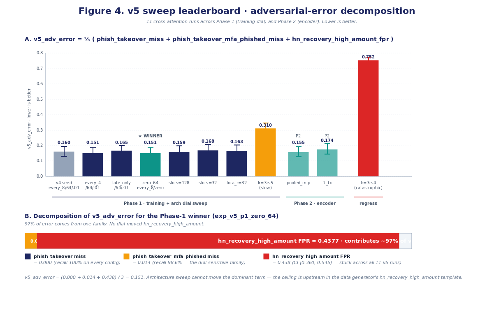

\thispagestyle{empty}

\vspace*{1.5cm}

\begin{center}
\Huge\textbf{Cross-Attention for Account-Takeover Detection}\\[0.6em]
\Large\textit{Executive Edition — An Abridged Briefing}\\[1.5em]
\large Arun Menon \\
Foundation Science · PayPal \\[0.8em]
\normalsize v1.0 (executive edition) · 2026-05-25 \\[1.5em]
\end{center}

\vspace{0.4cm}

\begin{center}
\large\textbf{The bet, in one paragraph}
\end{center}

Account-takeover (ATO) detection has two natural views of every session — an analyst-style narrative of what happened, and the raw structured log of events that produced it. Large language models read narratives well; the structured event stream is where the fraud signal historically lives. This work asks whether **Flamingo-style gated cross-attention** — a frozen language model that attends to a side-stream of structured events through inserted gated layers — can bridge that gap. The deliverable is two things: a **reusable agentic research system** that prevented us from drawing false conclusions, and a **synthetic-eval architectural win for cross-attention** that the system surfaced after correcting a data-side flaw in the first generation. All results are on synthetic data; production transfer is explicitly not claimed.

\begin{center}
\textit{The loop is the durable asset. Cross-attention is a validated synthetic case study — not yet a production claim.}
\end{center}

\newpage

# Executive summary

A one-page take. Each line is supported by the comprehensive whitepaper (linked in §6).

- **What we built.** A research system where an AI agent picks the next experiment to run, and a strict Python script does everything else around it — validates the config, locks the GPU, launches the training job, parses the metrics, computes confidence intervals, and writes one tamper-proof line to a history log. We paired it with a leakage-controlled synthetic ATO dataset and an evaluation pipeline that reports honest confidence intervals on every number. This system is the **reusable artifact** — the part of the work that should outlive the specific model we tested.

- **What we tested.** Whether a frozen language model (Qwen3-8B) can do better at spotting fraud when it has access to two views of every session simultaneously: the narrative and the structured events. The mechanism is *gated cross-attention*, the recipe from DeepMind's Flamingo (originally designed for vision-language). v3 compared cross-attention against four baselines (`CPT-light-merged`, `LoRA-text-only`, `structured-as-text concat`, and an `event-only classifier`); the load-bearing comparison was against **structured-as-text** — the same frozen LM with the event stream serialized into the prompt. v4 introduced the cleaner **text-only baseline** under byte-identical LM prompts (same prompt, with vs. without the side stream); that is the comparison used for the v4 and v5 architectural claims.

- **How the test is set up.** The dataset is ~25,000 synthetic ATO sessions for training and a held-out eval of ~5,000 sessions, each one a *pair* — the structured event timeline (logins, transactions, device changes, password resets, with bucketed features like `amount_bucket=high`) on one side, and the analyst narrative on the other. Sessions belong to *scenario families* — legitimate logins, legitimate account recoveries, phishing-driven takeovers, and so on — and the eval is stratified so each family is represented in proportion.

- **What happened — three sweep generations, three different stories.**
    1. **v3** (the 3-day proof-of-concept) ran 18 cross-attention configurations and produced a **null result** — no separation from the load-bearing `structured-as-text` baseline (cross-attention 0.0524 vs. baseline 0.0507 on worst-family HN-FPR; confidence intervals overlap heavily). A code audit traced that null to a *bug in how the synthetic data was generated*: the LLM that wrote the narratives could see the structured events, so it ended up describing them in the text — leaving cross-attention with no extra information to fetch.
    2. **v4** fixed the data pipeline and added two intentionally hard scenario families to stress-test the architecture. The same cross-attention configuration now produced a **CI-separated win**: detection of `phish_takeover` jumped from 11% to 100%; detection of `phish_takeover_mfa_phished` (the harder case where the phisher also captured the MFA code) jumped from 0% to 97%.
    3. **v5** ran 11 architectural variations on the v4 data and confirmed the win is **dial-robust** across gate initialization, layer insertion density, resampler capacity, LoRA rank, and side-stream encoder family. It also exposed a new ceiling: one family of legitimate sessions (`hn_recovery_high_amount` — large-amount account recoveries) where cross-attention falsely flagged ~44% as fraud. *No architectural change moved that number.* The ceiling is upstream, in the synthetic data generator — not in the architecture.

- **What we learned.** The cross-attention architecture works **when the test is set up correctly**. The research system (agent + strict-Python-script split, leakage-controlled data, honest-CI evaluation) is portable and reusable beyond this task. And the v5 ceiling is a *data finding*, not a *model failure* — the events for that family don't carry enough disambiguating signal, and no amount of architectural tuning will fix that.

- **What's next.**
    1. Test the v4 winner on a held-out window of real anonymized PayPal traffic.
    2. Regenerate the `hn_recovery_high_amount` examples so the events carry richer disambiguating signal (device-trust history, step-up-auth chain, etc.).
    3. Add a strong non-LLM baseline (XGBoost or LightGBM on the bucketed event features) so any future "cross-attention beats fraud baselines" claim is properly defended.

\vspace{0.5em}

**Bottom line.** *The cross-attention finding is the worked example; the loop is the reusable artifact.*

\newpage

# The story in three acts

This section walks through the v3 → v4 → v5 arc in slightly more detail than the executive summary. Each generation tracks on-disk artifacts (`experiments.jsonl` rows, `data/train_llm_narrated_v*/` pools, `metric_version: {1, 2, 5}` schemas) so every claim is reproducible.

## Act I — v3: the honest null

The original 3-day proof-of-concept ran **18 cross-attention configurations** against four baselines (`CPT-light-merged`, `LoRA-text-only`, `structured-as-text concat`, and an `event-only classifier`). The load-bearing comparison was against the `structured-as-text` baseline — the same frozen LM with the event stream serialized into the prompt. The headline number — worst-family hard-negative false-positive rate at 1% legitimate-FPR — landed at **0.0524** [CI 0.0420, 0.0647] for the cross-attention leader and **0.0507** [CI 0.0408, 0.0635] for the `structured-as-text` baseline. The confidence intervals overlap heavily; cross-attention was statistically tied (and +0.0017 absolute *worse* on the point estimate). No measurable lift. The default interpretation would have been "cross-attention doesn't help for fraud."

The agentic research loop is what prevented us from stopping there. The harness wrote every configuration's full result row to an immutable history, with bootstrap confidence intervals on each number; a Codex code review of the eval pipeline caught a sklearn boundary-rule artifact (`metric_version: 1 → 2`); and a per-family decomposition revealed that v3's `event_only` baseline was solving a different problem than cross-attention was — the structured event tokens already carried so much signal that even a feature-level classifier hit near-perfect accuracy on the hard-negative families. The "ceiling" wasn't a model-capability bound; it was a measurement artifact.

A second code audit then found the actual cause: the LLM that wrote v3's narratives **could see the structured events while writing**, so it ended up paraphrasing the bucketed fraud-signal features (`amount_bucket=high`, `device_age=new`, `recipient_age=newly_added`) directly into the prose. The two views the cross-attention architecture was meant to combine ended up carrying the same information — there was nothing unique for the structured side to contribute.

*The v3 null was a data artifact, not an architecture verdict.*

## Act II — v4: the data pivot and the architectural win

The v4 pivot was a redesign of the synthetic dataset, not of the architecture. Four changes:

1. **Stripped the narrator's view of bucketed feature tokens** — the narrator now sees only event types and timing, not the quantitative buckets that carry the fraud signal.
2. **Re-implemented hard-negative templates to sample feature signatures from distributions**, breaking the label-deterministic feature-level discrimination that v3's templates inadvertently created.
3. **Added two adversarial cross-modal families** specifically designed to require both views to disambiguate — `hn_recovery_high_amount` (legitimate but text-reads-fraud) and `phish_takeover_mfa_phished` (fraud but text-reads-safe).
4. **Refactored trainer dataloading** so `text_only`, `structured_as_text`, and `xattn` arms receive byte-identical LM prompts modulo the presence/absence of the side stream — the only thing the architecture comparison turns on.

The result of re-running the same cross-attention configuration on v4 data was a CI-separated win:

\vspace{0.5em}

| Scenario family                  | Text-only baseline | Cross-attention      | $\Delta$ recall |
|----------------------------------|-------------------:|---------------------:|----------------:|
| `phish_takeover`                 |              0.11  | **1.00** [1.00, 1.00] |          +0.89  |
| `phish_takeover_mfa_phished`     |              0.00  | **0.97** [0.93, 1.00] |          +0.97  |

\vspace{0.5em}

The confidence intervals around the old and new numbers do not overlap — the standard test for "this is a real change, not random noise." The architecture's gate magnitudes ran at ~0.022 (well below Flamingo's image-text regime of 0.1–1.0): **sparse, but effective**.

## Act III — v5: dial-robust, with a data-shaped ceiling

The v5 sweep ran **11 architectural variations** on the v4 data, testing whether the v4 win was an artifact of one specific configuration or a robust property of the architecture. The variations covered gate initialization (zero, small\_0.01), insertion density (every\_4 / every\_8 / late\_only), resampler capacity (64 / 128 latents), LoRA rank (16 / 32 / 64), and side-stream encoder family (`small_transformer` / `pooled_mlp` / `ft_transformer`). **The v4 win held across all of them.**

The Phase-1 winner was `exp_v5_p1_zero_64` — a tuned variant of the v4 seed using `gate_init=zero` instead of `small_0.01`. The headline metric (`v5_adv_error`, the average of three adversarial-error components) was **0.1506** with bootstrap CI **[0.1238, 0.1871]**.

But v5 also exposed a ceiling. The `hn_recovery_high_amount` family — large-amount legitimate account-recovery sessions that look on the surface like attacker-driven recoveries — saw cross-attention false-positive rates clustered between 0.4377 and 0.4505 across *all* non-pathological runs in the sweep. That single family contributed **97% of the total error** for the Phase-1 winner (0.146 of 0.151). **No architectural dial moved it beyond statistical noise.** The bottleneck is in the synthetic data generator: that family doesn't carry enough disambiguating signal in the events for *any* architecture to recover it.

A 50,000-row LLM-narrated eval has already been built but not yet scored on the v5 winner; its per-family confidence interval would be ~3× tighter than the 5k eval's (this family has only n=78 examples in the 5k eval, per-family CI width ~0.18). That run is the recommended next step.

\newpage

# Headline results

Two views of the same finding: the v4 architectural win (table) and the v5 sweep robustness with the per-family error decomposition (figure).

## The v4 win

\vspace{0.5em}

| Metric (5k clean eval, v4 data) | Text-only baseline | Cross-attention (v4) |
|---------------------------------|-------------------:|---------------------:|
| `phish_takeover` recall                                                    | 0.11                       | **1.00** [1.00, 1.00] |
| `phish_takeover_mfa_phished` recall                                        | 0.00                       | **0.97** [0.93, 1.00] |
| `hn_recovery_high_amount` FPR (lower is better) — *the data-shaped ceiling*| **0.42** [0.34, 0.51]      | **0.45** [0.37, 0.56] |
| Worst-family HN-FPR @ 1% legit-FPR                                         | 0.038                      | 0.027 [0.020, 0.038]  |

\vspace{0.5em}

The first two rows are the headline architectural finding — cross-attention catches adversarial cross-modal fraud that text-only cannot. The third row is the data-shaped ceiling: both arms are stuck near 0.42–0.45 false-positive rate, the confidence intervals overlap, and cross-attention is in fact +0.03 *worse* on the point estimate (but tied within CI noise). This is the row v5 then confirmed is architecture-immutable across 11 variations. The fourth row is the v3-era headline metric, rolled forward via the `metric_version: 1 → 2 → 5` evolution; cross-attention wins on that as well, but the modality-gap result on the first two rows is the cleaner architectural finding.

## The v5 sweep

{width=100%}

Each bar is one of the 11 v5 architectural variations; the y-axis is `v5_adv_error` (the average of `phish_takeover_miss`, `phish_takeover_mfa_phished_miss`, and `hn_recovery_high_amount_fpr` — lower is better). The shaded segments decompose the error by family. The blue and orange segments (the two adversarial-fraud families) are essentially solved across the whole sweep; the green segment (`hn_recovery_high_amount`) dominates every bar at roughly 44%, regardless of architectural choice. The dial-robust win and the data-shaped ceiling are both visible in a single chart.

\newpage

# What this means — and what comes next

## What we learned, plainly

1. **Cross-attention works on this task when the data lets it.** The v4 win on adversarial cross-modal fraud is the cleanest evidence we have. It's also conditional on a data pipeline that does *not* leak the structured signal into the narrative — which is what v3 inadvertently did.

2. **The bottleneck is upstream.** The `hn_recovery_high_amount` ceiling is a data finding, not a model failure. No architectural dial we tested moved it. Re-generating that family with richer event-level signal (device-trust history, step-up-auth chain, etc.) is the path forward — not a different architecture.

3. **The research loop is the durable asset.** The harness ran 30 experiments across three sweep generations with zero format drift, zero concurrency races, and zero manual reconciliation. It surfaced the v3 data pathology, drove the v4 pivot, and validated v5 robustness — all under a single ownership invariant (one writer per file). The same loop applies to any cross-modal architecture experiment we'd want to run next.

## The strategic recommendation

\vspace{0.5em}

> **Invest in the loop; validate cross-attention through data and replay, not blind architecture sweeps.** Cross-attention is now a validated synthetic case study — not a failed architecture, and not yet a production claim either. The next mile of confidence comes from two specific moves: scoring the v5 winner on the held-out 50k LLM-narrated eval to tighten the per-family confidence intervals, and replaying the v4 winner against a real anonymized PayPal traffic window. Both are *data-and-replay* investments. We do **not** recommend further architectural sweeps without those data steps; the v5 result already shows that no architectural dial moves the data-shaped ceiling. The research system that produced these findings is reusable across architectures and tasks — that is the durable asset.

\vspace{0.5em}

## What's explicitly **not** claimed

Read this before any specific number is quoted out of context:

- **Production transfer is not claimed.** All results are on synthetic data modeled on PayPal session schemas. The held-out anonymized window has not been tested.
- **A win over non-LLM baselines is not claimed.** XGBoost / LightGBM on the bucketed event features was not tested as a baseline. Any future "cross-attention beats fraud baselines" claim must be defended against this first.
- **Calibration is not claimed.** The eval is discrimination-only (recall, FPR, AUC); we do not measure ECE, Brier score, or reliability curves.

## Where to read more

The full **comprehensive whitepaper** (`whitepaper-comprehensive.pdf`, ~86 pages, ~27k words) at `cross_attn_ato_poc/whitepaper/` carries the full technical depth across five linked documents:

- *Part I* — full master narrative, related work, method, the experimental arc, results, discussion, limitations.
- *Part II* — data curation and distribution (the v3-vs-v4 pathology analysis and the 4-change pivot).
- *Part III* — the agentic experiment harness in 10 steps.
- *Part IV* — the eval strategy across `metric_version: {1, 2, 5}`.
- *Part V* — the cross-attention experiments, per-cell numbers, gate-magnitude story.

The **leadership-readout package** at `cross_attn_ato_poc/leadership-readout/` adds the 14-slide deck (`leadership-readout.pptx`) plus four companion markdowns covering the executive summary, the auto-research loop deep-dive, the cross-attention technical readout, and the integration-friction catalog. The PPTX is the meeting deliverable; this PDF is the read-on-a-flight deliverable; the markdowns are the supporting depth.

\vspace{1em}

\begin{center}
\textit{All numbers in this Executive Edition match the comprehensive whitepaper and the leadership-readout package. Discrepancies, if found, should be reported as bugs against the comprehensive whitepaper.}
\end{center}
