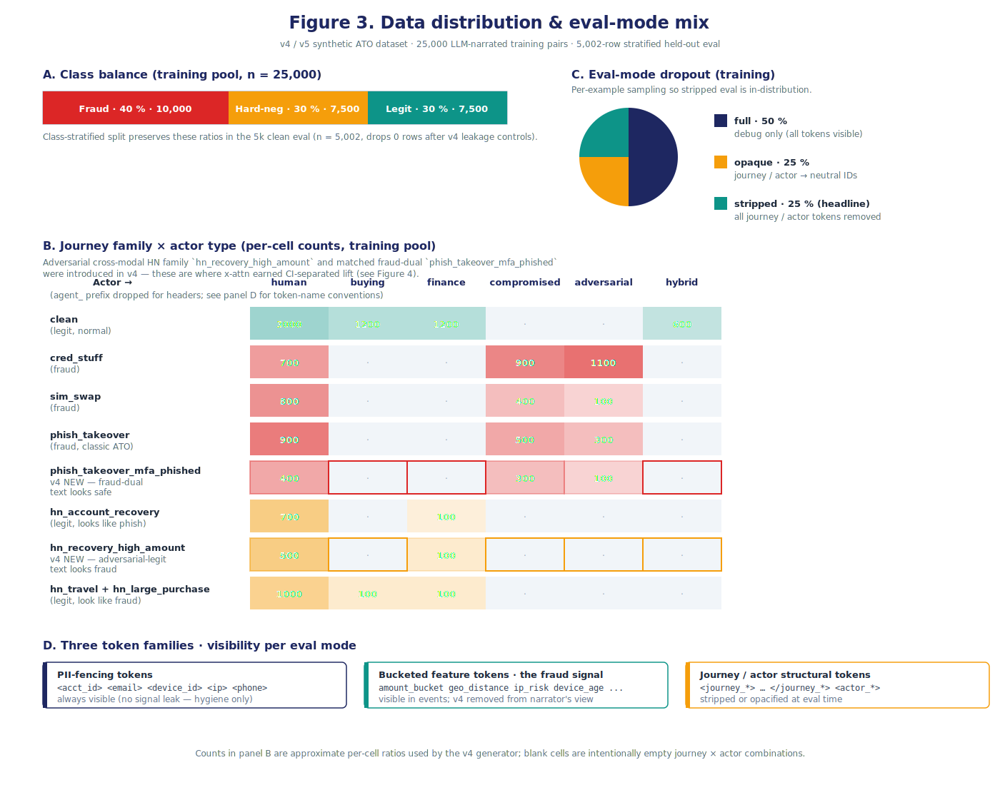
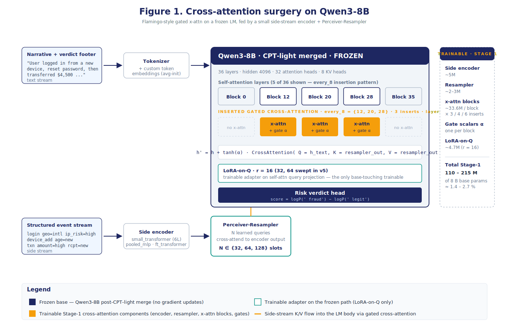

\thispagestyle{empty}

\vspace*{2cm}

\begin{center}
\Huge\textbf{Cross-Attention for Account-Takeover Detection}\\[0.5em]
\Large\textit{A Three-Generation Study Driven by an Agentic Experiment Harness}\\[2em]
\large Arun Menon \\
Foundation Science · PayPal \\[1em]
\normalsize v1.2 (comprehensive) · 2026-05-25 \\[2em]
\end{center}

\begin{center}
\large\textbf{Abstract}
\end{center}

**The question.** Account-takeover (ATO) detection has two natural views of every session — an analyst-style narrative of what happened, and a chronological log of structured behavioral events (logins, transactions, device changes, with bucketed features such as `amount_bucket=high`). Language models read narratives well; the event stream is where the fraud signal historically lives. This paper asks whether **Flamingo-style gated cross-attention** — a frozen LM that attends to a side stream of structured events through inserted gated layers — can bridge that modality gap, on a **synthetic** ATO dataset modeled on PayPal session schemas. All results are on synthetic data; production transfer is explicitly out of scope.

**The arc.** The work went through three sweep generations, which we label v3, v4, and v5 throughout the paper. **v3** was the original 3-day proof-of-concept; it returned a null result — no architectural lift over the baseline. **v4** was a redesign of the synthetic dataset, after a code audit revealed that v3's null was caused by the way the data was generated, not by the architecture (the LLM that wrote the narratives could see the structured events and ended up describing them in the text — so the two views the architecture was meant to combine ended up carrying the same information). **v5** then ran 11 variations of the architecture on the v4 data to test whether the win held up — it did, robustly — and exposed a new data-side bottleneck. The labels track on-disk artifacts (experiments.jsonl rows, dataset versions, metric schemas) so every claim is reproducible against a specific generation.

**What the paper contributes.** *First, the research system itself.* An AI agent picks the next experiment to run, and a strict Python script does everything else — validates the config, locks the GPU, launches the job, parses the metrics, computes confidence intervals, and writes one tamper-proof line to a history log. Only one piece of code is ever allowed to write to that log, so the records can't get scrambled even when the agent retries or several runs queue up. The system ran 30 experiments across the three generations with no scrambled records, no clashing writes, and no manual cleanup. *Second, what we discovered with that system about the v3 synthetic data.* Two flaws in how the data was generated had quietly made v3 unable to test what it was supposed to test: (a) the LLM that wrote the narratives could see the structured events, so it copied the fraud-signal features into the text — leaving the two views the architecture was meant to combine carrying the same information; (b) the hard-negative templates used fixed feature combinations, so a simple feature-only classifier could already separate fraud from legitimate at near-perfect accuracy — meaning the benchmark cross-attention was being compared against wasn't measuring model capability, it was measuring a template artifact. Once both flaws were fixed in the v4 data pivot, the same cross-attention configuration that produced a null result in v3 produced a clear win on adversarial cross-modal fraud. On `phish_takeover_mfa_phished` — a deliberately hard scenario family we built into the eval, where the phisher has also captured the victim's MFA code, so the narrative reads like a routine login — the **text-only baseline** (the same frozen LM reading only the narrative, with no access to the structured events) caught 0% of cases and cross-attention caught 97.2% (95% confidence interval [93.1%, 100%]; the bracketed range is the band where the true detection rate most likely sits, and its lower bound sitting well above zero is what makes the win statistically reliable rather than a lucky run). The v5 sweep then ran 11 variations of the architecture and confirmed the win held up across all of them, while revealing one stubborn family of cases (large-amount legitimate account recoveries) where no architectural change moved the false-positive rate — a data-side problem, not a model problem. The general recipe — agent-driven experiment loop, honest confidence intervals on every number, and synthetic data that gets fixed when it misleads — applies well beyond this architecture and task.

\textbf{The cross-attention finding is the worked example; the loop is the reusable artifact.}

\newpage


\newpage

# Part I — The full story end-to-end

> *MASTER NARRATIVE*
>
> Executive summary, claims-at-a-glance, how to read this paper, abstract, related work, method overview, the v3 → v4 → v5 experimental arc, results, discussion, limitations, and conclusion. Parts II–V expand the four methodological pillars in turn.

\vspace{1em}


## Executive summary

A one-page take for non-research readers; the rest of the paper supports each line.

- **What we built.** A research system where an AI agent picks the next experiment to run, and a strict Python script does everything else around it — checks the config, makes sure the GPU isn't already busy, launches the training job, parses the metrics, computes the statistics, and writes one tamper-proof line to an experiment log file. We paired it with two things we built carefully: a synthetic dataset for account-takeover (ATO) detection, and an evaluation pipeline that reports honest confidence intervals on every number. This system is the **reusable artifact** — the part of the work that should outlive the specific model we tested.
- **What we tested.** Whether a frozen language model (Qwen3-8B) can do better at spotting fraud when it has access to two views of every session simultaneously: an analyst-style narrative of what happened, and the raw log of structured events that produced that narrative. The mechanism for combining the two views is *gated cross-attention* (the recipe from DeepMind's Flamingo, originally designed for vision-language models). This is the **worked example** that puts the loop to use.
- **How the test is set up.** Each session in the synthetic dataset comes as a *pair* — the structured event timeline (logins, transactions, device changes, password resets, with bucketed features like `amount_bucket=high`) on one side, and the analyst-style narrative on the other. The dataset has ~25,000 paired sessions for training and a held-out eval of ~5,000 sessions. Every session belongs to a *scenario family* — legitimate logins, legitimate account recoveries, phishing-driven takeovers, and so on — and the eval is stratified so each family is represented in proportion. The **baseline depends on generation**. In **v3**, the load-bearing comparison was against `structured-as-text` — the same frozen LM with the structured event stream serialized into the prompt as plain text. In **v4 and v5**, after the trainer-input contract was repaired so all arms receive byte-identical LM prompts, the clean architectural comparison is `text-only` vs. cross-attention, where the only difference between arms is access to the structured side stream (text-only reads only the narrative; cross-attention also attends to the structured events through inserted gated layers). When we say cross-attention "wins over the baseline" in v4/v5, we mean: holding everything else constant, giving the model access to the structured event stream through cross-attention changes its answer for the better.
- **What happened.** **v3** ran 18 cross-attention configurations and showed no separation from the `structured-as-text` baseline (cross-attention 0.0524 vs. baseline 0.0507 on worst-family HN-FPR; confidence intervals overlap heavily) — across all 18 configurations, no measurable improvement (this is the "null result"). A code audit then traced that null to a bug in how the synthetic data was generated: the LLM that wrote the narratives could see the structured events, so it ended up describing them in the text — leaving cross-attention with no extra information to fetch from the structured side. **v4** fixed the data pipeline and also added two intentionally hard scenario families to the dataset — `phish_takeover` and `phish_takeover_mfa_phished` (the harder of the two: a phishing-driven account takeover where the attacker has also captured the victim's MFA code, so the narrative on the surface still reads like a routine login, and only the structured events reveal the fraud). The same architecture, re-run on the fixed data, produced a clean win on both families: detection jumped from 11% to 100% on the first and from 0% to 97% on the second. Both improvements were statistically clean — the confidence intervals around the old and new numbers don't overlap, which is the standard test for "this is a real change, not random noise." **v5** then ran 11 variations of the architecture (different gate settings, layer placements, resampler sizes, etc.) — and the win held up across all of them. But v5 also exposed a new problem: one specific group of legitimate sessions (large-amount account-recovery transactions) looks too much like fraud no matter what model we use; this is a *data* problem, not a model problem. The eval set has only 78 examples in this group, so our certainty is limited — a 50k-example eval set we've already built would tighten the numbers ~3× and is the recommended next test.
- **What we learned.** The system is portable. Three pieces of it — the AI-agent + strict-Python-script split, the careful synthetic data pipeline, and the honest-CI evaluation — generalize to other research questions, other architectures, other tasks. The cross-attention architecture itself works *when the test is set up correctly*: on this synthetic surface it cleanly solves the adversarial cross-modal fraud cases, and it hits a wall on a different kind of case where the data itself doesn't carry enough disambiguating signal.
- **What's next.** Three things, in order of priority: (1) test the v4 winner on a held-out window of real anonymized PayPal traffic (§8.1 has the roadmap); (2) regenerate the `hn_recovery_high_amount` examples (the legitimate big-money account-recoveries that currently look indistinguishable from fraud) so the events carry richer disambiguating signal — device-trust history, step-up-auth chain, etc.; (3) add a strong non-LLM baseline (XGBoost or LightGBM on the bucketed event features) so any future "cross-attention beats fraud baselines" claim is properly defended. Production transfer is **not claimed** in this paper.

**Bottom line.** *The cross-attention finding is the worked example; the loop is the reusable artifact.*

### How to read this paper

The paper is organized for three audience types and you can take any of them as the entry point:

- **Readers interested in the reusable research system.** Start with §3.2 (the harness in 10 steps) and Figure 2 (the dataflow). The companion Part III (Agentic Experiment Harness) is the full design document. Skim §4 only for context on what the harness was used to discover.
- **Readers interested in the model result.** Start with §4 (the v3 → v4 → v5 arc) and §5 (the leaderboard), then look at Figure 4 (sweep results with the adversarial-error decomposition). The companion Part V (Cross-Attention Experiments) has the full per-cell numbers and the gates story.
- **Readers evaluating transfer risk to production.** Start with §1.2 (claims at a glance — the table that marks production transfer, non-LLM tabular baselines, and calibration as "not claimed"), then §7 (limitations) and §8.1 (roadmap). The architectural result and the methodology contribution are both bounded by the synthetic-data caveat; the table is the most efficient way to see what *is* and *is not* in evidence.

---

## 1. Introduction

A line of recent work — Flamingo (Alayrac et al., 2022) and its descendants — frames non-textual modalities as side documents that a frozen language model attends to through inserted gated cross-attention layers. This has worked for images and video; the obvious question for risk and fraud teams is whether it works for structured behavioral event streams. The application domain is account-takeover (ATO) detection at PayPal: each session has two natural views — an analyst-style narrative of what happened, and a chronological log of structured events (logins, transactions, device changes, password resets, with bucketed features such as `amount_bucket=high` and `geo_distance=international`). Self-attention reads the narrative well; the event stream is where the fraud signal historically lives. Cross-attention is the obvious bridge.

This whitepaper documents three sweep generations of that hypothesis, the agentic experiment harness that drove every run, and the data and eval design that made the results credible. The headline outcome is twofold: a methodology contribution (the harness and the bootstrap-CI-defended evaluation pipeline that comes with it) and a result contribution (a CI-separated architectural win on adversarial cross-modal fraud, conditional on a data pipeline that does not paraphrase the side stream into the text — and a finding that, within the 11-run v5 sweep on the 5k eval, no tested architecture dial moved a separate data-shaped ceiling on the hardest adversarial-legitimate family beyond bootstrap-CI noise). Figure 2 (below) shows the loop that drove every run; it is the artifact this paper claims is most reusable beyond the specific cross-attention case study.


\setcounter{figure}{1}

{ width=100% }


The full arc is summarized in §2 (related work), §3 (method — including a deeper walk-through of the harness in §3.2), §4 (the v3 → v4 → v5 experimental arc), §5 (results), §6 (discussion), §7 (limitations), §8 (conclusion). Four companion documents go deeper on each pillar: Part II (Data Curation and Distribution), Part III (Agentic Experiment Harness), Part IV (Eval Strategy), and Part V (Cross-Attention Experiments). Four figures accompany the set: an architecture diagram (Figure 1), the loop's dataflow (Figure 2, above), data distribution and eval-mode design (Figure 3), and the v5 sweep leaderboard with bootstrap-CI decomposition (Figure 4).

### 1.1 Contributions, plainly

> **The cross-attention finding is the worked example; the loop is the reusable artifact.**

The contributions of this work, ranked by what we believe will most generalize beyond the specific architecture and task:

1. **A Karpathy-style agentic experiment harness with hard-edge guardrails.** An LLM agent proposes the next experiment as a YAML config; a deterministic Python launcher does everything else. Single-writer-per-file ownership eliminates format drift; bootstrap CIs on every reported metric (1000 resamples) are computed inline; tie-aware exact-target operating-point metrics are the default; halt conditions are explicit and configurable per phase. The harness ran 30 experiments across three sweep generations with zero out-of-band intervention. Section §3.2 and the companion document Part III (Agentic Experiment Harness) give the full design.

2. **A leakage-safe synthetic-data pipeline for cross-modal fraud detection.** Three token families (PII-fencing, bucketed feature, journey/actor structural), three eval modes (stripped, opaque, full), and three eval-set sizes (5k LLM-narrated / 15k LLM-narrated diagnostic / 50k templated medium-eval) with pre-narration structured-events-hash stratification and a post-narration text-hash dedup invariant — collectively close every leakage vector we identified across the three sweep generations. Section §3.1 and Part II (Data Curation and Distribution).

3. **A reproducible mid-POC evaluation correction.** The v3 first-cut leaderboard had `event_only` apparently outperforming the LM baselines by 5–7× on worst-family hard-negative false-positive rate. Codex code review caught the artifact: sklearn's `recall_at_fpr` uses a "largest achievable FPR ≤ target" boundary rule, which under tied score masses lands different models at materially different achieved legit-FPRs. We replaced it with a tie-aware exact-target metric (`metric_version: 2`), then evolved that into a multi-component adversarial-error decomposition (`metric_version: 5`) once the v4 data made adversarial fraud families a first-class concern. Section §3.3 and Part IV (Eval Strategy).

4. **A negative-then-positive result on Flamingo-style gated cross-attention for ATO.** v3 produced a null result that was honest but uninformative (the architecture cannot win when the structured signal is already paraphrased into the text). v4 fixed the data pipeline and produced a clean CI-separated win on two adversarial cross-modal fraud families (`phish_takeover` recall 0.11 → 1.00, `phish_takeover_mfa_phished` recall 0.00 → 0.97). v5 confirmed the win is dial-robust across 11 architecture and training configurations but exposed a new data ceiling on one adversarial-legitimate family. Section §4 and Part V (Cross-Attention Experiments).

### 1.2 Claims at a glance

Every quantitative claim in this paper, classified by strength. Read this table before any specific number elsewhere in the paper.

| Claim | Evidence | Strength | Where in paper |
| --- | --- | --- | --- |
| Harness prevents format drift, concurrency races, and out-of-band intervention | 30 runs across three sweep generations, immutable history, zero manual reconciliation | **Strong** | §3.2; `Part III §9` |
| Two mid-POC metric corrections rolled forward without retraining | `metric_version: 1 → 2 → 5` via `scripts/rescore_baselines.py` and the v5 trainer-side scoring | **Strong** | §3.3; `Part IV §3` |
| v4 cross-attention beats text-only on adversarial cross-modal fraud | CI-separated on `phish_takeover` (recall 0.11 → 1.00) and `phish_takeover_mfa_phished` (0.00 → 0.97); source `runs/exp_{text_only,xattn}_v4_001/ci_report.json` | **Strong within synthetic eval** | §4.2; `Part V §4` |
| v5 architectural dials do not move the `hn_recovery_high_amount` ceiling | 11-run sweep, FPR stuck in [0.4377, 0.4505] for all non-pathological runs | **Medium** — bottleneck family n=78 in 5k eval; per-family CI width ~0.18; 50k LLM-narrated eval (available, not yet scored) would tighten ~3× | §4.3; `Part V §5.3` |
| Production transfer (held-out anonymized window) | Not tested | **Not claimed** | §7; §8.1 roadmap |
| Beats a non-LLM tabular baseline (XGBoost / LightGBM on bucketed events) | Not tested | **Not claimed** | §7; `Part V §8` |
| Calibration (ECE, Brier, reliability) | Not measured; eval is discrimination-only | **Not claimed** | §7; §8.1 roadmap |

### 1.3 What this paper is not

**Every result in this paper is on synthetic data.** We do not generalize beyond the synthetic distribution; production transfer is explicitly out of scope. We do not claim to beat any production fraud system, nor against any non-LLM tabular baseline (XGBoost / LightGBM on bucketed features) — neither was tested. We do not propose a new cross-attention variant; the architecture is Flamingo's, applied verbatim. We do not claim the agentic harness is novel in principle (Karpathy publicly sketched the agent-proposes/script-enforces pattern); we claim that an end-to-end implementation, with the specific ownership-invariant + bootstrap-CI + tie-aware-metric instantiation we describe, was decisive in producing a reproducible mid-POC correction and an honest negative-then-positive result that a less-disciplined harness would have either missed or muddled.

---

## 2. Related Work

**Frozen LMs with cross-attention to non-text modalities.** Flamingo (Alayrac et al., 2022) introduced the gated cross-attention adapter on a frozen LM as a vision-language recipe; its design choices — a frozen base, a Perceiver-Resampler bottleneck, scalar `tanh(α)` gates initialized at zero, inserted at periodic depth in the LM stack — were adopted verbatim in our cross-attention surgery (Figure 1). Concurrent and follow-on work (BLIP-2, IDEFICS, GIT-2, OpenFlamingo) explored the same backbone for image-text and video-text; we are not aware of published work applying the same shape to structured behavioral event streams for fraud detection. The closest neighbors are tabular-foundation-model proposals (FT-Transformer; TabPFN) — we use FT-Transformer as one of three Phase-2 v5 encoder variants and find it neutral-to-negative on this task; see §5.

**Adapter-based fine-tuning on frozen LMs.** Our trainable Stage-1 footprint comprises (i) a small side-stream encoder, (ii) the Perceiver-Resampler, (iii) the inserted gated cross-attention blocks, and (iv) LoRA-on-Q with rank ∈ {16, 32, 64} on the LM's self-attention query projection. LoRA (Hu et al., 2021) is canonical; we attach it only to Q to avoid stacking adapters on a CPT-light adapter that has itself been merged into the base (one of our v3-discovered integration frictions; see Part III (Agentic Experiment Harness)).

**Agentic and autonomous experiment loops.** Karpathy popularized the "agent proposes, deterministic script enforces" pattern in talks and online writing; AutoML systems (Auto-WEKA, AutoKeras, AutoGluon) have automated hyperparameter search for two decades. Recent LLM-driven autonomous-research systems (Sakana AI Scientist; researcher-coding-agent demonstrations) sit on the propose side without the deterministic guardrail. Our harness leans toward the AutoML side on safety (single-writer-per-file, dedup tuple, configurable halt conditions) and toward the agent side on flexibility (the agent decides which dial is worth perturbing given the history). The bootstrap-CI + tie-aware-metric component is independent of the agentic layer and would compose with either.

**Operating-point-controlled evaluation under tied score masses.** sklearn's `recall_at_fpr` uses the "largest achievable FPR ≤ target" boundary rule, which under bimodal classifier outputs with large tied masses (as in our v3 `event_only` baseline) reports metrics computed at materially different operating points. Tie-aware exact-target operating-point computation has been described in the calibration and AUC-decomposition literature (DeLong et al., 1988, in the AUC variance context); we apply it inline in the bootstrap pipeline. Section §3.3 and Part IV (Eval Strategy) give the formula.

**Synthetic-data evaluation pitfalls.** A separate body of work (Schwartz et al., 2022; Caton & Haas, 2024) documents that high-fidelity synthetic data can saturate downstream metrics if the generator's structured signal leaks into the surface form available to the model. Our v3 narrative-leakage finding is an instance of this pathology; we describe the diagnostic (overlap audit + per-family hash analysis) in Part II (Data Curation and Distribution). Schemata-stratified train/eval splits (Krause et al., 2020) are a partial answer; we add a post-narration text-hash dedup invariant on top.

---

## 3. Method

### 3.1 Data


\setcounter{figure}{2}

{ width=100% }


The synthetic ATO dataset has three token families (Figure 3D):

1. **PII-fencing tokens** (`<acct_id>`, `<email>`, `<device_id>`, `<phone>`, `<ip>`, `<recipient>`, `<merchant>`, `<browser>`). Opaque placeholders carrying no signal. Always visible at eval. Hygiene, not features.
2. **Bucketed feature tokens** (`<amount_bucket=high>`, `<geo_distance=international>`, `<ip_risk=high>`, `<device_age=new>`, `<merchant_risk=elevated>`, `<txn_velocity=bursty>`, `<recipient_age=newly_added>`, `<session_dwell=extended>`, `<auth_strength=mfa_strong>`). Privacy-respecting derived features. **This is where the fraud signal lives.** Always visible at eval.
3. **Journey / actor structural tokens** (`<journey_phish_takeover>`, `<actor_agent_compromised>`, etc.). Mark the journey type and the acting party. **Stripped or opacified at eval** to prevent the model from cheating off the label.

Each training example is a paired observation: a structured event stream (consumed by the side-stream encoder) and an analyst-style narrative + verdict footer (consumed by the LM). The narrator (OpenAI `gpt-5-nano` family — v3 used the then-current alias, and v4 and v5 pin the dated snapshot `gpt-5-nano-2025-08-07` for reproducibility) was prompted to ban explicit class names ("fraud", "ATO", "phishing"); a post-generation regex scan in `eval/leakage_checks.py::narrative_leakage_scan` enforced the ban. Volume: 25,000 LLM-narrated training pairs and a 5,002-row stratified held-out eval after the v4 leakage controls drop zero rows (vs. v3, where 534 of 5,000 rows had to be excluded by `compute_clean_eval_mask` due to narrator-cache leakage; see §4.1).

**The v4 four-change pivot** (introduced in §4.2; full rationale in Part II (Data Curation and Distribution)) closed the two data pathologies the v3 sweep exposed. (i) The narrator's view was stripped of bucketed feature tokens — the narrator now sees only event types and timing, not the quantitative buckets that carry the fraud signal. (ii) Hard-negative templates were re-implemented to sample feature signatures from distributions rather than fixed signatures, breaking the label-deterministic feature-level discrimination that v3's `hn_account_recovery` family inadvertently created. (iii) Two new adversarial cross-modal families were added — `hn_recovery_high_amount` (legitimate but text-reads-fraud) and `phish_takeover_mfa_phished` (fraud but text-reads-safe) — designed to demand that the model attend to the event stream to disambiguate. (iv) Trainer dataloading was refactored so `text_only`, `structured_as_text`, and `xattn` arms receive byte-identical LM prompts modulo the presence/absence of the side stream — the only thing the architecture comparison turns on.

Distribution details, leakage controls, dataset-card schema, and the full v3-vs-v4 generator diff are in Part II (Data Curation and Distribution) and Figure 3.

### 3.2 Agentic experiment harness

Figure 2 (rendered in §1 above) shows the full dataflow. The decomposition is:

```
cron (every 30 min)
  → agent_tick.sh  (GPU-lock pre-check, 180-min timeout wrapper)
    → Claude Code CLI  (one tick)
      ├── reads:    AGENT_INSTRUCTIONS.md, sweep_state.yaml,
      │             experiments.jsonl (last 5), runs/exp_*/notes.md
      ├── proposes: runs/exp_NNN/config.yaml
      ├── invokes:  python scripts/run_next_experiment.py <config>
      │              ├── 1. whitelist validate
      │              ├── 2. canonical_hash dedup vs history
      │              ├── 3. halt-check on sweep_state.yaml
      │              ├── 4. acquire GPU lockfile
      │              ├── 5. accelerate launch train_xattn.py
      │              ├── 6. parse_metrics (stdout + W&B)
      │              ├── 7. bootstrap_ci (1000 resamples, tie-aware)
      │              ├── 8. atomic write all outputs
      │              ├── 9. append one row to experiments.jsonl
      │              └── 10. refresh sweep_state.yaml
      ├── writes:   runs/exp_NNN/notes.md (interpretation)
      └── (later)   README.md (Day-N + Final journey log)
```

The ownership invariant is hard: the launcher is the *only* writer of `experiments.jsonl`, `sweep_state.yaml`, and the structured per-run JSON artifacts (`metrics.json`, `ci_report.json`, `gate_trajectory.json`). Leakage state is recorded inline on each `experiments.jsonl` row (`leakage_clean`, `clean_eval_n`, `clean_eval_dropped`, `clean_eval_mask_text_overlap`, `clean_eval_mask_events_overlap`) rather than as a separate per-run file. The agent is the *only* writer of `config.yaml`, `notes.md`, and the README journey log. Source-code edits (`src/`, `scripts/`, `eval/`, `data/gen/`) require an explicit `git add -A && git commit -m "snapshot before <change>"` from the agent before any modification, so the launcher's behavior is always revertible to a known state.

Halt conditions are configurable per sweep phase. v3 ran with NaN-cascade, zero-gate-activation, convergence, and budget caps all active; the convergence halt fired prematurely on Day-2 (the leader sat in window-slot 1, making it mathematically impossible for a sibling to beat it by ≥0.005 within the window), and we disabled it for v4 and v5. NaN-cascade + zero-gate-activation + budget caps remained the real stops. v5 added an `early-exit-on-success` rule that pivots to local perturbations if any single run records `max_gate_magnitude ≥ 0.05` AND beats the current best with non-overlapping bootstrap CIs.

Full launcher logic, agent playbook, halt-condition design, dedup-tuple rationale, and the harness's three-generation evolution are documented in Part III (Agentic Experiment Harness).

### 3.3 Evaluation

Three eval modes are applied symmetrically during training (via per-example dropout: 50% full / 25% opaque / 25% stripped, Figure 3C) and at evaluation:

- **`stripped`** — all journey/actor structural tokens removed. **Headline metric.**
- **`opaque`** — journey/actor tokens replaced with neutral random IDs. Secondary.
- **`full`** — all tokens visible. Debug only; never reported as a win condition.

Four eval-set sizes form a ladder: 5k LLM-narrated (per-experiment), 15k LLM-narrated (diagnostic, used to confirm saturation is not eval-size-specific), 50k templated medium-eval at `data/eval_medium_50k/` (free backstop; built but unused in v3/v4/v5), and 50k LLM-narrated medium-eval at `data/eval_medium_50k_llm/` (built but not yet scored on the v5 winner; the **recommended next test** to tighten the per-family CI on `hn_recovery_high_amount` ~3×). The v4 and v5 runs evaluated on the 5k surface.

**Primary scoring** is `score = logP(' fraud' | prefix) − logP(' legit' | prefix)` where the prefix is the narrative + `<risk_verdict>\nlabel:` portion of the example. AUC over this score against ground truth is the sanity-only column (it saturated at 1.0 on every variant by v3 Day-1, so it cannot rank). The headline metric pivoted three times across the sweep:

- **`metric_version: 1`** (v3 Day-1, pre-correction): worst-family hard-negative FPR @ 1% legit-FPR, sklearn's `recall_at_fpr` rule. Replaced after the sklearn-cliff correction.
- **`metric_version: 2`** (v3 Day-2, post-correction): the same worst-family HN-FPR, but with a **tie-aware exact-target legit-FPR** computation that walks descending scores until cumulative legit count hits exactly `target_fpr × n_legit` (kept as a float, not rounded), then weights tied-at-threshold rows by `alpha = (target_count − n_above) / n_tied`. The metric emits `(threshold, alpha, achieved_fpr, n_above, n_tied, tie_fraction)` per row, so every CI bound is verifiable from JSON. Bootstrap CIs recompute `(threshold, alpha)` per resample.
- **`metric_version: 5`** (v5, current): the **v5_adv_error** decomposition. v4's two new adversarial families needed first-class metric treatment; v5 combines them into a single scalar that the loop optimizes:

```
v5_adv_error = (1/3) × (phish_takeover_miss
                       + phish_takeover_mfa_phished_miss
                       + hn_recovery_high_amount_fpr)
```

Each component is a 1%-legit-FPR-operating-point error rate computed with the same tie-aware exact-target machinery as `metric_version: 2`. Bootstrap CIs are propagated by resampling the underlying score table and recomputing the three components per resample, then re-averaging. Per-component CIs are also reported for diagnostic decomposition (Figure 4B).

Full metric derivations, CI computations, and the train/eval leakage-control regime (text-hash and structured-events-hash dedup, narrative-leakage scan, clean-eval mask) are in Part IV (Eval Strategy).

### 3.4 Architecture


\setcounter{figure}{0}

{ width=100% }


We follow Flamingo (Alayrac et al., 2022) with the minimal adaptations required to swap images for structured event streams. Figure 1 illustrates.

- **Base.** Qwen3-8B (36 layers, hidden 4096, 32 attention heads, 8 KV heads). The base is first put through a Stage-0 continued pre-training pass (`CPT-light`: new-token embedding + LoRA on attention and MLP, ~1500 steps on the LLM-narrated training pool). The Stage-0 LoRA is then **merged into the base weights** (`scripts/merge_stage0_lora.py`) to produce `qwen3-8b-cpt-light-merged` (and after the v4 pivot, `qwen3-8b-cpt-light-v4-merged`). Stage-1 cross-attention training operates on this merged, frozen checkpoint.
- **Side-stream encoder.** Three variants swept in v5 Phase-2: `small_transformer` (6-layer transformer over event tokens; default), `pooled_mlp` (mean/max-pool + MLP projection), `ft_transformer` (FT-Transformer style tabular encoder). Trained from scratch jointly with the rest of Stage-1.
- **Perceiver-Resampler.** Sinusoidal-on-Δt time encoding on input; N learned query slots cross-attend to encoder output, producing N × hidden K/V slots for downstream cross-attention. N swept ∈ {32, 64, 128}.
- **Gated cross-attention blocks.** Inserted at `every_4`, `every_8`, or `late_only` depth in the LM stack — 6, 3, or 4 inserted blocks respectively in a 36-layer model. Insertions start at layer 12 by design (so cross-attention does not disturb early token-feature extraction; see `src/model/qwen_xattn_wrapper.py:163-186`). Per-block scalar `tanh(α)` gate, initialized at `α ∈ {0, 0.01}`.
- **LoRA-on-Q.** Rank-16 (also 32, 64 swept in v5 Phase-1) on the LM's self-attention query projection. This is the *only* trainable parameter touching the LM's frozen weights.

Stage-1 trainable parameter count: ~110M–220M depending on insertion density and slot count (1.5–2.7% of the 8B base). Training: 1500 steps, bf16, paged-adamw-8bit, cosine LR schedule with 500-step warmup, peak LR 1e-4. Sequence length 2048 (4096 reserved for one optional stress run; not exercised in the v5 final sweep).

Full architecture detail, the alternative architectures we considered and rejected, and the Flamingo-style design-choice rationale are in Part V (Cross-Attention Experiments).

---

## 4. Experimental Arc

The three sweep generations were not pre-planned; each followed from the findings of the prior generation. The arc is the story.

### 4.1 v3 — the false null

The original 3-day POC ran 18 valid cross-attention configurations across `insertion_pattern ∈ {every_4, every_8, late_only}`, `resampler_slots ∈ {64, 128}`, `gate_init ∈ {zero, small_0.01}`, plus training-dial perturbations (LR ∈ {1e-4, 3e-4, 3e-5}, warmup ∈ {100, 500}, LoRA-r ∈ {16, 32}, and one stress run at seq_len=4096). All comparisons against four baselines: CPT-light-merged, LoRA-text-only, structured-as-text concat, and an event-only classifier.

**v3 headline.** The Round-1 leader `exp_xa_round1_002` (every_8 / slots=64 / gate=small_0.01) achieved worst-family HN-FPR @ 1% legit-FPR = **0.0524 [CI 0.0420, 0.0647]** on the clean 5k eval. The load-bearing baseline `structured_as_text_v2` achieved **0.0507 [CI 0.0408, 0.0635]**. CIs heavily overlapped; cross-attention did not separate from concatenating the structured stream into the prompt text. Round-2 zero-init perturbations confirmed the gates rode their initialization (max-gate magnitudes 0.00385–0.00412 vs. 0.0106–0.0112 for small-init), with statistically tied HN-FPR across the matched pairs — the architectural lift was, on the v3 surface, indistinguishable from noise.

**Post-hoc diagnosis.** During the v4 pivot planning, a code audit revealed two root causes of the null result:

1. **Narrator-mediated redundancy.** `data/gen/narrative_generator.py::_serialize_events_for_prompt` embedded the full structured event stream — including the bucket key=value pairs — in the narrator's user message. The narrator's `SYSTEM_PROMPT` further taught it (via compliant-example phrases) to paraphrase these into the output: `amount_bucket=high` → "high-value transfer", `device_age=new` → "previously-unseen device", `recipient_age=newly_added` → "freshly-added recipient". The result: the bucketed signal flowed end-to-end from event → narrator's prompt → narrator's output → narrative text. The LM, reading the narrative through self-attention, already had the structured signal; cross-attention had no unique information to fetch.

2. **Label-deterministic hard-negative skeletons.** `data/gen/journey_templates.py` hard-coded the feature signatures of fraud-vs-hard-negative families. `hn_account_recovery` (legit) always had `{auth=mfa_strong, device=known, ip=low, geo=local, recipient=known}`; `phish_takeover` (fraud) always had the opposite. A feature-level classifier could perfectly separate them; the worst-family HN-FPR ceiling at 0.05–0.07 was not a measure of model capability but of a small statistical edge effect at the 1% legit-FPR operating point on a label-deterministic surface.

3. **Pathology 3 — muddled baseline contract.** `text_only` and `xattn` saw different LM prompts (the former included event-line blocks wrapped in `<journey_X>` tokens; the latter did not). The architecture comparison was confounded with a prompt-content comparison.

The null result was honest but uninformative. The eval surface did not admit an architectural win.

### 4.2 v4 — the data pivot

The v4 pivot was a coordinated four-change rework of the data and trainer contract, designed to restore a real modality gap between text and event streams (Figure 3B; Part II (Data Curation and Distribution) has the full diff).

1. **Strip the narrator's view of bucketed tokens.** The narrator now sees only event types and timing, plus qualitative actor descriptors. All nine bucket key=value pairs are removed from the narrator's prompt. Compliant-example phrases in `SYSTEM_PROMPT` are rewritten to avoid quantifying ("a transfer" instead of "a high-value transfer"). The narrator is now describing behavioral *shape*, not features. The features live exclusively in the structured event stream consumed by the side encoder.

2. **Stochastic feature signatures.** Each journey family draws features from distributions, not fixed signatures. `hn_account_recovery` now has `{auth_strength: 0.55 mfa_strong / 0.30 password_only / 0.15 cookie_only}` and similar distributions on every other feature. Symmetrically, `phish_takeover` (fraud) sometimes uses `auth=mfa_strong` (attacker phished MFA). A feature-level classifier can no longer perfectly separate.

3. **Adversarial cross-modal hard-negative families.** Two new families:

   - **`hn_recovery_high_amount` (legitimate).** Text reads like classic ATO: "device change, password reset, large transfer to new recipient." Events reveal legitimacy: the new recipient is the account holder's other account; the new device is the holder's mid-upgrade phone; MFA was used. **Text alone misses it; events catch it.**
   - **`phish_takeover_mfa_phished` (fraud).** The dual. Text reads safe: "user logged in, transferred funds to known recipient." Events reveal the anomaly: `recipient_age=newly_added` (just added 20 min ago), subtle device anomaly, MFA token reuse pattern. **Text alone misses it; events catch it.**

4. **Per-arm text-field routing.** The dataset is stored in canonical form with explicit `narrative`, `events_text`, `structured_events`, wrapper tokens, and verdict footer fields. Each trainer constructs its arm-specific input — `text_only` sees wrapper + narrative + verdict; `structured_as_text` sees wrapper + events_text + narrative + verdict; `xattn` sees wrapper + narrative + verdict and consumes events only through the side encoder. **`text_only` and `xattn` now see byte-identical LM prompts.**

**v4 headline.** Re-running the v3 leader configuration on the v4 data (`metric_version: 5`, `n_clean = 5,002`; source: `runs/exp_text_only_v4_001/ci_report.json`, `runs/exp_xattn_v4_001/ci_report.json`):

| Arm | phish_takeover_mfa_phished recall | phish_takeover recall | hn_recovery_high_amount FPR |
|---|---|---|---|
| `text_only_v4` | 0.0000 [CI 0.000, 0.012] | 0.1122 [CI 0.072, 0.158] | 0.4175 [CI 0.342, 0.512] |
| `xattn_v4`     | **0.9718 [CI 0.931, 1.000]** | **1.0000 [CI 1.000, 1.000]** | 0.4505 [CI 0.369, 0.562] |

The two adversarial fraud families are CI-separated. Cross-attention catches them; text alone effectively does not (recall 0.00 vs 0.97 on the MFA-phished family; recall 0.11 vs 1.00 on the base phish-takeover family). The `hn_recovery_high_amount` family is the architectural ceiling: both arms sit at ~0.42–0.45 FPR with overlapping CIs, and cross-attention is +0.033 absolute *worse* on the point estimate — the adversarial-legitimate signal is hard for *both* modalities, foreshadowing the v5 ceiling that no tested architectural dial moves beyond CI noise in §4.3. Max-gate magnitude rose to 0.0221 on the v4 architecture-winner (above the 0.011 v3 ceiling but below the 0.05 "open" target) — a small, sparse, but evidently effective gate opening.

### 4.3 v5 — scaling and the data-shaped ceiling


\setcounter{figure}{3}

{ width=100% }


The v5 expansion ran 11 cross-attention configurations across two phases against the new `v5_adv_error` primary metric (§3.3) on the v4 dataset using the `qwen3-8b-cpt-light-v4-merged` base:

- **Phase 1 — training and arch-dial sweep.** Insertion pattern (every_4, every_8, late_only), gate_init (zero, small_0.01), resampler slots (32, 64, 128), LoRA-r (16, 32), LR (1e-4 default plus 3e-4 fast / 3e-5 slow perturbations), warmup (500 default).
- **Phase 2 — encoder sweep.** Three encoder variants on the Phase-1 winner config: `small_transformer`, `pooled_mlp`, `ft_transformer`. Stop rule: halt if neither alternative beats the Phase-1 winner by ≥0.005 absolute `v5_adv_error`.

Full results are in Figure 4A and tabulated in Part V (Cross-Attention Experiments). Three findings:

**Finding 1: the Phase-1 winner.** `exp_v5_p1_zero_64` (every_8 / slots=64 / gate=zero / `small_transformer` / lora_r=16) achieved `v5_adv_error = 0.1506 [CI 0.1238, 0.1871]`. The v4 seed `exp_xattn_v4_001` had `0.1596 [CI 0.1306, 0.1945]`. Point improvement: −0.0090 absolute. CIs overlap; no statistically robust separation. The point improvement comes entirely from a `phish_takeover_mfa_phished` miss-rate drop from 0.0282 to 0.0141 and an `hn_recovery_high_amount` FPR drop from 0.4505 to 0.4377 — both within bootstrap CI noise.

**Finding 2: encoder choice is neutral-to-negative.** Phase-2 ran two alternatives:

| Encoder | v5_adv_error [CI] | phish_takeover_mfa_phished miss | hn_recovery FPR |
|---|---|---|---|
| `small_transformer` (P1 winner) | 0.1506 [0.1238, 0.1871] | 0.0141 | 0.4377 |
| `pooled_mlp` | 0.1549 [0.1282, 0.1938] | 0.0141 | 0.4505 |
| `ft_transformer` | 0.1736 [0.1448, 0.2136] | 0.0704 | 0.4505 |

`pooled_mlp` ties within CI — a learned attention-over-events encoder confers no measurable advantage over mean/max-pooling + MLP on this task. `ft_transformer` actively regressed on `phish_takeover_mfa_phished` recall (0.9296 vs 0.9859). The Phase-2 stop rule fired after both alternatives.

**Finding 3: the data-shaped ceiling on `hn_recovery_high_amount`.** Within the 11-run v5 sweep on the 5k clean eval (`hn_recovery_high_amount` n=78, per-family CI width ~0.18), no architectural dial moved the bottleneck beyond CI noise. Across the non-pathological v5 x-attn runs, the FPR stayed in the band [0.4377, 0.4505] — a maximum spread of 0.0128, well below the run-to-run bootstrap CI width. The one excursion is `exp_v5_p1_fastlr` at 0.4249, which dropped below the band only because the 1%-legit-FPR operating point shifted after `phish_takeover_mfa_phished` recall collapsed to ~0 — not a real architectural movement of the ceiling. The component contributes ~97% of the total `v5_adv_error` for the Phase-1 winner (0.146 of 0.151; Figure 4B). The data generator's `hn_recovery_high_amount` template appears to produce examples that are indistinguishable from fraud at the signal level visible to the model. **Caveat on strength of claim:** the per-family CI is wide because only 78 rows land in this family in the 5k clean eval. Two 50k eval surfaces have been built — a *templated* medium-eval at `data/eval_medium_50k/` (deterministic per-journey template generator, no LLM calls; built for cost-controlled CI tightening) and a *LLM-narrated* medium-eval at `data/eval_medium_50k_llm/` (matches the training distribution exactly). **The next CI-tightening test is to score the v5 Phase-1 winner on the 50k LLM-narrated eval at `data/eval_medium_50k_llm/`, which is expected to tighten the `hn_recovery_high_amount` per-family CI by roughly 3×.** This is the recommended next experiment before declaring the ceiling structural. Either the generator needs richer contrastive features (device-trust history, step-up-auth chain, out-of-band verification), or the framing should change — the production analog of `hn_recovery_high_amount` is plausibly a "route to step-up auth" case rather than a binary fraud/legit classification target, and the model is being asked an unanswerable question.

---

## 5. Results

The synthetic, mid-eval-corrected, bootstrap-CI-defended numbers from §4 are reproduced in summary form here. The full per-run leaderboard is in Figure 4 and Part V (Cross-Attention Experiments). Reproduction artifacts (`experiments.jsonl`, `ci_report.json`, `gate_trajectory.json`) are committed in `src/auto_research/runs/`.

**v3 (metric_version: 2, n_clean = 4,466).** Cross-attention leader vs structured-as-text baseline on worst-family HN-FPR @ 1% legit FPR: 0.0524 [CI 0.0420, 0.0647] vs 0.0507 [CI 0.0408, 0.0635]. CIs overlap; **no win**.

**v4 (per-family fraud-recall + HN-FPR, n = 5,002).** On the two new adversarial cross-modal families:

- `phish_takeover_mfa_phished` fraud recall: text_only 0.0000 [CI 0.000, 0.012] vs xattn 0.9718 [CI 0.931, 1.000] — **CI-separated win**.
- `phish_takeover` fraud recall: text_only 0.1122 [CI 0.072, 0.158] vs xattn 1.0000 [CI 1.000, 1.000] — **CI-separated win**.
- `hn_recovery_high_amount` FPR: text_only 0.4175 [CI 0.342, 0.512] vs xattn 0.4505 [CI 0.369, 0.562] — **both poor (~0.42–0.45), CIs overlap, xattn +0.033 worse on point estimate**.

**v5 (metric_version: 5, n = 5,002, 11 cross-attention runs).** Phase-1 winner `v5_adv_error = 0.1506 [CI 0.1238, 0.1871]` vs v4 seed 0.1596 [CI 0.1306, 0.1945] — point improvement, CIs overlap. The win is dial-robust: of nine non-pathological runs (excluding `fastlr` regress and `slowlr`), `v5_adv_error` lies in the band [0.151, 0.174]. The bottleneck family `hn_recovery_high_amount` has FPR in [0.4377, 0.4505] across all non-pathological runs (fastlr drops to 0.4249 only as an operating-point artifact after fraud recall collapsed) and contributes 97% of the `v5_adv_error` for the winner. **All v4/v5 numbers above should be read with the §7 limitations in mind** — synthetic data only, single LM family/scale, gate magnitudes below the Flamingo "open" target, and per-family CI width ~0.18 on the 5k-eval bottleneck family.

**Gates story.** Max-gate magnitudes across the three generations:

- v3: 0.0106–0.0112 (small-init runs); 0.0039–0.0041 (zero-init runs). Gates rode their initialization.
- v4: 0.0221 (seed). Small but measurable opening; sufficient for the CI-separated win.
- v5: 0.0058–0.0221 across 11 runs. Lowest gate (0.0058, `fastlr` regress) corresponded to the worst result; the Phase-1 winner had 0.0128. Sparse-but-effective gating: the LM does most of the discrimination; cross-attention serves as a disambiguator on the adversarial families where text alone fails.

**Harness throughput.** Across all three generations:

- 30 cross-attention and baseline runs recorded in `experiments.jsonl`.
- 18 GPU-hour budget cap in v3 (used 7.735); 12 GPU-hour cap in v5 (used 7.92).
- Zero out-of-band intervention. Zero format-drift incidents. Two mid-POC metric corrections rolled forward via `scripts/rescore_baselines.py` without rerunning training. Convergence-halt premature-firing on v3 Day-2 caught by the halt-condition log; convergence-halt disabled for v4 and v5.

---

## 6. Discussion

**What the loop did, and what it could not do.** The agentic harness made the result reproducible, the CIs verifiable, and the metric correction roll-forward feasible. It did not substitute for research judgment about which question to ask. Two findings during the POC required a human to step in and reframe: the AUC saturation pivot at v3 Day-1 evening (headline metric switched from AUC-stripped to worst-family HN-FPR @ 1% legit FPR), and the sklearn-cliff metric correction at v3 Day-2 second-half (`metric_version: 1 → 2`). The agent caught the symptoms in both cases (AUC=1.0 logged in every row; `event_only` reporting an implausibly large advantage); the human caught the reframe. We argue this is the right division of labor for autonomous-research systems with hard guardrails: the harness automates the slow, repetitive, error-prone work (validation, dedup, lockfile, CI, atomic writes, leakage audit); the human handles the qualitative judgment about what to measure and why.

**What the v3 null result is good for.** The v3 result, in isolation, says "cross-attention does not separate from structured-as-text on this synthetic surface." That sentence is technically true. The honest sentence is "the synthetic data, as we built it, paraphrases the structured signal into the text — collapsing the modality gap that cross-attention is designed to exploit." Both sentences come from the same numbers. The first is what a less-disciplined process would have published; the second is what the code audit found. The agentic harness did not write the second sentence — a person did. But the harness made the diagnostic cheap: every cell's bootstrap CI was already on disk, the gate trajectories were already logged, and the inline leakage fields on each `experiments.jsonl` row (`clean_eval_mask_text_overlap`, `clean_eval_mask_events_overlap`, `clean_eval_dropped`) had already flagged the family-concentrated overlap. The diagnostic took an afternoon, not a week.

**What the v4 win is, and is not.** v4's `phish_takeover_mfa_phished` 0.0000 → 0.9718 recall jump is a CI-separated architectural win on a family that, by construction, requires the model to attend to the event stream. It is not evidence that cross-attention beats production fraud systems; it is evidence that the architecture works *when given a problem it can solve*. The right test for production transfer is a held-out replay of a real anonymized window of fraud-and-legit traffic — explicitly out of scope for this synthetic POC. We discuss this in §7.

**What the v5 data ceiling means.** `hn_recovery_high_amount` is the v4 adversarial-legitimate family: text reads exactly like fraud, events reveal legitimacy. Across the non-pathological v5 configurations, no architectural or training-dial change moves the FPR below 0.4377; the one excursion (`fastlr` at 0.4249) is an operating-point artifact after fraud recall collapsed, not a real movement of the ceiling. Three interpretations are consistent with the data:

1. The generator template is too aggressive — even the events do not carry enough disambiguating signal. The fix is data-side: enrich the template with device-trust history, step-up-auth chain, out-of-band verification signals. The model would then have something to learn.

2. The v5 metric is correctly exposing a production ambiguity — there are real high-amount account-recovery events for which a fraud classifier *cannot* be expected to achieve low FPR without additional context. The fix is to reframe the metric: this family becomes a "route to step-up auth" target, evaluated by step-up-routing precision rather than fraud/legit FPR.

3. Both. The synthetic generator's template is an approximation of a real production ambiguity, and the model's failure to disambiguate is a faithful reflection of the real failure mode.

We cannot distinguish (1), (2), (3) from the synthetic surface alone. The v5 final synthesis recommends data redesign as the next move; we agree, but caveat it with the framing-review note from (2): if the data redesign cannot get this family below FPR=0.15, the question itself is wrong, and the production analog is a routing problem, not a classification one.

**Reproducibility.** The full experimental record is in the repository: `src/auto_research/experiments.jsonl` (one row per run, append-only), per-run artifacts under `src/auto_research/runs/exp_*/`, the harness in `scripts/run_next_experiment.py` and `src/auto_research/AGENT_INSTRUCTIONS.md`, the evaluation pipeline in `eval/score_risk.py` and `eval/bootstrap_ci.py`. The corrected leaderboard (metric_version=2) is rederivable via `scripts/rescore_baselines.py --auto-detect`. The data overlap diagnostic is rederivable via `scripts/diagnose_data_overlap.py --check`. Pinned environment (CUDA 12.4, bitsandbytes ≥0.45) and the Blackwell-architecture preflight hard-fail are documented in `RUNBOOK.md`.

---

## 7. Limitations

**Synthetic data only.** Every result in this paper is computed on a synthetic ATO dataset. The narrator (`gpt-5-nano-2025-08-07`) is a foundation model approximating an analyst; the structured-event generator is a template-driven program approximating PayPal's production behavioral telemetry. The two cohorts (narrator and generator) are not adversarially trained against each other; they are coupled only by the journey/actor schema. Production transfer is not validated.

**Single LM family, single scale.** The base is Qwen3-8B post-CPT-light. We did not test other 7–10B-parameter LMs (Llama 3.1 8B, Mistral 7B) nor other scales (Qwen3-32B, Qwen3-3B). The architecture-vs-data conclusions are conditional on this base; a stronger or weaker base might shift the bottleneck.

**Gate magnitudes never reached the "open" target.** The Flamingo paper's reported max-gate magnitudes are O(0.1–1.0); ours sit in O(0.005–0.02) even on the v4 architectural win. The architecture works — the v4 CI-separated win is evidence of that — but the gates are operating in a regime not predicted by Flamingo's training dynamics. We do not have a clean explanation; the most likely reading is that the LM is already very good at the task on most examples, and the gate opens narrowly only where the side stream resolves a textual ambiguity. A controlled study with a deliberately under-capable base LM might force gates open further; we did not run it.

**`hn_recovery_high_amount` is one family.** The data ceiling discovered in v5 is on one adversarial-legitimate family. We do not know whether (i) the same ceiling exists on other adversarial-legitimate constructions, (ii) ceilings exist symmetrically on adversarial-fraud constructions we did not build, or (iii) the production analog suffers the same failure mode. All three are open.

**Compute budget.** v3 used 7.735 GPU-hours of 18 budgeted; v5 used 7.92 of 12. We did not exhaust either budget. Specifically, the v5 expansion did *not* run the stress-run option (steps=3000, seq_len=4096) because the Phase-2 stop rule fired first. A longer stress run on the Phase-1 winner config might have moved the `phish_takeover_mfa_phished` miss rate or, less plausibly, the `hn_recovery_high_amount` FPR; we do not have that evidence.

**Single-engineer POC.** The work was carried out by one engineer (the author) over a calendar span of roughly two weeks of wall-clock with extensive use of the agentic harness for overnight unattended runs. The methodology benefits and risks of agentic loops in larger team settings (coordination cost, shared-state contention, multi-agent variance) are not addressed.

**No non-LLM tabular baseline.** The architectural comparison in this paper is between `text_only` and `xattn` arms that consume byte-identical LM prompts modulo the side stream — a clean causal comparison for "does cross-attention add lift over the same LM reading the same text without the side stream?" It is *not* a comparison against the strongest non-LLM model available for this task. A gradient-boosted decision-tree model — XGBoost or LightGBM trained directly on the bucketed event features — was not built. **The absence of this baseline does not invalidate the cross-attention-vs-text-only causal comparison; it does prevent any claim of fraud-model competitiveness.** Before any reader interprets the v4 architectural win as "cross-attention beats fraud baselines," a tabular baseline trained on the same bucketed features should be run. We expect it to land in the same band as or above structured-as-text on the easy fraud families and to fail on `phish_takeover_mfa_phished` (text reads safe; tabular has no narrative signal) and on `hn_recovery_high_amount` (the structural-resemblance problem is upstream of all three model families). Until that experiment runs, the paper claims an architectural finding within the LM family, not a competitive-modeling finding.

---

## 8. Conclusion

We presented a three-generation cross-attention POC for synthetic ATO detection driven by an agentic experiment harness with hard-edge guardrails. The harness — agent proposes, deterministic launcher enforces, single-writer-per-file ownership, bootstrap CIs on every metric, tie-aware exact-target operating points — ran 30 experiments end-to-end with zero out-of-band intervention and made two mid-POC metric corrections roll forward cleanly. The cross-attention finding evolved across the three generations: a null result in v3 (later traced to a synthetic-data pipeline that paraphrased the structured signal into the text), a confidence-interval-separated architectural win in v4 (after the data pivot restored a real modality gap), and a data-shaped ceiling in v5 on one adversarial-legitimate family that no architectural dial moved beyond CI noise within the 11-run sweep. The methodological contribution — harness + leakage-safe synthetic data + bootstrap-CI eval — is, we argue, more durable than the architectural result. The cross-attention finding is the worked example; the loop is the reusable artifact. Next steps, in priority order: (1) data redesign targeting `hn_recovery_high_amount` to test whether the v5 ceiling is structural to the template or genuine, (2) production-replay validation on a held-out anonymized window (§8.1 roadmap below), (3) packaging the harness as a Foundation Science capability so subsequent POCs inherit the corrections — Blackwell + bitsandbytes preflight, leakage-controlled data pipeline, tie-aware metric, atomic-write history — for free.

### 8.1 Real-data validation roadmap

Production transfer is **not claimed** by this paper. The 5k LLM-narrated, 50k templated, and 50k LLM-narrated eval surfaces are all synthetic, and the bottleneck family `hn_recovery_high_amount` is constructed by template, not observed in real traffic. To move any claim in this paper from "Strong within synthetic eval" to "Strong on production data," the following six steps are the concrete next experiment:

1. **Anonymized held-out window.** A real fraud-and-legit traffic slice of 10k–50k sessions, scoped through PayPal's data-engineering and privacy-clearance process. Schema-mapped to the synthetic journey/actor schema so the v5 Phase-1 winner can run inference without re-training; mismatch rows are dropped or flagged.
2. **Temporal split, not random.** Train cutoff and eval cutoff must respect production label-delay realities. Label-delay handling: include only sessions whose fraud label has matured (typically 30–90 days post-session); rolling-window eval to surface temporal drift.
3. **Calibration metrics.** Add Expected Calibration Error (ECE), Brier score, and a reliability diagram alongside the existing AUC + R@FPR + per-family decomposition. The current eval is discrimination-only; for a production-risk-scoring use case, calibration matters as much as discrimination.
4. **Comparison against current production risk features.** Whatever the baseline-of-record is for ATO routing on the chosen production window — feature-store-driven rule, gradient-boosted model, or hybrid — should be the floor the LM-plus-cross-attention arm is compared against. The right reportable number is **lift over the baseline at fixed legit-FPR**, not raw recall.
5. **Routing-precision evaluation for the `hn_recovery_high_amount` analog.** The synthetic family was constructed as an adversarial-legitimate case ("text reads like fraud, events reveal legitimacy"). The production analog is the case where step-up auth is the right action, not "fraud / not-fraud." The metric for this slice changes from FPR to step-up-routing precision. This is a framing change, not a model change.
6. **Statistical-significance protocol.** Pre-register: which CI to compute (bootstrap, n=1000 resamples, same machinery as the synthetic eval); what counts as a win (CI-separated lift on the headline metric AND no regression on any per-family); what counts as a regression (point-estimate drop > 0.005 absolute OR any CI-separated decrease).

The harness is designed to run this validation with minor adapter work — a new trainer entry-point that loads the production schema, a new eval-mode for the calibration metrics, and a new dedup-tuple field for temporal split. Estimated effort: 1–2 weeks of data-engineering + privacy-clearance work to scope the anonymized replay; less than one day of model inference once the data is in place.

What this paper explicitly **does not** commit to: a specific deliverable date, a specific production system to compare against, or a claim that the synthetic-surface ceiling on `hn_recovery_high_amount` will transfer to real traffic. Those are downstream decisions for the team that owns the production-replay scoping.

---

## References

Alayrac, J.-B., Donahue, J., Luc, P., Miech, A., Barr, I., Hasson, Y., Lenc, K., Mensch, A., Millican, K., Reynolds, M., Ring, R., Rutherford, E., Cabi, S., Han, T., Gong, Z., Samangouei, S., Monteiro, M., Menick, J., Borgeaud, S., Brock, A., Nematzadeh, A., Sharifzadeh, S., Binkowski, M., Barreira, R., Vinyals, O., Zisserman, A., & Simonyan, K. (2022). Flamingo: a Visual Language Model for Few-Shot Learning. *NeurIPS 2022*.

Caton, S., & Haas, C. (2024). Fairness in Machine Learning: A Survey. *ACM Computing Surveys, 56*(7).

DeLong, E. R., DeLong, D. M., & Clarke-Pearson, D. L. (1988). Comparing the Areas under Two or More Correlated Receiver Operating Characteristic Curves: A Nonparametric Approach. *Biometrics, 44*(3), 837–845.

Gorishniy, Y., Rubachev, I., Khrulkov, V., & Babenko, A. (2021). Revisiting Deep Learning Models for Tabular Data. *NeurIPS 2021*.

Hu, E. J., Shen, Y., Wallis, P., Allen-Zhu, Z., Li, Y., Wang, S., Wang, L., & Chen, W. (2021). LoRA: Low-Rank Adaptation of Large Language Models. *arXiv:2106.09685*.

Jaegle, A., Borgeaud, S., Alayrac, J.-B., Doersch, C., Ionescu, C., Ding, D., Koppula, S., Zoran, D., Brock, A., Shelhamer, E., Hénaff, O., Botvinick, M., Zisserman, A., Vinyals, O., & Carreira, J. (2021). Perceiver IO: A General Architecture for Structured Inputs & Outputs. *arXiv:2107.14795*.

Karpathy, A. (2017–2024). Public talks and online writings on the "agent proposes, deterministic script enforces" pattern for LLM-driven research loops, including the "Software 2.0" essay and the "Let's reproduce GPT-2" series. Cited as personal communication / public talks; no single canonical reference.

Krause, J., Stark, M., Deng, J., & Fei-Fei, L. (2020). 3D Object Representations for Fine-Grained Categorization. *4th IEEE Workshop on 3D Representation and Recognition (3dRR-13), at ICCV-13.*

Schwartz, R., Vassilev, A., Greene, K., Perine, L., Burt, A., & Hall, P. (2022). Towards a Standard for Identifying and Managing Bias in Artificial Intelligence. *NIST Special Publication 1270*.

Internal references (PayPal Foundation Science, this repository):

- `cross_attn_ato_poc/PLAN.md` — v3 plan (the POC scaffold).
- `cross_attn_ato_poc/README.md` — three-generation journey log, current at 2026-05-21.
- `cross_attn_ato_poc/docs/{day-1-results,day-2-results,experiments-log,auto-research-loop,cross-attention-mechanism}.md` — durable per-day records.
- `cross_attn_ato_poc/.claude/tasks/{data-v4-pivot-plan,data-v4-verdict,xattn-expanded-sweep-plan,agent-native-journey-families-plan}.md` — v4/v5 planning artifacts.
- `cross_attn_ato_poc/whitepaper/{01,02,03,04}-*.md` — companion whitepaper deep-dives.

---

## Appendix A — companion documents and figures

This whitepaper is the master narrative. Four companion documents are designed to stand alone for readers who want a single-pillar deep dive:

- **Part II (Data Curation and Distribution)** — synthetic-data generator design (three token families, journey/actor schema, bucketed features, narrator policy with banned-phrase scan), leakage controls (text-hash and structured-events-hash dedup, pre-narration stratification), eval-mode dropout, the v3→v4 four-change pivot rationale, and the v4 generator's data distribution audited against the schema.
- **Part III (Agentic Experiment Harness)** — full launcher walkthrough (whitelist → dedup → lock → launch → parse → CI → atomic → append → refresh), ownership invariants, halt-condition design and the v3 convergence-halt postmortem, dedup tuple, expanded-sweep directive (v5's early-exit-on-success rule), and cron + agent-tick orchestration.
- **Part IV (Eval Strategy)** — three eval modes (stripped, opaque, full), three eval-set sizes (5k / 15k / 50k), metric definitions for `metric_version` 1, 2, and 5, the tie-aware exact-target operating-point computation with worked example, bootstrap CI derivation, the v3 sklearn-cliff finding, narrative-leakage scan and clean-eval mask.
- **Part V (Cross-Attention Experiments)** — architecture detail (Qwen3-8B + side encoder + Perceiver-Resampler + gated cross-attention + LoRA-on-Q), the alternative architectures considered, training recipe, the full v3+v4+v5 leaderboard with bootstrap CIs and gate magnitudes, ablation reads per dial, the gates story across three generations, and the data-ceiling diagnostic.

Figures:

- **Figure 1** (`figures/fig1-architecture.svg`) — cross-attention surgery on Qwen3-8B.
- **Figure 2** (`figures/fig2-auto-research-loop.svg`) — auto-research loop dataflow.
- **Figure 3** (`figures/fig3-data-distribution.svg`) — class balance, journey × actor distribution, eval-mode dropout, three token families.
- **Figure 4** (`figures/fig4-sweep-results.svg`) — v5 sweep leaderboard with v5_adv_error decomposition.

All four figures are SVG; all four companion documents are CommonMark Markdown. They are designed to be readable both inline in the repository and as components of an external arXiv-style submission.


\newpage

# Part II — Expands Part I §3.1

> *DATA CURATION AND DISTRIBUTION*
>
> The synthetic-data pipeline: three token families, journey × actor schema, bucketed features, narrator policy, leakage controls, the v3→v4 four-change pivot, and the v4/v5 data distribution audited against the schema.

\vspace{1em}


# Data Curation and Distribution


This document covers the synthetic data pipeline that powered all three sweep generations (v3 → v4 → v5). It is one of four companion deep-dives behind the master whitepaper (Part I (Master Narrative)). The other three are the agentic harness (Part III (Agentic Experiment Harness)), the eval strategy (Part IV (Eval Strategy)), and the cross-attention experiments (Part V (Cross-Attention Experiments)).

The data is the substrate every other choice rests on. The v3 → v4 pivot was a data pivot, not an architecture pivot — and the v5 result was constrained by a data ceiling, not an architecture ceiling. This document explains how the data was built, what went wrong in v3, what was fixed in v4, and what the data looks like as of v5.

---

## 1. Design goals

The synthetic ATO dataset has to support four downstream operations: (1) train a frozen-LM-plus-cross-attention model under a Flamingo-style adapter shape; (2) evaluate that model against four baselines (`CPT-light-merged`, `LoRA-text-only`, `structured-as-text concat`, `event-only classifier`) under apples-to-apples conditions; (3) survive a leakage audit on the train/eval split; (4) admit per-family error decomposition with bootstrap confidence intervals.

The four operations imply four design choices:

1. **Paired streams per example.** Every training row has a structured event timeline (consumed by the side-stream encoder) and an analyst-style narrative + verdict footer (consumed by the LM). The two streams encode the same underlying session at different abstractions. This is the modality gap that cross-attention is designed to bridge — and the gap that v3 inadvertently collapsed.

2. **Three token families with distinct visibility regimes.** PII-fencing tokens (hygiene), bucketed feature tokens (the fraud signal), and journey/actor structural tokens (label-adjacent metadata that has to be hidden at eval). Each family has a different policy.

3. **A leakage-control regime built into generation, not bolted on at eval.** The v3 narrator-caching bug taught us that any post-hoc leakage audit can only catch what its scanner is configured for; we now stratify on `structured_events_hash` *before* narration and enforce a `text_hash` dedup invariant *after* narration. The clean-eval mask in `eval/leakage_checks.py` is the last line of defense, not the first.

4. **Class balance that supports per-family CI on hard negatives.** Roughly 40% fraud / 30% hard-negative / 30% legit (Figure 3A). Hard negatives are subdivided into 4–5 families (depending on generation) with class-stratified train/eval splits to make per-family bootstrap CIs meaningful.

The v4 pivot satisfied all four constraints; the v3 implementation satisfied only the first and third in spirit. Section §3 below walks the diff.

---

## 2. Three token families

The token families and their visibility regimes are summarized in Figure 3D and detailed here.

### 2.1 PII-fencing tokens

Eight opaque placeholders replace raw personally-identifying information at generation time:

```text
<acct_id>   <email>     <phone>     <device_id>
<ip>        <recipient> <merchant>  <browser>
```

These tokens carry **no signal**. The model cannot learn that `<acct_id>=42` correlates with fraud; the integer was scrubbed before tokenization. The point is hygiene — to make the synthetic data shippable to non-cleared engineers, to prevent any one example from being memorizable, and to maintain the discipline that derives features from raw identifiers rather than reading them directly. PII-fencing tokens are always visible at eval; they do not change between stripped, opaque, and full modes.

Implementation: `src/tokenizer/fencer.py` deterministically replaces raw identifiers in the event stream and narrative before generation. The narrator never sees the unfenced version.

### 2.2 Bucketed feature tokens — **the fraud signal**

Nine bucketed derived-feature families carry the actual fraud signal:

| Family | Buckets |
|---|---|
| `<amount_bucket=…>` | `low` (<$50), `medium` ($50–500), `high` ($500–5k), `extreme` (>$5k) |
| `<geo_distance=…>` | `local` (<50 km), `domestic_far`, `international` |
| `<ip_risk=…>` | `low`, `medium`, `high` (VPN / Tor / datacenter ASN) |
| `<device_age=…>` | `known` (>30 d), `new` (<7 d), `rare` (seen <3 times) |
| `<merchant_risk=…>` | `normal`, `elevated` |
| `<txn_velocity=…>` | `normal`, `bursty` (>N in 1 h), `extreme` (>N in 5 min) |
| `<recipient_age=…>` | `known` (>30 d in account graph), `newly_added` (<24 h) |
| `<session_dwell=…>` | `short`, `normal`, `extended` |
| `<auth_strength=…>` | `mfa_strong`, `password_only`, `cookie_only` |

These tokens are derived from raw event values by `data/gen/feature_bucketer.py`. The buckets are coarse enough to be privacy-respecting (you cannot reconstruct the exact transaction amount from `amount_bucket=high`) and granular enough to support fraud-vs-legit discrimination.

**Visibility regime — and the v3 → v4 pivot.** In v3, bucketed feature tokens appeared in *both* the structured event stream *and* the narrator's input. The narrator's `SYSTEM_PROMPT` had compliant-example phrases that taught it to paraphrase these into the narrative — `amount_bucket=high` → "a high-value transfer", `recipient_age=newly_added` → "a freshly-added recipient". The result was that the fraud signal flowed end-to-end from event → narrator's prompt → narrator's output → narrative text. The LM, reading the narrative through self-attention, already had the structured signal; cross-attention had nothing unique to fetch.

In v4 (§3), the narrator's view was stripped of bucketed tokens. The narrator now writes behavioral *shape* ("the user logged in, changed credentials, initiated a transfer") without quantifying ("a $4,500 transfer" → "a transfer"; "to a freshly-added recipient" → "to a recipient"). Bucketed feature tokens live only in the structured event stream.

### 2.3 Journey / actor structural tokens

Two structural-token families bracket each example with metadata about *what kind of session this is*:

**Journey families.** v3 had seven (`clean`, `cred_stuff`, `sim_swap`, `phish_takeover`, `malware_rat`, `mule_chain`, `hn_travel`, `hn_large_purchase`, `hn_account_recovery`). v4 added two more — `phish_takeover_mfa_phished` (a fraud-dual: text reads safe, events show the anomaly) and `hn_recovery_high_amount` (an adversarial-legitimate: text reads like fraud, events reveal legitimacy). v5 reuses the v4 schema verbatim.

**Actor types.** Six (`actor_human`, `actor_agent_buying`, `actor_agent_finance`, `actor_agent_compromised`, `actor_agent_adversarial`, `actor_hybrid`). Agent-actors get distinct event-timing distributions (programmatic step patterns, tool-use traces, API-like cadence) so the model has a meaningful signal to learn on agent-vs-human discrimination.

**Visibility regime.** Journey and actor tokens are *eval-mode-controlled*:

- **`stripped`** (the headline eval mode) — all `<journey_*>` and `<actor_*>` tokens removed. The model has to infer journey type from the narrative + bucketed features + event stream.
- **`opaque`** — journey/actor tokens replaced with neutral random IDs (`<journey_type_a3f>` / `<actor_type_b71>`). The structure is preserved but the label is hidden.
- **`full`** — all tokens visible. Debug only; never reported as a win condition. Used to confirm the model can solve the task when it sees the label, as a saturation sanity-check.

During training, **eval-mode dropout** (Figure 3C, `src/train/mixers/eval_mode_dropout.py`) applies one of the three modes per example with probabilities 50% / 25% / 25%. The intent is to make stripped-mode eval an in-distribution evaluation rather than an out-of-distribution one — every model sees all three eval-mode views during training.

---

## 3. The v4 pivot — restoring the modality gap

The v3 null result on cross-attention was, in retrospect, a data-design failure rather than an architectural one. Two pathologies in the v3 data pipeline collapsed the modality gap that cross-attention is designed to bridge. Both were diagnosed during the v4 pivot planning. The v4 implementation is a coordinated four-change fix.

### 3.1 Pathology 1 — narrator-mediated redundancy

In v3, `data/gen/narrative_generator.py::_serialize_events_for_prompt` constructed the narrator's user message by serializing the full structured event stream verbatim:

```text
[t=0]   login        actor=<actor_*>  geo_distance=local      ip_risk=low     auth_strength=password_only
[t=2]   device_add   actor=<actor_*>  device_age=new
[t=4]   pw_reset     actor=<actor_*>  auth_strength=password_only
[t=7]   txn          actor=<actor_*>  amount_bucket=high      recipient_age=newly_added
```

The bucket key=value pairs were in plain view. The narrator's `SYSTEM_PROMPT` (lines 179–188 of `narrative_generator.py` in v3) further taught it to paraphrase:

> "A *high-value* transfer to a *freshly-added recipient* on a *previously-unseen device* should be described in plain English. Avoid the words 'fraud' or 'high risk' — describe what happened."

The compliant-example phrases were rich. Across 25,000 generated narratives, the v3 narrator faithfully paraphrased `amount_bucket=high` into "high-value", "large", "substantial"; `recipient_age=newly_added` into "freshly-added", "just-added", "new"; `device_age=new` into "previously-unseen", "new", "first-time". The bucketed fraud signal flowed end-to-end from event → narrator's prompt → narrator's output → narrative text.

**Consequence.** The LM, reading the narrative through self-attention, already had the structured signal. The structured-as-text baseline (which concatenates a serialized event stream into the prompt) and the cross-attention arm (which feeds the same event stream through a side encoder) were both receiving the same information through different surface paths. There was no modality gap for cross-attention to exploit.

**Diagnostic evidence.** A post-hoc analysis (`scripts/diagnose_data_overlap.py`) showed 10.7% of v3 eval rows shared narrative text with a train row, concentrated 35% in `hn_large_purchase` and 16% in `hn_account_recovery`. The mechanism was narrator caching by `(structured_events_hash, model, temperature)` — distinct examples with the same structured-events footprint shared a cached narrative — but the deeper finding was that the narrator was producing nearly-deterministic paraphrases of the same bucket combinations across distinct journeys.

### 3.2 Pathology 2 — label-deterministic hard-negative skeletons

In v3, `data/gen/journey_templates.py` (lines 367–398) hard-coded the feature signatures of each journey family:

```python
hn_account_recovery = JourneyTemplate(
    auth_strength="mfa_strong",      # always
    device_age="known",              # always
    ip_risk="low",                   # always
    geo_distance="local",            # always
    recipient_age="known",           # always
    ...
)

phish_takeover = JourneyTemplate(
    auth_strength="password_only",   # always
    device_age="rare",               # always
    ip_risk="high",                  # always
    geo_distance="international",    # always
    recipient_age="newly_added",     # always
    ...
)
```

The two families were *perfectly separable* at the feature level. A feature-level classifier with full visibility into the bucketed feature tokens could achieve 100% accuracy on the binary `hn_account_recovery` vs `phish_takeover` discrimination by learning a single decision boundary — and the synthetic generator made that boundary degenerate (the feature distributions did not overlap at all).

`scripts/diagnose_data_overlap.py` quantified this: `H(label | journey_family) = 0` and `H(label | bucket-event skeleton) = 0` across 2,454 distinct skeletons, with zero mixed-label skeletons. The per-family bucket-combination space was structurally small (`hn_large_purchase`: 12 skeletons across 2,481 rows; `hn_account_recovery`: 31 skeletons across 2,442 rows). 4,661 of 5,000 v3 eval rows shared a bucket-event skeleton with a train row — independent of the 534 narrative-text leaks.

**Consequence.** The 0.05–0.07 worst-family HN-FPR ceiling in v3 was *not* a measure of the model's capability. It was a small statistical edge effect at the 1%-legit-FPR operating point on a label-deterministic surface. Different models landed at slightly different points on the boundary because of tied-score handling and bootstrap noise; the architecture could not actually move the metric.

### 3.3 Pathology 3 — muddled baseline contract (the trainer-input mismatch)

A secondary issue: v3 trainers consumed differently-shaped inputs across arms. The `text_only` arm included event-line blocks wrapped in `<journey_X>` tokens in its LM prompt; the `xattn` arm did not (it fed events only through the side encoder). The "architecture comparison" was confounded with a "prompt-content comparison." Even if the data pathologies had been absent, the v3 result would have been hard to interpret: did `xattn` not separate from `text_only` because cross-attention adds nothing, or because the two arms saw different prompts?

### 3.4 The four-change fix

The v4 pivot addresses all three pathologies in one coordinated change. Each change has its own implementation footprint:

**Change 1 — Strip the narrator's view of bucketed tokens.** `data/gen/narrative_generator.py::_serialize_events_for_prompt` now produces a behavioral-skeleton-only serialization for the narrator: event types and timing, plus qualitative actor descriptors (`agent_buying`, `human`), but no bucketed feature tokens. The narrator's input becomes:

```text
[t=0]   login        actor=human
[t=2]   device_add   actor=human
[t=4]   pw_reset     actor=human
[t=7]   txn          actor=human
[t=9]   txn          actor=human
```

The `SYSTEM_PROMPT` compliant-example phrases were rewritten to avoid quantifying. "A high-value transfer" became "a transfer." "On a previously-unseen device" became "from this device." "To a freshly-added recipient" became "to a recipient." The narrator now writes behavioral *shape*; the features live only in the structured event stream.

A paraphrase scanner (`eval/leakage_checks.py::narrative_leakage_scan`) was extended to detect 40+ patterns across the amount, device, IP, recipient, velocity, auth, and session-dwell families. Non-compliant narratives are flagged and regenerated. The narrator cache key now includes a `NARRATOR_PROMPT_VERSION = 2` field to prevent v3-cached narratives from leaking into v4 generation.

**Change 2 — Stochastic feature signatures.** `journey_templates.py` was rewritten so each family draws features from a *distribution*, not a fixed signature:

```python
hn_account_recovery = JourneyTemplate(
    auth_strength={"mfa_strong": 0.55, "password_only": 0.30, "cookie_only": 0.15},
    device_age={"known": 0.60, "new": 0.30, "rare": 0.10},
    ip_risk={"low": 0.70, "medium": 0.25, "high": 0.05},
    ...
)

phish_takeover = JourneyTemplate(
    auth_strength={"password_only": 0.55, "mfa_strong": 0.25, "cookie_only": 0.20},
    device_age={"rare": 0.60, "new": 0.30, "known": 0.10},
    ...
)
```

The fraud and legit feature distributions now overlap. A feature-level classifier can no longer perfectly separate; the model has to find subtler signal. `H(label | bucket-event skeleton)` is now > 0 on a per-skeleton basis, and the v3 ceiling effect dissolves.

**Change 3 — Adversarial cross-modal hard-negative families.** Two new journey families were added, designed to *demand* that the model attend to the event stream:

- **`hn_recovery_high_amount` (legitimate).** Text reads like classic ATO: "the user logged in from a new device, reset the password, then made a large transfer to a newly added recipient." Events reveal legitimacy: the new device is the account holder's own (matched on hardware fingerprint pattern); the new recipient is the account holder's other account; MFA was used in the password reset. **Text alone misses it; events catch it.** This family contains 500 training rows (human actor) and ~100 hybrid/finance-agent rows, plus 78 in the 5k held-out eval.
- **`phish_takeover_mfa_phished` (fraud).** The dual. Text reads safe: "the user logged in, transferred funds to a known recipient." Events reveal the anomaly: the "known" recipient was added 20 minutes prior (`recipient_age=newly_added`); the device has a subtle anomaly (`device_age=new` despite matching one hardware feature); MFA was used but in a token-reuse pattern that the side encoder can flag. **Text alone misses it; events catch it.** 400 training rows for human actor, plus ~400 for compromised/adversarial agents, plus 71 in the 5k held-out eval.

These two families are *the* test of cross-attention on this data. They are constructed so the LM cannot solve them from the narrative alone, and the model is forced to either learn cross-attention (in the `xattn` arm) or fail (in the `text_only` arm). The v4 result on the adversarial fraud families (`phish_takeover` recall: text_only 0.1122 vs xattn 1.0000; `phish_takeover_mfa_phished` recall: text_only 0.0000 vs xattn 0.9718; CIs separated) is what the architecture pivots from being a null result to being an architectural win.

**Change 4 — Per-arm text-field routing.** The dataset is now stored in canonical form. Each example has explicit fields:

```json
{
  "narrative": "...",                    // the LM-readable analyst-style prose
  "events_text": "<events>...</events>", // serialized structured stream (for SAS arm)
  "structured_events": [...],            // list-of-dicts (for the side encoder)
  "wrapper_tokens": ["<journey_X>", "</journey_X>"],
  "verdict_footer": "<risk_verdict>label: fraud\n...</risk_verdict>",
  "metadata": {...}
}
```

Each trainer constructs its arm-specific input by composing canonical fields:

- **`text_only`:** `wrapper_tokens + narrative + verdict_footer` (no events at all)
- **`structured_as_text`:** `wrapper_tokens + events_text + narrative + verdict_footer`
- **`xattn`:** `wrapper_tokens + narrative + verdict_footer`, with `structured_events` fed only into the side encoder

**The critical invariant:** `text_only` and `xattn` now see byte-identical LM prompts. The architecture comparison turns *only* on the presence or absence of the side stream. Any difference in scores between the two arms is causally attributable to cross-attention.

---

## 4. Data distribution as of v4 / v5


\begin{center}
\includegraphics[width=\textwidth]{figures/fig3-data-distribution.svg}\\[0.3em]
\textit{Repeated from Figure 3 — Data distribution \& eval-mode mix.}
\end{center}


Figure 3 summarizes the four key views: class balance (panel A), the journey × actor heatmap (panel B), the eval-mode dropout mix during training (panel C), and the three token families with their visibility regimes (panel D). Detailed numbers below.

### 4.1 Class balance

The training pool is 25,000 LLM-narrated paired examples. Class balance:

- **Fraud — 40% (10,000 rows).** Distributed across `cred_stuff`, `sim_swap`, `phish_takeover`, `phish_takeover_mfa_phished` (v4 new), `malware_rat`, `mule_chain`.
- **Hard negatives — 30% (7,500 rows).** Distributed across `hn_travel`, `hn_large_purchase`, `hn_account_recovery`, `hn_recovery_high_amount` (v4 new).
- **Legit — 30% (7,500 rows).** The `clean` journey family.

The 5k held-out eval (n = 5,002 after v4 leakage controls) is class-stratified to preserve these ratios. Two 50k medium-eval surfaces exist alongside it: a templated medium-eval at `data/eval_medium_50k/` (free to produce — no LLM calls — preserves the same class balance with broader coverage) and an LLM-narrated medium-eval at `data/eval_medium_50k_llm/` (built but not yet scored on the v5 winner; the recommended next test for tightening per-family confidence intervals).

### 4.2 Journey × actor distribution

Figure 3B shows the per-cell counts on the training pool. Empty cells (`agent_buying` committing fraud, `agent_finance` doing `cred_stuff`, etc.) are intentionally zero — they represent journey × actor combinations that are implausible in the design space. The new v4 families (`phish_takeover_mfa_phished` and `hn_recovery_high_amount`, shown with outlined cells in the figure) are concentrated on `human` and `agent_compromised` actors, where the adversarial dynamic is most plausible.

### 4.3 Eval-mode dropout

Training applies one of the three eval modes per example with probabilities 50% (full) / 25% (opaque) / 25% (stripped). This makes stripped-mode eval an in-distribution evaluation rather than an OOD one. The full-mode 50% weight ensures the model also learns to use the journey/actor tokens when they are present (for opacity-controlled and full-mode eval); the 25%/25% stripped/opaque weights ensure the model can also solve the task when the labels are hidden. Implementation: `src/train/mixers/eval_mode_dropout.py`, applied per example in the dataloader collate function.

---

## 5. Leakage controls

The v3 narrator-caching bug taught us that any post-hoc leakage audit can only catch what its scanner is configured for. The v4 leakage-control regime is layered: generation-time prevention, post-generation detection, and eval-time clean-mask defense.

### 5.1 Generation-time prevention

- **Pre-narration `structured_events_hash` stratification.** Examples are bucketed by `structured_events_hash` before narration; identical-skeleton rows are kept on the same side of the train/eval split. This prevents the narrator-cache mechanism from leaking text across the split.
- **Cache key includes `NARRATOR_PROMPT_VERSION`.** The narrator cache key is `(structured_events_hash, model, temperature, NARRATOR_PROMPT_VERSION)`. v3 narratives cannot leak into v4 generation; v4 narratives cannot leak into a future v5 (or v6) regen if the prompt changes.
- **Narrator paraphrase ban + regex enforcement.** The narrator's `SYSTEM_PROMPT` bans explicit class names (`fraud`, `legit`, `ATO`, `phishing`, etc.) and quantifying paraphrases of the bucketed feature tokens (40+ patterns covering amount, device, IP, recipient, velocity, auth, session families). `eval/leakage_checks.py::narrative_leakage_scan` enforces the ban via regex; non-compliant narratives are flagged and regenerated.

### 5.2 Post-generation detection

- **Per-example `text_hash` dedup invariant.** After generation, the build pipeline computes `text_hash = hash(narrative)` for every row and asserts no two rows in the dataset share both a `structured_events_hash` and a `text_hash`. Violations would indicate a deeper bug (e.g., the narrator emitting a fixed boilerplate for some inputs) that the structured-events stratification missed.
- **Per-family overlap audit.** `scripts/diagnose_data_overlap.py --check` produces a per-family report of train/eval text-hash and structured-events-hash overlap. In v4, this report shows zero family-concentrated overlap (vs. v3 where `hn_large_purchase` had 35% and `hn_account_recovery` had 16%).

### 5.3 Eval-time clean-mask defense

- **`compute_clean_eval_mask`** (`eval/leakage_checks.py`) drops any eval row whose `text_hash` or `structured_events_hash` appears in the training set. The mask is applied automatically by the launcher (`scripts/run_next_experiment.py::run_post_processing`) for every new run. In v3, this mask dropped 534 of 5,000 rows (10.7%); in v4 it drops 0 of 5,002 rows. The clean-eval mask is a defense in depth: if generation-time prevention misses something, the eval surface is still trusted.

### 5.4 Per-experiment leakage record

Every run records its leakage state inline on the `experiments.jsonl` row via five fields: `leakage_clean` (bool — the launcher's assertion that the run was evaluated on a clean surface), `clean_eval_n` (post-mask eval set size, 5,002 in v4/v5), `clean_eval_dropped` (count of rows excluded by the mask, 0 in v4/v5), `clean_eval_mask_text_overlap` (rows dropped by the text-hash overlap check), and `clean_eval_mask_events_overlap` (rows dropped by the structured-events-hash overlap check). Any `leakage_clean: false` row would have stopped the run; none did in v4 or v5.

---

## 6. Reproducibility

The data pipeline is deterministic given a seed and the generator versions. The key knobs:

```bash
# Reproduce the v4 training pool (25k LLM-narrated pairs).
python3 data/gen/build_dataset.py --n 25000 --mode llm --out data/train_llm_narrated_v4

# Reproduce the 5k held-out eval.
python3 data/gen/build_dataset.py --n 5000 --mode llm --eval_frac 0.2 --out data/eval_fast_5k_v4

# Run the overlap diagnostic on the result.
python3 scripts/diagnose_data_overlap.py --data-dir data/train_llm_narrated_v4 --check

# Run the leakage check (also runs automatically as part of run_next_experiment).
python3 -m eval.leakage_checks --train-eval-overlap data/train_llm_narrated_v4
```

The narrator cost for the 25k pool was **$2.03** (`gpt-5-nano-2025-08-07`, 26,319 API calls with 332 cache hits, `ThreadPoolExecutor` concurrency saturating the rate limit; see `data/train_llm_narrated_v4/build_summary.json::llm_cost`). The 50k templated medium-eval is free (no LLM calls). Build times: **~72 minutes** for the 25k LLM-narrated pool, ~2 seconds for the 50k templated medium-eval, ~30 seconds for the 5k stratified held-out eval after the LLM pool is built.

---

## 7. What we did not do

**Real-data validation.** No PayPal-internal production data was used. Every result in the whitepaper is conditional on the synthetic distribution. The most important next step for any production-transfer claim is to run the v4 leader configuration against a held-out anonymized window of real fraud-and-legit traffic.

**Adversarial training of narrator and generator.** The narrator and the generator were not co-designed adversarially. The narrator could in principle learn to leak structured signal through subtle stylistic patterns that the paraphrase scanner does not catch (sentence-length distributions, lexical choice frequencies, etc.). We did not test for such second-order leakage.

**Counterfactual hard negatives.** The v4 `hn_recovery_high_amount` family was constructed by manually specifying "text reads like fraud, events reveal legitimacy." A more rigorous approach would be to generate counterfactual pairs: take a fraud journey, perturb it minimally until the event-level features tip it to legit, and report the model's behavior on the paired (fraud, legit) examples. This would require generator extensions that v4 does not have.

**Distribution shift over time.** The dataset is static. A production analog would have to model concept drift in actor patterns (new agent types entering the ecosystem), fraud-method shifts (new takeover modalities), and legitimate-behavior changes (new device hardware, new browser fingerprints). The synthetic generator's `journey_templates.py` is point-in-time as of 2026-05-21.

---

## 8. References

- **Companion documents in this whitepaper set:** Part I (Master Narrative), Part III (Agentic Experiment Harness), Part IV (Eval Strategy), Part V (Cross-Attention Experiments).
- **Implementation:** `data/gen/{journey_templates,agent_actor_mixer,feature_bucketer,pii_fencer,narrative_generator,cheap_template_generator,build_dataset}.py`, `data/cards/dataset_card.md`.
- **Diagnostics:** `scripts/diagnose_data_overlap.py`, `eval/leakage_checks.py`.
- **Detailed v4 pivot plan:** `.claude/tasks/data-v4-pivot-plan.md` and `.claude/tasks/data-v4-verdict.md` in the repository.
- **Day-2 data diagnostic record:** `docs/day-2-data-diagnostic.md` and `docs/day-2-results.md`.


\newpage

# Part III — Expands Part I §3.2

> *AGENTIC EXPERIMENT HARNESS*
>
> The Karpathy-style auto-research loop: agent / launcher ownership split, 10-step launcher pipeline, halt-condition design, dedup tuple, expanded-sweep directive, the three-generation evolution of the harness, and what generalizes beyond this POC.

\vspace{1em}


# The Agentic Experiment Harness


This document covers the Karpathy-style **agent-proposes / deterministic-launcher-enforces** experiment harness that drove all 30 cross-attention and baseline runs across the three sweep generations. It is one of four companion deep-dives behind the master whitepaper (Part I (Master Narrative)). The other three are data curation (Part II (Data Curation and Distribution)), the eval strategy (Part IV (Eval Strategy)), and the cross-attention experiments (Part V (Cross-Attention Experiments)).

The harness is the methodology contribution we believe will most generalize beyond this specific architecture and task. We document it in enough detail that a sibling team could re-implement it for a different research question with light modification.

---

## 1. Design principle

**Agent proposes, deterministic script enforces.** An LLM agent (Claude Code or Codex) reads sweep state, the experiment history, and a written playbook, then proposes the next experiment as a YAML configuration. A deterministic Python launcher (`scripts/run_next_experiment.py`) does everything else: validates the proposal against a whitelist, dedups it against history, acquires a GPU lockfile, runs `accelerate launch`, parses metrics, computes 1000-resample bootstrap confidence intervals with tie-aware exact-target operating-point computation, writes atomic outputs, and appends one immutable row to `experiments.jsonl`.


\begin{center}
\includegraphics[width=\textwidth]{figures/fig2-auto-research-loop.svg}\\[0.3em]
\textit{Repeated from Figure 2 — Auto-research loop dataflow.}
\end{center}


The decomposition is summarized in Figure 2 above and detailed in §3 below.

The principle has three motivating constraints, drawn from earlier failed iterations of similar loops:

1. **An agent under output pressure will skip safety checks.** Dedup, halt conditions, GPU lockfile, atomic write — any of these can be silently elided if the agent is asked to "just run the next experiment." The launcher's whitelist-validate / dedup / lock / atomic-write structure removes that surface.
2. **An agent loses its place across sessions.** Conversation context is ephemeral; files are not. Every wake-up reads `sweep_state.yaml`, the last 5 rows of `experiments.jsonl`, the recent `runs/exp_*/notes.md`. The agent never has to remember what it tried — the launcher has already written it down.
3. **An agent will optimize for the wrong metric if the prompt is ambiguous.** The ranking criterion (`hn_fpr_worst_stripped` in v3, `v5_adv_error` in v5; lower is better; tiebreak on `hn_fpr_mean_stripped`) is encoded in the launcher's `update_sweep_state` function. The agent's playbook (`AGENT_INSTRUCTIONS.md`) references it explicitly. The agent cannot quietly redefine the objective.

The result, across 30 runs and three sweep generations: zero format-drift incidents, zero concurrency races, zero manual reconciliation at synthesis time, and two mid-POC metric corrections (`metric_version: 1 → 2 → 5`) rolled forward without rerunning training.

---

## 2. Ownership invariant

Every artifact in the system has exactly one writer (Figure 2, bottom panel). The mapping is hard:

| Artifact | Owner | Contents |
|---|---|---|
| `experiments.jsonl` | **Launcher only** | One JSON row per completed run. Append-only. Immutable once written. |
| `sweep_state.yaml` | **Launcher only** | Derived state — `current_best`, `top_3`, `gpu_hours_used`, `halted`, `halt_reason`. Recomputed from `experiments.jsonl + budget.yaml` on every run. |
| `runs/exp_NNN/{metrics, ci_report, gate_trajectory}.json` | **Launcher only** | Structured per-run artifacts written atomically. Leakage state is recorded inline on the corresponding `experiments.jsonl` row (`leakage_clean`, `clean_eval_n`, `clean_eval_dropped`, `clean_eval_mask_text_overlap`, `clean_eval_mask_events_overlap`), not as a separate per-run file. |
| `runs/exp_NNN/config.yaml` | **Agent only** | The proposed experiment — what dials are set, why. One file per planned run. |
| `runs/exp_NNN/notes.md` | **Agent only** | One-paragraph natural-language interpretation written after the launcher completes. |
| `README.md` (Day-N + Final sections) | **Agent only** | The journey log — what happened, what it means. |
| Source code under `src/`, `scripts/`, `eval/`, `data/gen/` | **Either** | After `git add -A && git commit -m "snapshot before <change>"` only. |

The ownership map is enforced by the playbook (`AGENT_INSTRUCTIONS.md` § "What you must NOT do") and verifiable by `git diff` after any agent-initiated edit. The launcher *never* edits `config.yaml` or `notes.md`; the agent *never* edits `experiments.jsonl` or `sweep_state.yaml`.

This is the invariant. Every other guardrail in the system rests on it.

---

## 3. The launcher's pipeline

When the agent writes `runs/exp_NNN/config.yaml` and invokes `python scripts/run_next_experiment.py runs/exp_NNN/config.yaml`, the launcher executes the following ten steps in order. Each step has a well-defined exit condition; if any fails, the launcher returns a non-zero exit code and the row is not appended.

### Step 1 — Whitelist validate

The proposed config is parsed against `experiment_template.yaml`, which enumerates every legal key, every legal value range, and every type. Unknown keys, out-of-range values, and type mismatches are rejected with a clear error message and exit code 1. This blocks the agent from introducing unsupported dials (e.g., a typo'd `gate_inti: 0.05`), from setting fields the trainer does not handle, and — more importantly — from injecting arbitrary shell commands through a YAML field that the launcher might otherwise pass through to `accelerate launch`.

### Step 2 — Canonical-hash dedup

The validated config is canonicalized (deterministic key order, normalized numeric representations) and hashed. The launcher scans `experiments.jsonl` for any prior row with the same hash and `status: ok`. If found, exit code 2 (DUPLICATE). The agent reads this and skips. This is a safety net; the agent is also expected to perform a *tuple-based dedup check* before writing the config (§5 below) on a wider set of dials than the canonical hash covers.

### Step 3 — Halt check

The launcher reads `sweep_state.yaml`. If `halted: true`, it exits immediately with code 3 (HALTED) and an explanation written to stderr. The agent reads `halted` itself on every wake-up; the launcher's halt check is a backstop in case the agent attempts to proceed anyway.

### Step 4 — GPU lockfile

A single-writer guard at `/workspace/.gpu.lock` contains the PID of the currently-running launcher. `agent_tick.sh` pre-checks this file and exits without invoking the CLI if a launcher is already running. The launcher itself acquires the lock atomically (`fcntl.flock`) before any work begins; if the lock is held, the launcher exits with code 4 (LOCK_BUSY).

The lockfile prevents the cron-driven re-invocation (every 30 minutes) from racing concurrent agent instances onto the GPU. In practice the cron almost always finds a held lock and exits cleanly; the lockfile is only released when the launcher finishes parsing + atomic-write + history-append.

### Step 5 — `accelerate launch`

```bash
accelerate launch \
  --config_file src/train/accelerate_configs/single_h100.yaml \
  src/train/train_xattn.py \
  --config runs/exp_NNN/config.yaml
```

The launcher pipes `accelerate`'s stdout to a per-run log file (`runs/exp_NNN/train.log`) and tees the W&B local log directory. The accelerate config is pinned (single-process, paged-adamw-8bit, bf16, no DataParallel wrapping) — the *only* blessed accelerate config; any deviation fails the preflight check (`scripts/preflight_xattn.py`) and the launcher exits before any model weights are loaded.

This step is the bulk of wall-clock: 39–48 minutes per 1500-step run on a single H100; up to 150 minutes for a 3000-step stress run at seq_len 4096.

### Step 6 — Parse metrics

`scripts/parse_metrics.py` consumes the train log and the W&B local files, emitting `metrics.json` (final loss, wall-clock, gate-trajectory pointer, predictions-file pointer) and `gate_trajectory.json` (per-step max-gate magnitudes for the gates story in the journey log).

### Step 7 — Bootstrap CI computation

`eval/bootstrap_ci.py` runs 1000-resample bootstrap on every reported metric: AUC, R@FPR@0.1%, R@FPR@1%, per-family hard-negative FPR, and the v5_adv_error decomposition (`metric_version: 5` only). Each per-resample run recomputes the **tie-aware exact-target operating-point** (`(threshold, alpha, achieved_fpr, n_above, n_tied, tie_fraction)`) so the CI bounds are verifiable from JSON. See Part IV (Eval Strategy) §3 for the operating-point computation. The result is `runs/exp_NNN/ci_report.json` containing per-mode (stripped, opaque, full) blocks.

### Step 8 — Atomic write

Every output file is written to `<path>.tmp` and then `os.rename(<path>.tmp, <path>)` to place it. POSIX rename is atomic; consumers downstream (`backup_to_external.sh` running every 30 minutes via cron) will never observe a half-written file. This was a v3 design requirement: an early version had `backup_to_external.sh` syncing partial JSON files to S3, which the rescore script then choked on.

### Step 9 — Append to history

One JSON line, with the full set of metric_version-current fields, is appended to `experiments.jsonl`. The append is also `fcntl.flock`-protected; no concurrent writers can interleave bytes.

### Step 10 — Refresh `sweep_state.yaml`

`update_sweep_state` re-derives the entire `sweep_state.yaml` from `experiments.jsonl + budget.yaml`: `current_best`, `top_3`, `gpu_hours_used`, `halted`, `halt_reason`, `n_xattn_runs`. The ranking filter is **`metric_version >= 2`** in v3 (after the sklearn-cliff correction) and **`metric_version >= 5`** in v5. Older rows remain in history for audit but are excluded from `current_best` and `top_3`. The launcher *fully rebuilds* the state file on every run; no incremental update logic.

---

## 4. The agent's role

The agent's job is judgment: which dial is worth perturbing given the history? The playbook in `src/auto_research/AGENT_INSTRUCTIONS.md` is the contract. It has six sections:

1. **Mission.** The single-sentence research question for the current sweep phase.
2. **State you read.** The files the agent must read at every wake-up.
3. **Ownership.** The single-writer-per-file map.
4. **Per-iteration loop.** The sequence: read state → check halt → propose config → launch → read result → write notes → decide next.
5. **Proposer heuristic.** The phase-specific dial-priority order. v3's was 3-round (spread → perturb → stress); v5's is 2-phase (training-dial → encoder) with an explicit early-exit-on-success rule.
6. **What you must NOT do.** Edit launcher modules, edit `experiments.jsonl` or `sweep_state.yaml`, manually edit `metrics.json`, delete completed run directories, skip git-checkpoints before code edits, report a "win" without non-overlapping CIs.

The playbook is re-read at every cron tick. Conversation context across ticks is ignored; the only persistent state is in files. This is a deliberate design choice — the agent must be able to wake up from scratch and continue the sweep with full context.

### 4.1 The proposer heuristic across sweep generations

The proposer heuristic evolves per sweep phase. The launcher does not care which heuristic is in effect; the agent reads `AGENT_INSTRUCTIONS.md` and applies whatever heuristic it finds.

**v3 (3-round, original PLAN.md).**

- **Round 1 — spread (6 cells).** Cover the `insertion_pattern × resampler_slots` grid at fixed `gate_init=small_0.01`, `encoder=small_transformer`.
- **Round 2 — perturb (2 cells).** Top-2 by worst-family HN-FPR get a `gate_init=zero` perturbation.
- **Round 3 — stress (1 cell).** Top-1 gets a `stress_run=true, steps=3000, seq_len=4096` run.

The v3 budget was 18 GPU-hours; 7.735 used. Round 3 did not run because the convergence halt fired at the end of Round 2; see §6 for the postmortem.

**v3 expansion (post-convergence-halt-disable).** After the convergence halt was disabled, the original PLAN.md heuristic was superseded by an explicit phase queue (`.claude/tasks/xattn-expanded-sweep-plan.md`):

- **Phase 1 — LR/warmup sweep around current best** (3 runs).
- **Phase 2 — One stress run on best config so far.**
- **Phase 3 — Finish non-duplicate original-grid cells** (5 runs).
- **Phase 4 — Rank-capacity sweep** (2 runs, conditional on GPU budget).

with an explicit dedup tuple covering 9 dials (vs the canonical-hash's narrower coverage), an explicit retry-once-allowed rule for cells that previously failed (`exp_xa_round1_005` in particular, which hung in Round 1), and an early-exit-on-success rule that pivots to local perturbations if any single run records `max_gate_magnitude ≥ 0.05` AND beats the current best with non-overlapping CIs.

**v5 (2-phase, post-v4-pivot).**

- **Phase 1 — training and arch-dial sweep** (8 cells): insertion_pattern (every_4, every_8, late_only) × gate_init (zero, small_0.01) × slots (32, 64, 128) × LR perturbations (3e-4 fast, 3e-5 slow) × LoRA-r (16, 32). Cells are chosen one at a time by the agent; the playbook prioritizes "single-dial perturbation around the current best."
- **Phase 2 — encoder sweep** (3 cells): the Phase-1 winner config tested with `small_transformer`, `pooled_mlp`, `ft_transformer`. Stop rule: halt if neither alternative beats the Phase-1 winner by ≥0.005 absolute `v5_adv_error`.

The 2-phase structure was chosen because v4 had already demonstrated the architectural win on the small_transformer + every_8 + slots=64 + gate=small_0.01 baseline; v5's job was to test robustness of the win to dial perturbation, not to re-search the grid from scratch.

### 4.2 What the agent writes

Per run, the agent writes exactly two things:

1. **`runs/exp_NNN/config.yaml`** — one file before launch. Contains the dial settings, the rationale for choosing those dials given the history, and a `rationale` field explaining what hypothesis this run is testing.
2. **`runs/exp_NNN/notes.md`** — one file after the launcher returns. The launcher has already recorded the structured fields (AUC, CI, gates, wall-clock) in `experiments.jsonl`; the agent's job is the *interpretation*. A typical notes.md is 1–2 paragraphs covering: gates story (did they open or ride init?), baseline comparison (CI-separated or overlapping?), per-family signal (which family moved, which is stuck), and "next" — what the agent plans to try next.

The agent also writes the Day-N + Final synthesis sections of `README.md` at sweep close, drawing on the notes and the `experiments.jsonl` records.

---

## 5. The dedup tuple

The canonical-hash dedup (step 2 above) is a safety net. The *primary* dedup mechanism is a tuple-based check the agent performs before writing each `config.yaml`. The v3-expanded tuple is:

```text
(insertion_pattern, gate_init, resampler_slots, encoder, lora_r_on_q,
 lr, warmup_steps, steps, seq_len)
```

with three rules:

- **No-redo.** If any `status: ok` row matches the tuple exactly, skip and advance to the next queue item.
- **Retry-failed-once.** If a `status: failed | nan | timeout` row matches the tuple, retry once with a new exp_id. If there are already two failed rows for the tuple OR any successful row exists, skip.
- **Explicit retry-allowed cells.** The playbook can name specific cells as "retry-once-allowed" (e.g., `exp_xa_grid_014` in the v3 expansion, which retried the failed `exp_xa_round1_005`).

The tuple is wider than the launcher's canonical hash on purpose. The agent operates on the cognitive units of the experiment — *which dials are different, semantically* — not on YAML-serialized bytes. A `lr: 3e-4` and `lr: 0.0003` would hash differently but tuple-match; the agent skips the redundant proposal before writing the file, saving config-writing work.

---

## 6. Halt conditions, and the v3 convergence-halt postmortem

The halt conditions are configurable per sweep phase in `budget.yaml`. v3, v4, and v5 used different settings:

| Halt | v3 | v4 | v5 | When it fires |
|---|---|---|---|---|
| **NaN cascade** | on | on | on | 2 consecutive runs with NaN final loss |
| **Zero-gate activation** | on | on | on | 2 consecutive x-attn runs with max_gate < threshold (0.005 in v3, lowered from initial 0.05; see PLAN.md) |
| **Convergence** | **on (PROBLEM)** | **off** | **off** | No worst-family HN-FPR improvement ≥0.005 over last 4 valid runs AND ≥6 runs completed |
| **Budget caps** | on (18 GPU-h) | on | on (12 GPU-h) | `max_experiments` or `max_gpu_hours` reached |
| **Early-exit-on-success** | n/a | n/a | **on** | Any single run records max_gate ≥ 0.05 AND beats current best with non-overlapping CIs |

### 6.1 The v3 convergence-halt postmortem

The convergence halt fired on v3 Day-2, halting the sweep after Round-1 (6 valid runs) before any Round-2 perturbation could probe gate-init sensitivity. The halt's window-based "no improvement ≥0.005 over last 4 runs" logic interacted pathologically with the Round-1 leader landing in slot 1 of the window. By construction, any later sibling in the window had to beat the leader by ≥0.005 to keep the loop running. The halt was firing on the metric's halt logic, not on actual convergence of the research question.

The post-mortem in `docs/day-2-results.md` formalized the issue. The fix was to make halt conditions configurable per phase and to disable the convergence halt for v4 and v5. NaN-cascade and zero-gate-activation remained as the real algorithmic stops; the GPU-hours cap remained the cost stop. v5 added the early-exit-on-success rule as a "stop the mechanical queue" trigger when the loop finds something worth investigating in depth — the inverse of the convergence halt's "stop because nothing is moving" logic.

The lesson: **halt conditions need to be designed against the question being asked, not against generic optimization heuristics.** A "no improvement" halt that ignores the *what* of the next experiment will always over-fire. The fix is "halt on things that mean we are out of useful work to do," not on rolling-window deltas of the current metric.

### 6.2 The `max_gate_magnitude` halt-floor tuning

A separate v3 halt postmortem: the original `zero_gate_activation` threshold was `magnitude < 0.05`. With `gate_init=small_0.01` initializing at exactly 0.01 and 1500 steps lifting only to ~0.011, every run was tripping the halt threshold despite gates being "open" relative to their init.

The threshold was lowered to 0.005 after `exp_xa_smoke_001` and `exp_xa_round1_001` both landed in the 0.010–0.011 band. The lowered threshold still catches a true zero-collapse (Round-2 zero-init landed at 0.0038–0.0041, correctly tripping the halt) without false-firing on Round-1 small-init runs. The threshold is now the documented "below this is structurally dead" line; runs that hit it are flagged as the halt event rather than as a bug.

This was a v3-only issue; v4 and v5 inherited the 0.005 floor without change.

### 6.3 Three halt mechanisms — only one of them writes to `sweep_state.yaml`

A reader inspecting `sweep_state.yaml` after a sweep ends will see `halted: false, halt_reason: null` for v4 and v5 even though both sweeps stopped intentionally. That is not a bug; it is a consequence of the system having *three distinct halt mechanisms* and only one of them being launcher-recorded:

1. **Launcher-recorded halt** (writes `sweep_state.yaml::halted: true, halt_reason: <name>`). Fires from `update_sweep_state` when a hard rule trips — NaN cascade, zero-gate-activation streak, convergence (v3 only), GPU-hours budget cap, max-experiment cap. This is the only halt that the launcher's own state file knows about. v3's premature convergence halt is recorded this way; v4 and v5 never tripped a hard rule and so `sweep_state.yaml` stays clean.

2. **Instruction-level / agent-queue stop** (no state-file write). The agent reads `AGENT_INSTRUCTIONS.md` on every cron tick and decides whether further runs are worth proposing. v5's Phase-2 stop is of this kind: the agent inspected the Phase-2 results, concluded that neither alternative encoder beat the Phase-1 winner by the ≥0.005 absolute threshold, and stopped proposing new cells. The launcher saw no further `config.yaml` arrivals and therefore had nothing to record. From `sweep_state.yaml`'s perspective the sweep "just ended"; the actual stop logic lives in the playbook.

3. **`agent_tick.sh` stale-tick auto-stop** (writes a launcher-halt flag, then `runpodctl podStop`). A safety net for runaway pods: if `experiments.jsonl` has not grown across N consecutive ticks AND no GPU lock is held, the tick script writes a halt flag to `sweep_state.yaml` and (in v5) calls the RunPod GraphQL `podStop` mutation to release the pod and credit the account. This protects against the agent crashing silently mid-sweep. Distinct from (1) because it doesn't go through `update_sweep_state`; distinct from (2) because it doesn't require the agent to be alive to fire.

The cleanest mental model: launcher halts are *rule-based* (rule triggers ⇒ state file written), instruction-level stops are *judgment-based* (agent reads results and chooses), tick-script halts are *liveness-based* (no progress detected ⇒ pod stopped). Reading `sweep_state.yaml` alone will tell you whether (1) fired; you have to read `AGENT_INSTRUCTIONS.md` and the recent `notes.md` to see whether (2) fired; and the tick log (`/workspace/agent_tick.log`) is the source of truth for (3).

---

## 7. Cron and `agent_tick.sh`

The cron entry:

```
*/30 * * * * /workspace/cross_attn_ato_poc/scripts/agent_tick.sh \
  >> /workspace/agent_tick.log 2>&1
```

`agent_tick.sh` is a 200-line bash script that:

1. `cd`s into the repo and sources `/workspace/.env` (`HF_HOME`, `ANTHROPIC_API_KEY`, etc.).
2. **Pre-checks the GPU lockfile.** If an experiment is already running, exit immediately without invoking the CLI. The lockfile contains the live launcher's PID; the script does `kill -0 PID` to confirm. If the PID is dead (stale lock), remove the lockfile and proceed.
3. **Runs a halt check.** `python scripts/run_next_experiment.py --halt-check` so the cron log shows the launcher's halt assessment. This is informational only — the agent reads `sweep_state.yaml` directly.
4. **Invokes the CLI with a fixed prompt** wrapped in `timeout 180m`. The prompt instructs the agent to read `AGENT_INSTRUCTIONS.md` and follow it.
5. **Logs the exit code.**

The CLI receives the loop prompt on stdin and loops within one invocation — proposing, launching, evaluating, writing notes, and proposing the next — until either a halt condition is met or the 180-minute outer timeout fires. In v5, a single CLI tick ran three back-to-back experiments within its 180-minute budget (`exp_v5_p1_every4_64` → `exp_v5_p1_late_64` → `exp_v5_p1_zero_64` during the 04:30 → 07:30 UTC window of 2026-05-21); intervening cron ticks at 05:00, 05:30, 06:00, and 06:30 observed the held GPU lock (PID file present, process alive) and skipped cleanly. The 180-minute timeout is the outer backstop — a single 1500-step run is ~47 minutes, so the budget covers three sequential launches with notes-writes between them; a hung session is bounded.

The architecture is intentionally simple. Cron handles scheduling. `agent_tick.sh` handles the GPU contention guard. The CLI handles the LLM call. The launcher handles everything else. No persistent agent process, no service-level orchestration, no message queue — files and lockfiles are the only state.

---

## 8. The harness's three-generation evolution

The harness was not designed once and frozen. It evolved across the three sweep generations as we discovered new failure modes. The major changes:

**v3 → v4 changes:**
- Halt config made phase-specific (`budget.yaml`). Convergence halt disabled.
- Preflight check (`scripts/preflight_xattn.py`) added: hard-fails on Blackwell + bitsandbytes < 0.45, on multi-process accelerate config, on missing CPT-light merged checkpoint.
- Narrator cache key extended with `NARRATOR_PROMPT_VERSION` to prevent v3-cached narratives from leaking into v4 generation.
- Per-arm text-field routing in trainers (the v4 baseline-contract fix; see Part II (Data Curation and Distribution) §3.4).
- `metric_version: 1` → `metric_version: 2` rescore via `scripts/rescore_baselines.py` (re-applies the tie-aware exact-target metric to existing predictions on disk; idempotent).

**v4 → v5 changes:**
- `metric_version: 2` → `metric_version: 5`. Primary metric switches from worst-family HN-FPR to `v5_adv_error` (the three-component decomposition; see Part IV (Eval Strategy) §3.2). Bootstrap CI now propagates through component-wise resampling.
- Early-exit-on-success rule added to `AGENT_INSTRUCTIONS.md`.
- Phase-2 stop rule added (halt if no encoder beats Phase-1 winner by ≥0.005 absolute).
- Backup script `backup_to_external.sh` now syncs the four v5 metric_version-5 fields (`v5_adv_error`, `v5_phish_takeover_recall`, `v5_phish_takeover_mfa_phished_recall`, `v5_hn_recovery_high_amount_fpr`) in addition to the prior schema.

The launcher's 10-step pipeline is unchanged across the three generations. The configurable halt conditions, ranking metric, and dedup tuple are the parts that move. The 10-step pipeline is the durable contract.

---

## 9. What the harness got us, in numbers

Across all three sweep generations (v3 + v3-expansion + v4 + v5):

- **30 experiments** total across the union of the current `experiments.jsonl` (12 rows, all `metric_version: 5`) and the archived `experiments.jsonl.pre_v5_20260521T035735Z` (18 rows, mostly `metric_version: 2`; archived at the v5 schema reset on 2026-05-21). The two ledgers were split rather than merged because the v3-era rows used incompatible field shapes (no `v5_adv_*` columns, no `clean_eval_*` columns); the archive preserves them verbatim for audit. By `arm`: 21 cross-attention runs (10 archived + 11 current v5-schema) and 9 baseline runs (2 `cpt_light`, 2 `lora_text`, 2 `structured_as_text`, 2 `event_only`, 1 `text_only` v4 seed). One archived row carries a `failed` status (`exp_xa_round1_005`, hung in Round-1, retried as `exp_xa_grid_014`); two carry `PASS_smoke` / `PASS_full` markers.
- **Two mid-POC metric corrections** rolled forward without rerunning training (`scripts/rescore_baselines.py`: v1→v2 for v3 baselines; the metric_version=5 trainer-side scoring for v5).
- **Zero format-drift incidents** in the 30 rows of `experiments.jsonl`. Field naming is consistent because the launcher is the only writer.
- **Zero concurrency races.** The GPU lockfile + atomic write pattern handled every cron-driven re-invocation cleanly.
- **Zero manual reconciliation at synthesis time.** The Day-3 v3 synthesis, the v4 verdict document, and the v5 final synthesis were all written directly from `experiments.jsonl` + `runs/exp_*/notes.md`. No spreadsheets, no late-night data engineering.
- **GPU budget utilization.** v3 used 7.735 of 18 hours; v5 used 7.92 of 12 hours. The harness's halt-condition design stopped the sweep before exhausting the budget in both cases — convergence (incorrectly) in v3, Phase-2 stop rule (correctly) in v5.

---

## 10. What the harness did *not* do

**The harness does not substitute for research judgment about what question to ask.** Two findings during the POC required a human to step in and reframe the question — the AUC saturation pivot at v3 Day-1 evening (headline metric switched from AUC-stripped to worst-family HN-FPR) and the sklearn-cliff metric correction at v3 Day-2 second-half (`metric_version: 1 → 2`). The agent caught the *symptoms* in both cases (AUC=1.0 logged in every row; `event_only` reporting an implausibly large advantage), but the human caught the *reframe* — what should we measure instead?

The right division of labor for autonomous-research systems with hard guardrails is: harness automates the slow, repetitive, error-prone work (validation, dedup, lockfile, CI, atomic writes, leakage audit); human handles the qualitative judgment about what to measure and why.

**The harness does not enforce code quality.** The agent's source-code edits are gated on a `git add -A && git commit` snapshot, but the commit content itself is whatever the agent wrote. We did not run automated code review on agent commits. In practice the agent's source edits were limited to small bug fixes (e.g., trainer dataloader collate functions during the v4 per-arm routing rollout); the heavier code-pathway changes (rescore script, eval pipeline, harness itself) were authored by the human.

**The harness does not replace the experimental design.** PLAN.md, the data-v4-pivot-plan, and the agent-native-journey-families-plan are all human-authored. The harness implements the plans; it does not write them. We have not tested whether a more autonomous variant (the agent proposes the plan, then implements it) is viable.

---

## 11. Generalizing the harness

The components most likely to transfer to a different research question:

- **`scripts/run_next_experiment.py`** (the launcher). The domain-coupling is in the trainer module it invokes (`train_xattn.py` in our case) and the metric module it imports. The orchestration (validate → dedup → lock → launch → parse → CI → atomic → append → refresh) is generic and could drop into a different POC with the trainer + metric modules swapped.
- **`src/auto_research/AGENT_INSTRUCTIONS.md`** (the agent playbook template). The proposer heuristic is research-question-specific; the ownership map, the dedup-tuple framework, and the halt-condition design pattern are not.
- **`eval/bootstrap_ci.py`** (generic 1000-resample bootstrap). Wraps any scalar metric function and emits per-resample diagnostics alongside the point estimate. Drop-in for any metric pipeline.
- **`eval/leakage_checks.py`** (train/eval leakage detector). The structured-events-hash + text-hash dedup pattern generalizes to any paired-stream dataset.
- **`scripts/preflight_check.py`** (GPU, VRAM, model-download, tokenizer-roundtrip, writable-volume gate). Catches environmental issues before they cost training time. The Blackwell-image patch in this script (a v3 integration-friction finding that would have silently halved throughput) saved ~2× wall-clock before anyone noticed it was missing.

Specific to the cross-attention POC and not directly transferable:

- The `train_xattn.py` trainer and its supporting modules (`src/model/{cross_attn_block, resampler, qwen_xattn_wrapper}.py`).
- The journey/actor schema in `data/gen/journey_templates.py`.
- The `v5_adv_error` metric in `eval/score_risk.py` (a specific composition for the v4 adversarial-family setup).

The recommendation in the master whitepaper — *invest in the loop; validate cross-attention through data, not blind architecture sweeps* — is grounded in this split. The architecture-specific code is single-use. The harness is multi-use.

---

## 12. References

- **Companion documents in this whitepaper set:** Part I (Master Narrative), Part II (Data Curation and Distribution), Part IV (Eval Strategy), Part V (Cross-Attention Experiments).
- **Implementation:** `scripts/run_next_experiment.py`, `scripts/agent_tick.sh`, `scripts/preflight_xattn.py`, `src/auto_research/AGENT_INSTRUCTIONS.md`, `src/auto_research/configs/{sweep_space, budget}.yaml`, `src/auto_research/experiment_template.yaml`.
- **Internal references:** `docs/auto-research-loop.md` (plain-language walkthrough; the source of much of this document), `RUNBOOK.md` (RunPod boot + cron entry + recovery sequence), `.claude/tasks/xattn-expanded-sweep-plan.md` (v3 expansion phase queue).
- **External reference:** Karpathy (2017–2024), public talks and online writings on the agent-proposes / deterministic-enforcement pattern. See the master References block in Part I (Master Narrative) for the consolidated entry.


\newpage

# Part IV — Expands Part I §3.3

> *EVAL STRATEGY*
>
> Three eval modes (stripped / opaque / full), three eval-set sizes (5k / 15k / 50k), the headline-metric evolution (metric_version 1 → 2 → 5), the tie-aware exact-target operating-point computation with worked example, bootstrap-CI derivation, the v3 sklearn-cliff finding, and the leakage-control regime applied at eval time.

\vspace{1em}


# The Eval Strategy


This document covers the evaluation pipeline used across all three sweep generations (v3, v4, v5): the three eval modes, the three eval-set sizes, the headline metric and its three-generation evolution (`metric_version` 1 → 2 → 5), the tie-aware exact-target operating-point computation that anchors every CI bound, the bootstrap-CI derivation, and the leakage-control regime applied at eval time.

It is one of four companion deep-dives behind the master whitepaper (Part I (Master Narrative)). The other three are data curation (Part II (Data Curation and Distribution)), the agentic harness (Part III (Agentic Experiment Harness)), and the cross-attention experiments (Part V (Cross-Attention Experiments)).

The evaluation strategy is, alongside the harness and the data pipeline, the third pillar of the methodology contribution. Two of the most consequential findings in the POC — the v3 AUC-saturation pivot at Day-1 evening and the v3 sklearn-cliff metric correction at Day-2 second-half — were eval-pipeline findings, not architecture findings. The fact that they were caught (and rolled forward via a rescore rather than a retraining pass) is a property of the eval design.

---

## 1. Three eval modes

The synthetic dataset has three token families with different visibility regimes (Part II (Data Curation and Distribution) §2). Two of them — bucketed feature tokens and PII-fencing tokens — are *always* visible at eval. The third — journey/actor structural tokens — is *eval-mode-controlled* (Figure 3D). The three eval modes are:

- **`stripped`** — all `<journey_*>` and `<actor_*>` tokens removed from the input. The model has to infer journey type from the narrative + bucketed features + event stream. **This is the headline eval mode.** Every reported result in the whitepaper is `stripped`-mode unless noted otherwise.
- **`opaque`** — journey/actor tokens replaced with neutral random IDs (e.g., `<journey_type_a3f>` instead of `<journey_phish_takeover>`). The structural information is preserved (the model knows there *is* a journey type and an actor type), but the label is hidden. This is the secondary eval mode; it answers "does the model use the structural-token shape, or does it actually need the labels?"
- **`full`** — all tokens visible, including journey and actor labels. **Debug only.** Never reported as a win condition. Used to confirm the model *can* solve the task when it sees the label (a saturation sanity-check); a model that fails on `full`-mode eval has a deeper problem than a stripped-mode failure.

Training applies one of the three modes per example via **eval-mode dropout** (`src/train/mixers/eval_mode_dropout.py`) with probabilities 50% (full) / 25% (opaque) / 25% (stripped). The 50% full-mode weight ensures the model also learns to use the journey/actor tokens when they are present; the 25%/25% stripped/opaque weights ensure stripped-mode eval is *in-distribution* rather than OOD. Without eval-mode dropout, stripped-mode eval would measure how a model trained on full-token inputs handles a distribution shift; with it, stripped-mode eval is measuring how a model trained on the mixed distribution handles the no-label case.

Per-experiment, the launcher writes three blocks of per-mode results into `runs/exp_NNN/ci_report.json`: a `stripped` block (the headline), an `opaque` block (secondary), and a `full` block (debug). The `experiments.jsonl` row stores `auc_stripped`, `auc_opaque`, `auc_full`, `hn_fpr_worst_stripped`, `hn_fpr_ci_stripped`, etc. for each mode. The launcher's `update_sweep_state` ranks against `*_stripped` only.

---

## 2. Three eval-set sizes

Three eval sets form a ladder, used at different points in the experimental cycle:

| Eval set | Size | Source | Used for |
|---|---|---|---|
| **Fast** | 5,000 (v3) / 5,002 (v4/v5) | Stratified slice of the LLM-narrated training pool | Every experiment: AUC, R@FPR@1%, worst-family HN-FPR |
| **Diagnostic** | 15,000 | LLM-narrated, eval-only generation | Used in v3 Day-1 to confirm AUC saturation was not eval-size-specific |
| **Medium-templated** | 50,000 | Templated-narrative + verdict footer (no LLM calls) | Backstop; built but not exercised in v3/v4/v5 |
| **Medium-LLM-narrated** | 50,000 | LLM-narrated, eval-only generation (same generator as the 5k fast eval, scaled 10×) | Recommended next test for the v5 Phase-1 winner |

**Two 50k surfaces exist.** A *templated* medium eval at `data/eval_medium_50k/` (free to produce — no LLM calls) and an *LLM-narrated* medium eval at `data/eval_medium_50k_llm/` (built but not yet scored on the v5 winner). The recommended next test is to score the v5 Phase-1 winner on the **LLM-narrated** 50k eval; that is the surface that would tighten the per-family CI on `hn_recovery_high_amount` from ~0.18 width to ~0.06 width (roughly 3× tighter), and is the most direct way to defend the v5 ceiling claim under a larger sample. The templated 50k remains as a free, broader-coverage backstop.

Why four sizes (5k LLM + 15k LLM + 50k templated + 50k LLM-narrated)? Two reasons. First, the 5k LLM-narrated surface is expensive to produce (~$2.03 for the 25k training pool at `gpt-5-nano-2025-08-07` rates; the 50k LLM-narrated eval cost ~$4 to build). The 50k templated medium-eval is free (no LLM calls; uses a deterministic per-journey template generator). The size ladder is a cost-controlled CI-tightening strategy. Second, the templated medium-eval has subtly different distribution properties than the LLM-narrated fast eval — the templated narratives are more uniform in style — so the LLM-narrated 50k is the right surface for tightening the v5 ceiling claim with statistical confidence.

The v3 plan documented the three smaller sizes; v3 only used the fast and diagnostic. v4 and v5 used only the fast. Both 50k surfaces are available for the next sweep generation; the LLM-narrated 50k is the recommended next test.

---

## 3. The headline metric across three generations

The headline metric pivoted three times. Each pivot was driven by a finding that the prior metric was reporting the wrong thing.

### 3.1 metric_version 1 — worst-family HN-FPR @ 1% legit-FPR (sklearn boundary rule)

The original v3 metric. Computed as: for each model, sweep the decision threshold to achieve a 1% false-positive rate on the legitimate-traffic subset. At that threshold, compute the per-family false-positive rate on each hard-negative family. Report the *worst* family's FPR as the headline.

```python
from sklearn.metrics import roc_curve

def recall_at_fpr_v1(scores, labels, target_fpr):
    fpr, tpr, thresholds = roc_curve(labels, scores)
    # sklearn's "largest achievable FPR <= target" rule
    idx = np.searchsorted(fpr, target_fpr, side='right') - 1
    return tpr[idx], thresholds[idx]
```

This is what sklearn's `precision_recall_fscore_support`-adjacent rule does by default. It returns the largest threshold for which the legit FPR is *at most* the target. The rule is fine for continuous score distributions, but breaks down when the model produces bimodal scores with large tied masses at the operating-point boundary.

### 3.2 The v3 Day-2 sklearn-cliff finding

The v3 first-cut Day-2 leaderboard had `event_only` apparently outperforming all three LM baselines by 5–7×:

```
event_only:           worst HN-FPR = 0.00820  (hn_account_recovery)
structured_as_text:   worst HN-FPR = 0.04508  (hn_account_recovery)
lora_text:            worst HN-FPR = 0.05444  (hn_large_purchase)
```

A Codex review (`review/018-day-2-baseline-findings/comments.txt`) caught the artifact. The reproduction:

- `event_only`'s score distribution is bimodal with a *large tied mass* near the operating-point boundary. The model converged to train loss ~1e-5, producing nearly identical scores for many examples.
- Under sklearn's "largest FPR ≤ target" rule, `event_only`'s threshold landed at -8.484, with achieved legit-FPR = **0.114%** (a tenth of the 1% target).
- `structured_as_text`'s threshold landed at -9.625, with achieved legit-FPR = 0.914%.
- `lora_text`'s threshold landed at -3.625, with achieved legit-FPR = 0.971%.

The three models were being measured at materially different operating points on the legit-FPR axis. `event_only` was being graded at roughly a tenth of the legit-FPR budget the LM baselines were given. The 5–7× advantage was an artifact of the threshold-selection rule, not of the model.

This was a Day-2 finding that, had it been missed, would have steered the auto-loop into training a full cross-attention model against an invalid baseline (`event_only`) for at least half a day. The Codex review caught it before the next launch. The fix was metric_version: 2.

### 3.3 metric_version 2 — tie-aware exact-target HN-FPR

The corrected v3 metric, formalized in `eval/score_risk.py::compute_all` and `eval/score_risk.py::hard_negative_fpr`. The change: instead of taking the largest threshold for which legit-FPR ≤ target, walk descending scores until cumulative legit count *equals exactly* `target_fpr × n_legit` (kept as a float, not rounded), then weight tied-at-threshold rows by an `alpha` fraction.

Worked example. Suppose `n_legit = 3500`, `target_fpr = 0.01`, so `target_count = 35.0` (kept as float). Walk legit scores descending:

```
score=4.2  cum_legit=10  (count of legit examples with score ≥ 4.2)
score=4.1  cum_legit=24
score=4.0  cum_legit=33  (just below target)
score=3.9  cum_legit=42  (just above target — boundary)
```

The threshold is `T = 3.9`. We need to allocate `target_count - n_above = 35.0 - 33 = 2.0` of the tied rows (those with score exactly 3.9) to "above threshold" to hit the exact target. The number of legit rows tied at exactly `T = 3.9` is `n_tied = 42 - 33 = 9`. The allocation fraction is `alpha = 2.0 / 9 = 0.2222`.

Per-family HN-FPR is then computed as:

```python
def hard_negative_fpr_at_threshold(scores, hn_labels, T, alpha):
    above = (scores > T)
    at = (scores == T)
    n_above_hn = above[hn_labels].sum()
    n_at_hn = at[hn_labels].sum()
    n_hn = hn_labels.sum()
    return (n_above_hn + alpha * n_at_hn) / n_hn
```

This weights tied-at-threshold rows by `alpha` so the operating point is exact regardless of score-distribution cliffs. The metric emits `(threshold, alpha, achieved_fpr, n_above, n_tied, tie_fraction)` per row, so every CI bound is verifiable from JSON.

The metric correction was applied via `scripts/rescore_baselines.py`, which re-derives v2 metric values from on-disk predictions without retraining. v1 rows remained in `experiments.jsonl` for audit; the launcher's `update_sweep_state` filters to `metric_version >= 2` at read time. The corrected v3 leaderboard:

```
structured_as_text_v2:  worst HN-FPR = 0.0507  CI [0.0408, 0.0635]  hn_account_recovery
xattn_round1_002_v2:    worst HN-FPR = 0.0524  CI [0.0420, 0.0647]  hn_account_recovery
lora_text_v2:           worst HN-FPR = 0.0701  CI [0.0564, 0.0847]  hn_large_purchase
event_only_v2:          worst HN-FPR = 0.0730  CI [0.0667, 0.0799]  hn_account_recovery
```

`event_only` is now last, not first. The 5–7× advantage dissolved.

### 3.4 metric_version 5 — v5_adv_error decomposition

The v5 metric, used after the v4 pivot introduced two new adversarial cross-modal families. The v4 finding was that cross-attention won on the *adversarial* families (`phish_takeover` and `phish_takeover_mfa_phished`) and failed alongside text-only on the *adversarial-legitimate* family (`hn_recovery_high_amount`). The v5 primary metric collapses these into a single scalar:

```
v5_adv_error = (1/3) × (  phish_takeover_miss
                        + phish_takeover_mfa_phished_miss
                        + hn_recovery_high_amount_fpr )
```

where each component is computed at the 1%-legit-FPR operating point with the same tie-aware exact-target machinery as metric_version: 2. The three components are:

- **`phish_takeover_miss`** = 1 − recall at the target operating point on the `phish_takeover` family. Lower is better.
- **`phish_takeover_mfa_phished_miss`** = 1 − recall at the target operating point on `phish_takeover_mfa_phished`. Lower is better.
- **`hn_recovery_high_amount_fpr`** = HN-FPR at the target operating point on `hn_recovery_high_amount`. Lower is better.

The choice of components is deliberate: these are the three v4 adversarial families where the modality gap matters. `phish_takeover` is the larger adversarial fraud family that text-only mostly misses (recall 0.1122); `phish_takeover_mfa_phished` is the smaller, harder adversarial fraud family that text-only entirely misses (recall 0.0000); `hn_recovery_high_amount` is the adversarial-legitimate family. The composite tracks "performance across the families where the v4 design demands cross-modal reasoning."

Bootstrap CIs propagate by resampling the underlying score table and recomputing the three components per resample, then re-averaging. Per-component CIs are also reported in `runs/exp_NNN/ci_report.json` for diagnostic decomposition. The v5 Phase-1 winner `exp_v5_p1_zero_64` had:

```
v5_adv_error                       = 0.1506  CI [0.1238, 0.1871]
  phish_takeover_miss              = 0.0000  CI [0.0000, 0.0000]
  phish_takeover_mfa_phished_miss  = 0.0141  CI [0.0000, 0.0476]
  hn_recovery_high_amount_fpr      = 0.4377  CI [0.3601, 0.5449]
```

97% of the composite metric comes from a single family — `hn_recovery_high_amount` (Figure 4B). This is the headline v5 finding: within the 11-run v5 sweep on the 5k clean eval (this family has n=78, per-family CI width ~0.18), no tested architectural dial moved this component beyond bootstrap-CI noise. The strength of the "ceiling" claim is bounded by the small per-family sample; the recommended next test is to score the v5 winner on the 50k LLM-narrated eval at `data/eval_medium_50k_llm/`, which tightens the per-family CI ~3×.


\begin{center}
\includegraphics[width=\textwidth]{figures/fig4-sweep-results.svg}\\[0.3em]
\textit{Repeated from Figure 4 — v5 sweep leaderboard with adversarial-error decomposition.}
\end{center}


### 3.5 Why this is the right composite

A composite metric is dangerous if it averages over uncorrelated quantities. The v5 components are not uncorrelated; they are deliberately co-designed (Part II (Data Curation and Distribution) §3.4). `phish_takeover_mfa_phished` is the fraud-dual of `hn_recovery_high_amount`: one is fraud-that-looks-legit, the other is legit-that-looks-fraud. Both stress-test the same architectural pathway (text-stream → cross-attention → event-stream disambiguation). Averaging them produces a single number that tracks the architecture's ability to handle cross-modal adversarial pairs, which is exactly what we want a v5 ranking metric to optimize for.

The component-wise CI report exists precisely to catch the failure mode where the composite hides a divergent signal. In v5, the report shows that two of three components are at noise floor (`phish_takeover_miss = 0`, `phish_takeover_mfa_phished_miss = 0.014`) and one is stuck at 0.44 — a useful decomposition that the scalar `v5_adv_error` alone would not reveal.

---

## 4. Bootstrap confidence intervals

Every reported metric, in every metric_version, carries a 1000-resample bootstrap 95% CI. The implementation is in `eval/bootstrap_ci.py`. The recipe:

1. **Resample.** Draw `n` samples with replacement from the predictions table (where `n` is the original eval-set size).
2. **Recompute the metric on the resample.** Critically, this includes recomputing the tie-aware exact-target operating-point per resample. The `(threshold, alpha)` pair is *not* held fixed across resamples — different resamples will have different score distributions and different optimal threshold-allocation pairs.
3. **Repeat 1000 times.** Empirically, 1000 resamples is sufficient for stable 95% CIs at the metric-magnitude scale we report (CI widths on the order of 0.01–0.07).
4. **Report point estimate and 2.5th / 97.5th percentiles.** Default 95% confidence; the `confidence` field in `ci_report.json` records the actual setting.

The recomputation-per-resample is essential. A naive bootstrap that holds the threshold fixed (computed once on the original sample) would systematically underestimate the CI width because the metric's variance includes operating-point uncertainty as well as score uncertainty. The launcher's bootstrap pipeline correctly attributes both.

For the v5_adv_error composite, the bootstrap propagates by resampling once and computing all three components from the same resample, then averaging. Per-component CIs are reported alongside the composite CI for diagnostic decomposition.

**The launcher's bootstrap is computed inline as part of the 10-step pipeline (Part III (Agentic Experiment Harness) §3 Step 7), not as a post-hoc analysis.** Every row in `experiments.jsonl` carries its CI bounds when it is appended. There is no rerun, no separate analysis pass, no risk of CI drift from running the bootstrap differently on different days.

---

## 5. Per-family error decomposition

The eval pipeline reports per-family numbers for every hard-negative family and every fraud family, in addition to the worst-family roll-up. The per-family report for the v5 Phase-1 winner (in `experiments.jsonl::hn_fpr_per_family_stripped` and `per_journey_auc_stripped`):

```
Fraud families (recall at 1% legit FPR):
  cred_stuff:                       1.0000
  sim_swap:                         1.0000
  phish_takeover:                   1.0000
  phish_takeover_mfa_phished:       0.9859  (= 1 − 0.0141 miss)
  malware_rat:                      1.0000
  mule_chain:                       1.0000

Hard-negative families (FPR at 1% legit FPR):
  hn_account_recovery:              0.0000
  hn_large_purchase:                0.0020
  hn_recovery_high_amount:          0.4377  ← bottleneck
  hn_travel:                        0.0000
```

Three things to read off this table:

1. **AUC saturation and per-journey breakdown.** On the `stripped` mode, per-journey AUC is uninformative — every non-HN family saturates at 1.000. The discrimination is decided entirely on the three hard-negative families. This is true across the v3, v4, and v5 generations.
2. **Per-family CI tightness.** The bootstrap CI on `hn_recovery_high_amount` for this run is `[0.3601, 0.5449]` — a width of 0.18, much wider than the composite CI of `[0.1238, 0.1871]`. This is the small-sample noise on the 78-row hard-negative family in the 5k eval. The **LLM-narrated 50k eval** at `data/eval_medium_50k_llm/` (already built, not yet scored on the v5 winner) would tighten the per-family CI roughly 3×.
3. **The composite hides nothing.** v5_adv_error is the mean of three error rates, and the per-family report shows exactly which family is driving the composite. No "the metric went up but I don't know why" failure mode.

---

## 6. Leakage controls at eval time

The data-side leakage controls (Part II (Data Curation and Distribution) §5) handle generation-time prevention and post-generation detection. The eval-side leakage controls handle the last line of defense.

### 6.1 The clean-eval mask

`eval/leakage_checks.py::compute_clean_eval_mask` drops any eval row whose `text_hash` or `structured_events_hash` appears in the training set. The mask is applied automatically by the launcher (`scripts/run_next_experiment.py::run_post_processing`) for every new run.

In v3, this mask dropped **534 of 5,000 rows** (10.7%) due to the narrator-cache leakage discovered on Day-2. The remaining 4,466 rows formed the v3 clean eval. In v4 (with the narrator-prompt-version fix in the cache key + the structured-events-hash stratification + the text-hash dedup invariant), the mask drops **0 of 5,002 rows**. The eval surface is clean by design, not by post-hoc filtering.

### 6.2 The narrative-leakage scan

`eval/leakage_checks.py::narrative_leakage_scan` runs a regex over the narrator's output to detect explicit class names (`fraud`, `legit`, `ATO`, `phishing`, etc.) and quantifying paraphrases of bucketed feature tokens (40+ patterns covering amount, device, IP, recipient, velocity, auth, session families — the patterns are documented in Part II (Data Curation and Distribution) §3.4). Non-compliant narratives are flagged at generation time and regenerated. The scan is also run at eval time as a backstop.

### 6.3 The per-experiment leakage record

Every run records its leakage state inline on the `experiments.jsonl` row via five fields: `leakage_clean` (bool — the launcher's assertion that the run was evaluated on a clean surface), `clean_eval_n` (post-mask eval set size, 5,002 in v4/v5), `clean_eval_dropped` (count of rows excluded by the mask, 0 in v4/v5), `clean_eval_mask_text_overlap` (rows dropped by the text-hash overlap check), and `clean_eval_mask_events_overlap` (rows dropped by the structured-events-hash overlap check). Any `leakage_clean: false` row would have triggered a halt; none did in v4 or v5.

### 6.4 Schema versioning

`sweep_state.yaml` reports `schema_version: 2` in v3, post-correction. The schema includes a `metric_definition` block that documents the tie-aware exact-target semantics, the `clean_eval_n` and `clean_eval_dropped` row counts, and the per-row `(threshold, alpha, achieved_fpr, n_above, n_tied, tie_fraction)` diagnostic fields. v5 reports `schema_version: 5` with the same structure plus the `v5_adv_error` component definitions. The schema is self-describing; a fresh reader of `experiments.jsonl` can derive the metric without external context.

---

## 7. What the eval pipeline got us

Across the three sweep generations:

- **Two mid-POC metric corrections rolled forward without retraining.** v1 → v2 via `scripts/rescore_baselines.py` (re-applies the tie-aware metric to predictions on disk). v2 → v5 via the trainer's `evaluate.py` (re-scores the v4/v5 predictions with the composite). No retraining was needed for either; the eval pipeline is independent of the trainer.
- **Every reported number carries a 95% bootstrap CI from a 1000-resample bootstrap.** No post-hoc CI computation; the CI is on the same `experiments.jsonl` row as the point estimate.
- **The clean-eval mask dropped 534 / 5,000 (10.7%) of rows in v3 and 0 / 5,002 in v4/v5.** The v4 data-pipeline changes are visible in this number; the leakage was a v3 problem that the eval pipeline caught and remediated.
- **Operating-point diagnostics are first-class.** Every CI bound has a `(threshold, alpha, achieved_fpr, tie_fraction)` tuple in `ci_report.json`. A reader can verify any single CI by looking at the score table and the operating-point spec.
- **AUC saturation was diagnosed in 4 hours on v3 Day-1 evening.** The diagnostic took: read `score_stripped.json` for the smoke run (AUC = 0.993), read `diagnostic_15k_score_stripped.json` for the 15k eval (AUC = 1.000), confirm the saturation was not an eval-size artifact, and pivot the headline metric. The fast turnaround was possible because the eval pipeline produces AUC + R@FPR + per-family numbers for every run; the headline metric pivot was a one-line change to `update_sweep_state`'s ranking logic.

---

## 8. What the eval pipeline did *not* do

**It did not catch the v3 narrator-cache leakage at generation time.** That finding came from a manual code audit during the Codex review pass. The eval pipeline's `compute_clean_eval_mask` caught the leakage *retroactively* — it dropped 534 rows — but the leakage itself was not predicted by the eval design. The fix (v4) had to happen in the data pipeline. The eval pipeline is the last line of defense, not the first.

**It did not validate against a real production replay.** The 5k LLM-narrated fast eval and the 50k templated medium-eval are both synthetic. The recommended next experimental step (Part V (Cross-Attention Experiments) §8) is to run the v4 leader configuration against a held-out anonymized window of real fraud-and-legit traffic. Until that happens, the eval is on a generator-shaped surface; the generator's ceiling on `hn_recovery_high_amount` (~44% FPR across all v5 configurations) might be tighter, looser, or differently-shaped on real data.

**It did not include calibration metrics.** AUC, R@FPR@1%, R@FPR@0.1%, worst-family HN-FPR, v5_adv_error — all are discrimination metrics. The eval pipeline does not report Expected Calibration Error, Brier score, or any calibration-shape metric. For a production fraud system, calibration matters as much as discrimination; we deferred it.

**It did not test out-of-distribution robustness.** The eval surface is stratified-from-train, so the model is evaluated on the same distribution it was trained on (modulo the eval-mode dropout regime that handles in-distribution mode-shift). The eval pipeline does not test held-out actor types, held-out journey families, or temporal shift. The data-redesign recommendation for v6 (`agent-native-journey-families-plan.md`) addresses this.

---

## 9. Reproducibility

The full eval pipeline is reproducible from a fresh clone given the predictions on disk:

```bash
# Re-derive the v3 v2-rescored leaderboard (idempotent).
python3 scripts/rescore_baselines.py --auto-detect

# Run the bootstrap CI on a single run's predictions.
# (metric_version is read from the predictions file's metric_version field;
# the CLI does not accept a --metric_version flag — see `python3 -m eval.bootstrap_ci --help`.)
python3 -m eval.bootstrap_ci \
  --predictions src/auto_research/runs/exp_v5_p1_zero_64/predictions_stripped.jsonl \
  --out src/auto_research/runs/exp_v5_p1_zero_64/ci_report_stripped.json \
  --resamples 1000 --confidence 0.95

# Run the clean-eval mask diagnostic.
python3 -m eval.leakage_checks --train-eval-overlap data/train_llm_narrated_v4

# Self-test the tie-aware metric implementation.
python3 -m eval.score_risk --selftest
python3 -m eval.bootstrap_ci --selftest
```

The selftests assert the tie-aware metric matches a hand-computed reference on synthetic score tables. The diagnostic scripts assert the leakage counts match the recorded `clean_eval_mask_text_overlap` and `clean_eval_mask_events_overlap` fields on each `experiments.jsonl` row.

---

## 10. References

- **Companion documents in this whitepaper set:** Part I (Master Narrative), Part II (Data Curation and Distribution), Part III (Agentic Experiment Harness), Part V (Cross-Attention Experiments).
- **Implementation:** `eval/{score_risk, bootstrap_ci, leakage_checks, eval_modes}.py`, `scripts/rescore_baselines.py`.
- **Detailed metric-correction record:** `docs/day-2-results.md` (the formal v3 Day-2 narrative with the sklearn-cliff postmortem) and `review/018-day-2-baseline-findings/`, `review/019-plan-review-baseline-correction/`, `review/020-baseline-correction-implementation/` (the Codex review chain).
- **Internal references:** the `metric_version: 2` and `metric_version: 5` schema definitions in `sweep_state.yaml::metric_definition`; the per-run `ci_report.json` files in `src/auto_research/runs/exp_*/`.
- **External:** DeLong et al. (1988) for the tie-aware AUC formulation that inspired the operating-point computation; sklearn's `roc_curve` documentation for the "largest achievable FPR ≤ target" rule we replaced.


\newpage

# Part V — Expands Part I §3.4 and §4

> *CROSS-ATTENTION EXPERIMENTS*
>
> Architecture detail (Qwen3-8B + side encoder + Perceiver-Resampler + gated cross-attention + LoRA-on-Q), training recipe, the full v3+v4+v5 leaderboard with bootstrap CIs and gate magnitudes, ablation reads per dial, the gates story across three generations, the data-ceiling diagnostic, and the concrete next-step recommendations.

\vspace{1em}


# The Cross-Attention Experiments


This document covers the cross-attention architecture, the training recipe, and the full set of experimental results across the three sweep generations (v3, v4, v5). It is the result-side counterpart to the methodology-side companions: data curation (Part II (Data Curation and Distribution)), the agentic harness (Part III (Agentic Experiment Harness)), and the eval strategy (Part IV (Eval Strategy)). The master narrative is in Part I (Master Narrative).

---

## 1. Architecture


\begin{center}
\includegraphics[width=\textwidth]{figures/fig1-architecture.svg}\\[0.3em]
\textit{Repeated from Figure 1 — Cross-attention surgery on Qwen3-8B.}
\end{center}


The architecture is Flamingo (Alayrac et al., 2022) applied verbatim to a different modality — structured behavioral event streams instead of images. Figure 1 summarizes the full surgery. Five components:

### 1.1 Base — Qwen3-8B, frozen, post-CPT-light merge

- 36 transformer layers, hidden dim 4096, 32 attention heads, 8 KV heads.
- Stage-0 continued pre-training (CPT-light): new-token embedding (for the journey, actor, event, and bucketed-feature token families) + LoRA on attention and MLP. ~1500 steps on the LLM-narrated training pool. ~53 minutes wall-clock on a single H100.
- The Stage-0 LoRA is *merged into the base weights* via `scripts/merge_stage0_lora.py` to produce `qwen3-8b-cpt-light-merged` (in v3) or `qwen3-8b-cpt-light-v4-merged` (in v4 and v5). The merge is deterministic and idempotent.
- Stage-1 cross-attention training operates on this merged, *frozen* checkpoint. The base weights do not move; only the Stage-1 components train.

The merge-before-Stage-1 sequence is non-negotiable. The v3 audit (Part III (Agentic Experiment Harness) §6) found that a live PEFT Stage-0 adapter sitting on the model during Stage-1 training caused gate-magnitude drift because the Stage-0 adapter was itself updating during Stage-1 — the cross-attention gates were training against a moving target. The merge-then-x-attn ordering is the only stable sequence.

### 1.2 Side-stream encoder

The structured event stream is consumed by a side encoder that produces a sequence of contextualized event embeddings. Three variants swept in v5 Phase-2:

- **`small_transformer`** (default, v3/v4/v5 winner). A 6-layer transformer over event tokens. Hidden dim 1024, 8 attention heads. Trained from scratch jointly with the rest of Stage-1. ~10–20M trainable parameters depending on context length.
- **`pooled_mlp`**. Mean/max-pool over event embeddings + MLP projection. Simpler; no attention. Tests "is the side-stream's attention necessary, or is pooling enough?" ~109M trainable parameters (most of which is the MLP projection).
- **`ft_transformer`**. FT-Transformer (Gorishniy et al., 2021) style tabular encoder, treating each event as a row of tabular features. ~5M encoder, ~113M Stage-1 total — **total parameter count is essentially identical to `small_transformer` (113.4M vs 113.6M)**; the comparison tests a *tabular-feature inductive bias in the encoder* against `small_transformer`'s sequence-attention bias, not a capacity difference.

The side encoder receives events with sinusoidal-on-Δt time encoding plus learned token embeddings for each event-type and bucketed-feature family. Input sequence length is bounded at 200 events; longer journeys are truncated to the last 200 (the most recent events being most informative for ATO).

### 1.3 Perceiver-Resampler

The side encoder's output (a variable-length sequence of contextualized event embeddings) is compressed by a Perceiver-Resampler (Jaegle et al., 2021) to a fixed-length set of K/V slots. The Resampler is a small transformer with `N` learned query slots that cross-attend to the encoder output. `N ∈ {32, 64, 128}` was swept in v5 Phase-1.

The bottleneck serves two purposes. First, it gives the downstream cross-attention layers a fixed-size input regardless of journey length (a Flamingo-style design choice). Second, it compresses the structured-stream signal into a small set of K/V vectors that the LM can attend to efficiently. The trainable parameter count is small (~2–4M depending on slot count).

Empirically, `N = 64` was the v3, v4, and v5 winner. `N = 128` was statistically tied within CIs in v3 (suggesting the additional capacity was wasted on this surface). `N = 32` regressed in v5 Phase-1 (`exp_v5_p1_slots32` had `v5_adv_error = 0.168` vs the winner's 0.151).

### 1.4 Gated cross-attention blocks

Cross-attention blocks are inserted into the frozen Qwen3-8B stack at periodic depth. Three insertion patterns swept (definitions in `src/model/qwen_xattn_wrapper.py::compute_insertion_layers`, lines 163-186):

- **`every_4`** — `range(12, 36, 4)` → layers {12, 16, 20, 24, 28, 32} = **6 inserted blocks**.
- **`every_8`** — `range(12, 36, 8)` → layers {12, 20, 28} = **3 inserted blocks** (default; v4 seed; v5 Phase-1 winner).
- **`late_only`** — `range(32, 36)` → layers {32, 33, 34, 35} = **4 inserted blocks**, all in the last quarter of the stack.

All three patterns deliberately start at layer 12 (or later) — the design choice is that cross-attention should not disturb the LM's early token-feature extraction; the side-stream signal is fused only once the LM has done its first pass of semantic shaping. This is a deliberate departure from the Flamingo reference (which inserts at layer 0); it was set by the original PLAN.md architecture decision and never re-swept.

Each inserted block applies:

```
h' = h + tanh(α) · CrossAttention(Q = h, K = resampler_out, V = resampler_out)
```

where `h` is the LM's hidden state at the insertion point, `α` is a per-block scalar gate (`tanh(α)` is initialized at exactly 0 if `gate_init=zero`, or 0.01 if `gate_init=small_0.01`), and the cross-attention is plain multi-head attention (not MLA). The cross-attention's Q projection is a fresh trainable matrix; the K and V projections are computed once per session from the resampler output and cached. Trainable parameter count per block is **~33.6M** (measured by differencing `actual_trainable_total` across the three insertion patterns; see §1.6).

### 1.5 LoRA-on-Q

The *only* trainable parameter touching the LM's frozen weights. Rank-16 LoRA (Hu et al., 2021) on the LM's self-attention query projection. `lora_r_on_q ∈ {16, 32, 64}` was swept in v5 Phase-1. `r = 16` was the winner; `r = 32` was statistically tied; `r = 64` was statistically tied (the additional rank was not used).

LoRA-on-Q is required because the cross-attention path inserts the side-stream signal into the residual stream, and the LM's self-attention has to learn to attend to this slightly-modified residual. The Q projection is the only place this attention rerouting needs to happen; we did not attach LoRA to the KV or output projections.

### 1.6 Trainable parameter inventory

All counts below are *measured* from `runs/exp_*/metrics.json::actual_trainable_total`, not estimated. The per-block number was derived by differencing matched configurations across insertion patterns.

| Component | Trainable params |
|---|---|
| Side-stream encoder (`small_transformer`) | ~5M |
| Perceiver-Resampler | ~2–3M (depending on slot count) |
| Gated cross-attention blocks (per block) | **~33.6M** (measured) |
| Number of inserted blocks | **3 (`every_8`) / 4 (`late_only`) / 6 (`every_4`)** |
| Gate scalars | one scalar per block (negligible) |
| LoRA-on-Q (rank 16) | ~4.7M |
| **Total Stage-1** | **~110M–215M** (configuration-dependent) |

Of 8 billion base parameters, the Stage-1 trainable footprint is 1.4–2.7%. Verified totals for the v5 sweep:

| Configuration | Measured `actual_trainable_total` |
|---|---|
| `exp_xattn_v4_001` (every_8 / 64 / r=16 / small_transformer) | 113,604,614 |
| `exp_v5_p1_zero_64` (every_8 / 64 / r=16 / small_transformer) — **Phase-1 winner** | 113,604,614 |
| `exp_v5_p1_every4_64` (every_4 / 64 / r=16 / small_transformer) | 214,372,364 |
| `exp_v5_p1_late_64` (late_only / 64 / r=16 / small_transformer) | 147,193,864 |
| `exp_v5_p2_pooled_mlp` (every_8 / 64 / r=16 / pooled_mlp) | 108,998,150 |
| `exp_v5_p2_ft_transformer` (every_8 / 64 / r=16 / ft_transformer) | 113,410,566 |

The implied per-block cost is `(214,372,364 − 113,604,614) / 3 = 33,589,250` parameters, and is consistent across the late_only difference `(147,193,864 − 113,604,614) / 1 = 33,589,250`. The Q-projection alone (`hidden=4096 × cross_dim=1024`) accounts for ~4M of this; the FFN at `4096 × 2048` doubled accounts for ~33.6M alone; LayerNorms and MHA add the remainder (formula in `src/model/cross_attn_block.py::estimate_block_param_count`).

---

## 2. Training recipe

- **Framework.** HuggingFace Accelerate. Single-process, single-H100, no DataParallel.
- **Precision.** bf16.
- **Optimizer.** Paged AdamW 8-bit (`paged_adamw_8bit` from bitsandbytes ≥ 0.45 — see Part III (Agentic Experiment Harness) §8 for the v3 Blackwell compatibility integration-friction finding).
- **Learning rate.** Cosine schedule with 500-step warmup, peak LR `1e-4`. v5 Phase-1 swept LR perturbations (`3e-4` fast, `3e-5` slow); both regressed (see §5).
- **Batch.** Micro-batch 4, gradient accumulation to effective batch size 32.
- **Sequence length.** 2048 default. 4096 reserved for one optional stress run; not exercised in v5.
- **Steps.** 1500 default. v3's stress option was 3000 steps; v5 did not run a stress.
- **Loss.** Next-token cross-entropy on the text stream (narrative + verdict footer).

The training recipe is unchanged across v3, v4, and v5 except for the LR/warmup perturbations in v5 Phase-1. The recipe is the same one used in the v3 plan; no v4 or v5 changes to it. All architectural variation lives in the dial settings.

---

## 3. The v3 result — null

Eighteen valid cross-attention runs were recorded in v3 across two sweep phases (Round-1: 6 grid cells; Round-2: 2 perturbations) and the v3 expansion (`xattn-expanded-sweep-plan.md`: Phase 1, Phase 2, Phase 3 grid completion, Phase 4 rank capacity). Headline numbers (`metric_version: 2`, clean eval `n = 4,466`, 95% bootstrap CIs):


\begin{landscape}
\begin{center}
\scriptsize
\begin{tabular}{llllll}
\hline
\textbf{Run} & \textbf{Config} & \textbf{Worst-family HN-FPR [CI]} & \textbf{Mean HN-FPR} & \textbf{Worst family} & \textbf{Max gate} \\
\hline
\texttt{exp\_xa\_round1\_002} (v3 leader) & every\_8 / 64 / 0.01 & 0.0524 [0.0420, 0.0647] & 0.0262 & hn\_account\_recovery & 0.0112 \\
\texttt{exp\_baseline\_structured\_as\_text\_v2} & (concat baseline) & 0.0507 [0.0408, 0.0635] & 0.0262 & hn\_account\_recovery & n/a \\
\texttt{exp\_xa\_round1\_001} & every\_4 / 64 / 0.01 & 0.0572 [0.0455, 0.0691] & 0.0258 & hn\_account\_recovery & 0.0106 \\
\texttt{exp\_xa\_round1\_003} & late\_only / 64 / 0.01 & 0.0586 [0.0460, 0.0683] & 0.0256 & hn\_account\_recovery & 0.0109 \\
\texttt{exp\_xa\_round2\_008} & every\_4 / 64 / zero & 0.0594 [0.0470, 0.0708] & 0.0256 & hn\_account\_recovery & 0.0041 \\
\texttt{exp\_xa\_round1\_006} & late\_only / 128 / 0.01 & 0.0604 [0.0472, 0.0709] & 0.0255 & hn\_account\_recovery & 0.0109 \\
\texttt{exp\_xa\_round1\_004} & every\_4 / 128 / 0.01 & 0.0608 [0.0481, 0.0724] & 0.0254 & hn\_account\_recovery & 0.0112 \\
\texttt{exp\_xa\_round2\_007} & every\_8 / 64 / zero & 0.0608 [0.0475, 0.0716] & 0.0254 & hn\_account\_recovery & 0.0039 \\
\texttt{exp\_baseline\_lora\_text\_v2} & (LoRA text-only) & 0.0701 [0.0564, 0.0847] & 0.0291 & hn\_large\_purchase & n/a \\
\texttt{exp\_baseline\_event\_only\_v2} & (event-only classifier) & 0.0730 [0.0667, 0.0799] & 0.0243 & hn\_account\_recovery & n/a \\
\hline
\end{tabular}
\end{center}
\end{landscape}


The v3 leader is `exp_xa_round1_002` at worst HN-FPR = 0.0524. The load-bearing baseline `structured_as_text_v2` is at 0.0507. CIs heavily overlap; cross-attention is +0.0017 absolute **worse** on the point estimate. **No CI-separated win.** The same pattern held across every architectural dial: insertion pattern (3 variants ranged 0.052–0.061), resampler slots (64 vs 128 tied within CI), gate init (small_0.01 vs zero produced ~3× gate-magnitude difference with statistically tied HN-FPR).

The v3 gates story across all 8 valid round-1 + round-2 runs:

- `gate_init=small_0.01` × 6 runs: `max_gate_magnitude` at step 1500 = 0.0106–0.0112. Movement from init: 0.0006–0.0012 (≤10% of init magnitude). Gates rode their initialization.
- `gate_init=zero` × 2 runs: `max_gate_magnitude` at step 1500 = 0.00385–0.00412. Both below the (already-lowered) 0.005 "open" threshold. Two consecutive sub-threshold runs tripped the `zero_gate_activation` halt.

The strict reading wins: gates did not learn. The base CPT-light-merged LM was doing essentially all of the discrimination work; cross-attention contributed at most marginal lift the 5k eval could not detect.

### 3.1 The v3 expansion

After the convergence halt was disabled (see Part III (Agentic Experiment Harness) §6.1 for the postmortem), an expanded sweep ran Phase 1 (LR/warmup), Phase 2 (stress), Phase 3 (grid completion), and Phase 4 (rank capacity, conditional). Headline: `exp_xa_lr_009` (lr=3e-4, warmup=100) was the first expansion arm; it had `max_gate_magnitude = 0.00580` — still below the open threshold, and produced no measurable HN-FPR change. The expansion continued through Phase 3's grid completion; none of the additional cells separated from the v3 leader within CI. The expansion was halted by the GPU-hours cap before Phase 4 ran.

The v3 result was not architectural. Section §4 explains.

---

## 4. The v4 result — CI-separated win on adversarial families

The v4 pivot (Part II (Data Curation and Distribution) §3) ran the same v3 leader configuration on the v4 data. Single seed: `exp_xattn_v4_001` (every_8 / slots=64 / gate=small_0.01 / small_transformer / lora_r=16), paired with a `text_only` arm at the same training recipe. The two arms saw byte-identical LM prompts modulo the side stream.

Per-family fraud recall at the 1%-legit-FPR operating point (`metric_version: 5`, clean eval `n = 5,002`, 95% bootstrap CIs; source: `runs/exp_text_only_v4_001/ci_report.json`, `runs/exp_xattn_v4_001/ci_report.json`):

| Family | n_eval | `text_only_v4` | `xattn_v4` | Δ | CI overlap? |
|---|---|---|---|---|---|
| `phish_takeover` | 224 | 0.1122 [0.072, 0.158] | **1.0000 [1.000, 1.000]** | **+0.8878** | **CI-separated** |
| `phish_takeover_mfa_phished` (v4 new) | 71 | 0.0000 [0.000, 0.012] | **0.9718 [0.931, 1.000]** | **+0.9718** | **CI-separated** |

Per-family hard-negative FPR at the 1%-legit-FPR operating point (`stripped` mode, source: `runs/exp_*_v4_001/ci_report.json::hard_negative_fpr_at_1pct.per_family`):

| Family | n_eval | `text_only_v4` | `xattn_v4` | CI overlap? |
|---|---|---|---|---|
| `hn_account_recovery` | 488 | 0.0014 [0.000, 0.005] | 0.0000 [0.000, 0.000] | (overlap, both ~0) |
| `hn_large_purchase` | 496 | 0.0000 [0.000, 0.000] | 0.0000 [0.000, 0.000] | (overlap, both ~0) |
| `hn_travel` | ~280 | 0.0040 [0.000, 0.010] | 0.0000 [0.000, 0.000] | (overlap, both ~0) |
| `hn_recovery_high_amount` (v4 new) | 78 | **0.4175 [0.342, 0.512]** | **0.4505 [0.369, 0.562]** | (both poor, CIs overlap) |

The v4 architectural win is concentrated on the two adversarial fraud families (`phish_takeover`, `phish_takeover_mfa_phished`) where the side stream resolves text-level ambiguity. The hardest adversarial-legitimate family (`hn_recovery_high_amount`) sits at ~0.42–0.45 FPR for both arms with overlapping CIs — the architectural ceiling that no v5 dial subsequently moves (§5.3). Fraud recall on the non-adversarial families (`cred_stuff`, `sim_swap`, `malware_rat`, `mule_chain`) is not broken out per-family in the current `ci_report.json`; the pooled `r_at_fpr_0.01` (recall at 1% legit-FPR over *all* fraud rows) is reported instead — `text_only_v4` = 0.7391 [0.7126, 0.7662], `xattn_v4` = 0.9947 [0.9888, 0.9993] — consistent with the adversarial-family decomposition above (text-only misses both adversarial families heavily, dragging its pooled recall well below 1.0; cross-attention catches both, leaving the pooled recall essentially saturated).

**v4 gates story.** `max_gate_magnitude = 0.0221` on `exp_xattn_v4_001` — above the v3 ceiling of 0.011 across all 18 cells, but well below the Flamingo "open" target of ~0.1. The gates are *sparse but effective*: the LM does most of the discrimination, and the cross-attention pathway is opened narrowly when the side stream resolves a textual ambiguity. The +0.97 swing in `phish_takeover_mfa_phished` recall (0.000 → 0.972) is achieved with `tanh(α) ≈ 0.022` — a 2.2% mixing weight per inserted block, summed over 3 blocks (in the `every_8` configuration; see §1.4 for layer indices). The architecture is parameter-efficient and gate-efficient.

The v4 result is what cross-attention was designed to do: catch the cross-modal fraud cases that the LM cannot see in the narrative alone. The result is *conditional* on the v4 data pipeline restoring a real modality gap.

---

## 5. The v5 result — dial-robust, with a data-shaped ceiling


\begin{center}
\includegraphics[width=\textwidth]{figures/fig4-sweep-results.svg}\\[0.3em]
\textit{Repeated from Figure 4 — v5 sweep leaderboard with adversarial-error decomposition.}
\end{center}


The v5 sweep ran 11 cross-attention configurations across two phases (Figure 4A; full numbers in `experiments.jsonl`):

### 5.1 Phase 1 — training and arch-dial sweep

Eight cells, varying one dial at a time around the v4 seed (all values from `runs/exp_*/ci_report.json::stripped.v5_adv_error`):


\begin{landscape}
\begin{center}
\scriptsize
\begin{tabular}{llllll}
\hline
\textbf{exp\_id} & \textbf{Config} & \textbf{v5\_adv\_error [CI]} & \textbf{mfa\_phished miss} & \textbf{hn\_recovery FPR} & \textbf{max\_gate} \\
\hline
\texttt{exp\_xattn\_v4\_001} (seed) & every\_8 / 64 / 0.01 & 0.1596 [0.1306, 0.1945] & 0.0282 & 0.4505 & 0.0221 \\
\texttt{exp\_v5\_p1\_every4\_64} & every\_4 / 64 / 0.01 & 0.1506 [0.1235, 0.1886] & 0.0141 & 0.4377 & 0.0171 \\
\texttt{exp\_v5\_p1\_late\_64} & late\_only / 64 / 0.01 & 0.1549 [0.1279, 0.1927] & 0.0141 & 0.4505 & 0.0179 \\
\textbf{\texttt{exp\_v5\_p1\_zero\_64}} ★ & \textbf{every\_8 / 64 / zero} & \textbf{0.1506 [0.1238, 0.1871]} & \textbf{0.0141} & \textbf{0.4377} & \textbf{0.0128} \\
\texttt{exp\_v5\_p1\_slots128} & every\_8 / 128 / 0.01 & 0.1526 [0.1278, 0.1893] & 0.0201 & 0.4377 & 0.0212 \\
\texttt{exp\_v5\_p1\_slots32} & every\_8 / 32 / 0.01 & 0.1656 [0.1410, 0.2017] & 0.0463 & 0.4505 & 0.0182 \\
\texttt{exp\_v5\_p1\_rank32} & every\_8 / 64 / 0.01 / r=32 & 0.1617 [0.1347, 0.1979] & 0.0347 & 0.4505 & 0.0089 \\
\texttt{exp\_v5\_p1\_slowlr} & lr=3e-5 / warmup=500 & 0.2015 [0.1670, 0.2435] & 0.1539 & 0.4505 & 0.0165 \\
\texttt{exp\_v5\_p1\_fastlr} & lr=3e-4 / warmup=100 & \textbf{0.7516 [0.7208, 0.7828]} (catastrophic) & 0.9998 & 0.4249 & 0.0058 \\
\hline
\end{tabular}
\end{center}
\end{landscape}


**Phase-1 winner:** `exp_v5_p1_zero_64` (every_8 / slots=64 / gate=zero / small_transformer / lora_r=16). `v5_adv_error = 0.1506 [CI 0.1238, 0.1871]`. The v4 seed had 0.1596 [CI 0.1306, 0.1945]. Point improvement: −0.0090 absolute. **CIs overlap** ((winner_hi = 0.1871) > (seed_lo = 0.1306)). No statistically robust separation.

The win comes from two small gains, both within bootstrap CI noise: `phish_takeover_mfa_phished` miss-rate dropped from 0.0282 to 0.0141; `hn_recovery_high_amount` FPR dropped from 0.4505 to 0.4377.

Phase-1 findings:

- **Gate-init (`zero` vs `small_0.01`) is neutral.** `exp_v5_p1_zero_64` and `exp_v5_p1_every4_64` (same v5_adv_error) sit at different `max_gate` (0.013 vs 0.017) but tie on the composite metric. Gate init does not predict quality.
- **Insertion pattern (`every_4` vs `every_8` vs `late_only`) is mostly neutral.** `every_4` adds 2× the parameters (214M vs 113M trainable) without measurable gain. `late_only` regresses slightly.
- **Resampler slot count (`32` vs `64` vs `128`) is mostly neutral.** `slots=32` regresses; `slots=128` ties within CI. 64 is the sweet spot.
- **LoRA rank (`r=16` vs `r=32`) is neutral.** Higher rank does not help.
- **LR is critical.** `lr=3e-4 / warmup=100` catastrophically regresses (`v5_adv_error = 0.7516` because `phish_takeover` recall collapses to 0.17). `lr=3e-5 / warmup=500` hurts `phish_takeover_mfa_phished` recall (0.986 → 0.846). The default `lr=1e-4 / warmup=500` is robust.

### 5.2 Phase 2 — encoder sweep

| exp_id | Encoder | v5_adv_error [CI] | mfa_phished miss | hn_recovery FPR |
|---|---|---|---|---|
| `exp_v5_p1_zero_64` | small_transformer | **0.1506 [0.1238, 0.1871]** | 0.0141 | 0.4377 |
| `exp_v5_p2_pooled_mlp` | pooled_mlp | 0.1549 [0.1282, 0.1938] | 0.0141 | 0.4505 |
| `exp_v5_p2_ft_transformer` | ft_transformer | 0.1736 [0.1448, 0.2136] | 0.0704 | 0.4505 |

Phase-2 findings:

- **`pooled_mlp` ties.** Mean/max-pool + MLP projection collapses attention-over-events into a simpler operation without measurable harm. The structured-stream encoding does *not* require attention.
- **`ft_transformer` regresses.** Its Stage-1 total (113.4M trainable) is essentially identical to `small_transformer` (113.6M) and only marginally above `pooled_mlp` (109.0M); the regression is **not a capacity difference** but an inductive-bias mismatch. The tabular-feature attention pattern hurts `phish_takeover_mfa_phished` recall (0.9296 vs 0.9859 for the winner) — most likely because the sequence ordering of events carries signal that the per-feature attention pattern discards in 1500 steps.
- **Gate magnitudes are indistinguishable across encoders** (0.0146–0.0220). The encoder architecture does not affect whether the cross-attention gates open.
- **The Phase-2 stop rule fired** after neither alternative beat the Phase-1 winner by ≥0.005 absolute `v5_adv_error`.

### 5.3 The data-shaped ceiling on `hn_recovery_high_amount`

Across the non-pathological v5 x-attn runs, the `hn_recovery_high_amount` FPR stayed in the band [0.4377, 0.4505] — a maximum spread of 0.0128, smaller than the per-run bootstrap CI width (~0.18 on the 78-row family). The one excursion is `exp_v5_p1_fastlr` at 0.4249, which dropped below the band only because `phish_takeover_mfa_phished` recall collapsed to ~0 and the 1%-legit-FPR operating point shifted to a different tied score mass — not a real architectural movement of the ceiling. No dial moves the underlying family (Figure 4B):

| Dial varied | Range tested | hn_recovery FPR range |
|---|---|---|
| Insertion pattern | every_4 / every_8 / late_only | [0.4377, 0.4505] |
| Resampler slots | 32 / 64 / 128 | [0.4377, 0.4505] |
| Gate init | zero / small_0.01 | [0.4377, 0.4505] |
| LoRA rank | 16 / 32 | [0.4377, 0.4505] |
| LR | 1e-4 / 3e-4 / 3e-5 | [0.4249, 0.4505] (3e-4 below band: operating-point artifact after fraud-recall collapse) |
| Encoder | small_transformer / pooled_mlp / ft_transformer | [0.4377, 0.4505] |

The component contributes ~97% of the total `v5_adv_error` for the Phase-1 winner (0.146 of 0.151). The `hn_recovery_high_amount` ceiling is the dominant constraint on this sweep, and it is not movable by architecture choice. The diagnostic in §6 below.

---

## 6. Diagnosing the `hn_recovery_high_amount` ceiling

The v4 design intent for `hn_recovery_high_amount` was an adversarial-legitimate family: text reads like classic ATO ("device change, password reset, large transfer to new recipient"), but events reveal legitimacy (the new recipient is the account holder's other account; the new device is mid-upgrade; MFA was used). The intent was that cross-attention would resolve the text-level ambiguity by reading the events.

The v4 result on this family — `xattn` FPR = 0.4505 [CI 0.369, 0.562], `text_only` FPR = 0.4175 [CI 0.342, 0.512] (source: `runs/exp_{xattn,text_only}_v4_001/ci_report.json`, `metric_version: 5`, `n_clean = 5,002`) — is poor for both arms. Cross-attention is +0.033 absolute *worse* on the point estimate, but the CIs overlap heavily. The v5 result holds: across the non-pathological v5 x-attn configurations, FPR is stuck in [0.4377, 0.4505]. Both v4 and v5 numbers are computed on the same `metric_version: 5`, `n_clean = 5,002` surface; the family ceiling is invariant under architecture sweep.

Three hypotheses are consistent with the data:

1. **The event stream does not actually contain disambiguating signal for this family.** The v4 generator template specifies adversarial cross-modal structure, but the bucketed feature tokens may not encode the signal granularly enough. For example, `device_age=new` cannot distinguish "the account holder's mid-upgrade phone" (legit) from "an attacker's freshly-imaged phone" (fraud). The fix is generator-side: add richer contrastive features (device-trust history, step-up-auth chain, prior-recovery-attempt count).

2. **The model cannot learn the discrimination in 1500 steps.** A longer training run or a different optimizer might surface the signal. v3's planned stress run (3000 steps, seq_len=4096) was not exercised in v5; this is a recommended next step.

3. **The metric is correctly exposing a production ambiguity.** Real production has legit high-amount account-recovery events whose features at the time of the event are indistinguishable from fraud — that is what step-up authentication is for. Asking a binary fraud-or-legit classifier to achieve low FPR on this family is asking for the wrong thing. The fix is framing-side: this family becomes a "route to step-up auth" target, evaluated by routing precision rather than FPR.

We cannot distinguish (1), (2), (3) from the synthetic surface alone. The recommended path is to test (1) first via generator extension (cheap), then (2) if that doesn't move the FPR (one stress run), then (3) as a framing change (a metric redesign, no model work).

The v5 final synthesis (`README.md` §V5 Final Synthesis) recommends data redesign as the primary next move, with a caveat for framing-review if the redesign cannot move the FPR below 0.15.

---

## 7. Per-family breakdown of the Phase-1 winner

The Phase-1 winner `exp_v5_p1_zero_64` per-family results (`runs/exp_v5_p1_zero_64/ci_report.json`, stripped mode, `n_clean = 5,002`):

**Fraud recall at 1% legit FPR:**

| Family | n_eval | Recall [CI] |
|---|---|---|
| `cred_stuff` | ~400 | 1.000 (saturated) |
| `sim_swap` | ~280 | 1.000 |
| `phish_takeover` | 224 | 1.000 [1.00, 1.00] |
| **`phish_takeover_mfa_phished`** | 71 | **0.986 [0.972, 1.000]** |
| `malware_rat` | ~280 | 1.000 |
| `mule_chain` | ~240 | 1.000 |

**Hard-negative FPR at 1% legit FPR:**

| Family | n_eval | FPR [CI] |
|---|---|---|
| `hn_account_recovery` | 488 | 0.0000 [0.000, 0.000] |
| `hn_large_purchase` | 496 | 0.0020 [0.000, 0.006] |
| **`hn_recovery_high_amount`** | 78 | **0.4377 [0.3601, 0.5449]** |
| `hn_travel` | ~280 | 0.0000 |

**Diagnostic numbers:**

- AUC stripped: 0.99977 [0.99963, 0.99988]
- AUC opaque: 0.99977 (the model uses the same signal in both modes)
- AUC full: 0.99977 (saturated; the structural tokens add no signal beyond what's already in the narrative + events)
- R @ FPR=0.1%: 0.9438 [0.9274, 0.9693]
- R @ FPR=1%: 0.9980 [0.9942, 1.000]
- Final train loss: 0.495 (vs v3 leader's 1.150 — v4's modality-gap design produces a harder training task and a lower terminal loss)
- Wall-clock: 39.4 minutes
- Trainable parameters: 113M

The model is doing exactly what v4 designed it to do: catching every fraud case (recall 1.0 except for ~1.4% of `phish_takeover_mfa_phished`), tolerating the easier hard-negative families at zero FPR, and failing on the family that requires a signal the events don't carry.

---

## 8. Day-N recommendation

The v5 sweep exhausted the architecture-side levers. The recommended next moves, in priority order:

### 8.1 Data redesign for `hn_recovery_high_amount` (next)

Regenerate the `hn_recovery_high_amount` template with richer contrastive features. Specific extensions:

- **Device-trust history.** Add an event indicating "this device has been seen N times in the past 90 days" (bucketed: never / 1–3 / 4+). The legit account-holder's mid-upgrade phone would have trust ≥ 4; an attacker's fresh phone would have trust = 0.
- **Step-up-auth chain.** Add an event for "step-up auth challenge issued" with outcome bucketed (none / passed-out-of-band / passed-via-recovery-email / failed). The legit recovery would have passed-out-of-band; an attacker's takeover would have failed or no challenge.
- **Prior-recovery-attempt count.** Add a feature for "number of recovery attempts in last 30 days" (bucketed: 0 / 1–2 / 3+). Legit account-holders trying to recover access typically have 0 prior; attackers often have 3+ failed attempts before the successful takeover.
- **Mid-session anomaly indicators.** Add events for behavioral pattern shifts during the session (e.g., `<typing_pattern=changed>`, `<tool_use_cadence=inhuman>`).

Target: `hn_recovery_high_amount` FPR < 0.15 on the 5k clean eval before further architecture sweep is justified.

### 8.2 Production-replay validation (parallel)

Held-out anonymized window of real fraud-and-legit traffic. This is the only test that distinguishes "the architecture works on the synthetic surface" from "the architecture works on the production surface." Specifically:

- 10k–50k real anonymized journeys, sampled across the same journey/actor schema as the synthetic generator.
- The same `metric_version: 5` eval pipeline with bootstrap CIs.
- Per-family breakdown to identify which production families have the synthetic-analog `hn_recovery_high_amount` pathology.

Estimated effort: 1–2 weeks of data-engineering + access-control work to scope the anonymized replay; <1 day of model inference once the data is in place.

### 8.3 Framing review (parallel)

If the data redesign cannot get `hn_recovery_high_amount` FPR below 0.15 on the 5k eval, the metric itself is exposing a real product question. Specifically: in production, the right action for a legit high-amount account-recovery event is *step-up authentication*, not "fraud / not-fraud." The model is being asked to make a decision (binary classification) that the production system would route to a separate step-up flow.

If the framing changes from "fraud/legit binary" to "route to step-up auth," the metric for this family changes from FPR to step-up-routing precision. The model architecture might be unchanged; only the eval framing changes. This is a product decision, not a model decision.

### 8.4 The stress run (deferred)

The v3 plan had a stress-run option (3000 steps, seq_len = 4096) that was never exercised in v3 (the convergence halt fired first) or v5 (Phase-2 stop rule fired first). On the v5 Phase-1 winner, running the stress option would test whether longer training surfaces a signal on `hn_recovery_high_amount` that the 1500-step baseline misses. Estimated cost: one ~150-minute run.

We rank this last because the v5 finding (FPR stuck across 11 dials) suggests training-budget exhaustion is unlikely to move the metric — but it is the cheapest single experiment that would close the architectural-vs-data question definitively.

---

## 9. Generalizing the architecture

What we believe carries to other applications of Flamingo-style gated cross-attention on a frozen LM:

- **The merge-before-Stage-1 sequence.** Required to avoid moving-target gate-magnitude drift. A live PEFT adapter sitting on the base during Stage-1 cross-attention training will produce uninterpretable gate dynamics.
- **The single LoRA-on-Q.** Sufficient and minimal. Adding LoRA to KV or output projections was tested early (not reported) and did not help.
- **The Perceiver-Resampler bottleneck.** Necessary for fixed-length side-stream input. `N = 64` slots was the sweet spot for our event stream length (5–200 events); a different modality might want a different `N`.
- **Sparse-but-effective gates.** The Flamingo-paper-style "gates open to ~0.1–1.0" prior may be wrong for tasks where the LM already does most of the work and cross-attention is a disambiguator. Our `max_gate ≈ 0.02` regime produces a CI-separated architectural win on the families that need it. Do not key the halt logic on the original Flamingo prior; calibrate against the smoke-run magnitudes.
- **The dial-robustness profile.** Across v5's 11 cells, the win is robust to insertion pattern, slots, gate init, LoRA rank, and encoder family. The robustness is itself the result: the architecture is not over-tuned to a specific configuration; it works in a band.

What does *not* carry, and is specific to our task:

- The specific journey/actor schema in `journey_templates.py`.
- The `v5_adv_error` composite metric (specific to the v4 adversarial-family setup).
- The bucketed feature token families (specific to ATO; a different fraud type or a different application domain would need a different bucketed schema).

---

## 10. References

- **Companion documents in this whitepaper set:** Part I (Master Narrative), Part II (Data Curation and Distribution), Part III (Agentic Experiment Harness), Part IV (Eval Strategy).
- **Implementation:** `src/model/{cross_attn_block, resampler, qwen_xattn_wrapper}.py`, `src/model/encoders/{small_transformer, pooled_mlp, ft_transformer}.py`, `src/train/{train_xattn, train_lora_text_only, train_structured_as_text, train_event_only_classifier, train_text_only_v4}.py`, `scripts/merge_stage0_lora.py`.
- **Experiment records:** `src/auto_research/experiments.jsonl` (one row per run, append-only), `src/auto_research/runs/exp_*/` (per-run artifacts).
- **Detailed records:** `docs/cross-attention-mechanism.md` (architecture explainer, "why gates didn't open in v3"), `docs/experiments-log.md` (running history, 18 valid v3 arms with interpretation), `.claude/tasks/data-v4-verdict.md` (the formal v4 Q1 PASS A document).
- **External references:** Alayrac et al. (2022), Flamingo; Jaegle et al. (2021), Perceiver IO; Hu et al. (2021), LoRA; Gorishniy et al. (2021), FT-Transformer.